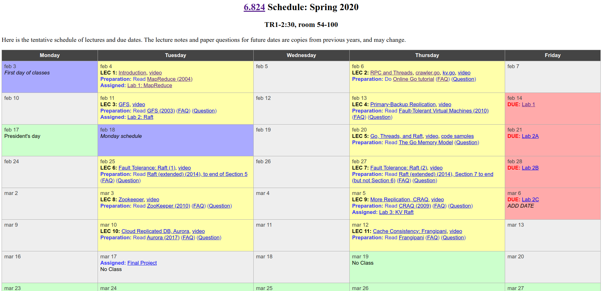
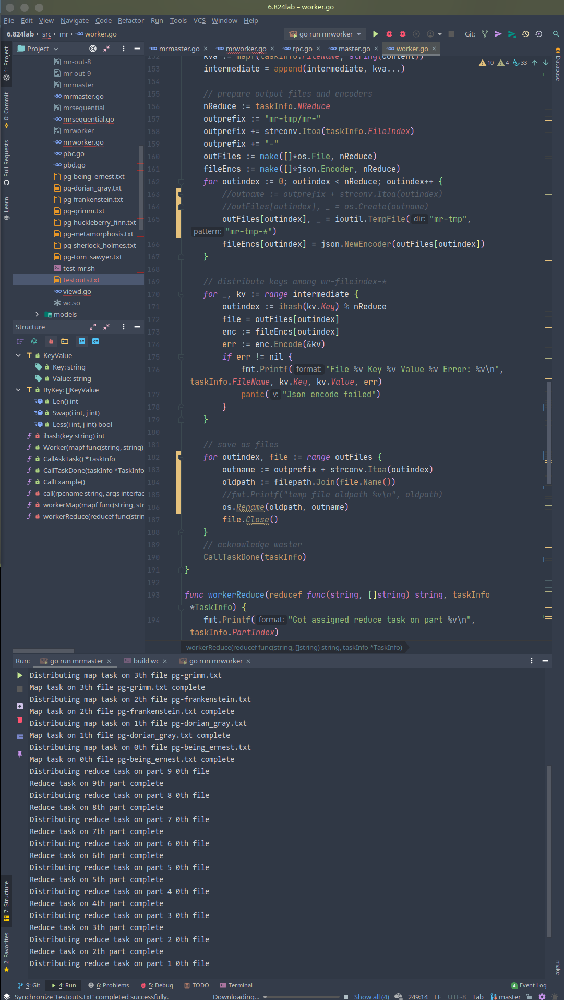

#! https://zhuanlan.zhihu.com/p/260470258

# MIT 6.824 分布式系统 | 材料准备和环境搭建

这是我开的第三个坑，前两个：

[CS143：编译原理 | 环境搭建HelloWorld](https://zhuanlan.zhihu.com/p/226190284)

[MIT 6.828：实现操作系统 | Lab1：快来引导一个内核吧](https://zhuanlan.zhihu.com/p/166413604)

个人认为，**编译原理**对我的帮助不如**操作系统**和**分布式**大，故暂时搁置`CS143`，先专注学习`6.828`和`6.824`的`Lab`。同样，一边写`Lab`一边写博客，解释我是如何一步步写出能通过测试的代码的。从[6.828](https://zhuanlan.zhihu.com/p/166413604)系列复制两段话：

>   写成博客的目的是防止自己走马观花，花了一堆时间还什么都没学到。
>
>   虽然我对我的表达能力很自信，但是我写博客的目的不是教给别人什么东西，而是逼迫自己认真操作、认真阅读。如果你的知识背景和我类似，你看我的博客将非常畅快，否则最好还是看原始的讲义。

So you have been warned.

本坑所有文章在这个专栏：[MIT 6.824 分布式系统](https://github.com/Anarion-zuo/AnBlogs/blob/master/6.828/lab1.md)。

`6.824`是`MIT`计科高级课程，讲的自然是**分布式**。这个课的`Lab`名声在外，质量极高。因为它不但很难、很复杂，而且提供了充分的材料和指引，让这样的难和复杂是可达的，是有意义的，而不是单纯的内卷工具。本文只进行**环境搭建和材料准备**，之后不定期更新每个`Lab`的实现和解释。

本文md源码：[AnBlog](https://github.com/Anarion-zuo/AnBlogs/blob/master/6.824/lab0-intro.md)

# 专栏目录

本系列所有文章整理在此，发布新文章后目录自然生长。

[本文](https://zhuanlan.zhihu.com/p/260470258)

# 课程网站

2020课程安排在 https://pdos.csail.mit.edu/6.824/schedule.html，这并不是课程官网的首页`index`，而是`schedule`页。我更喜欢看`schedule`页，因为`index`页并没有课程材料链接。

`schedule`页上有你需要的几乎所有东西，每次课的阅读材料、`Lab`说明，甚至是课程视频，都有链接，你可以按需求下载。如果你由于一些不知名的原因，不能打开视频链接，可以到B站搜索同等视频。

一般来说，我们需要阅读每次课之前布置的论文，并完成每周布置的`Lab`。论文在所有标有`LEC`的单元格中都有链接，`Lab`说明的链接集中在最右侧的一列。



# Lab代码材料

从官方仓库`clone`代码：

```shell
git clone git://g.csail.mit.edu/6.824-golabs-2020 6.824lab
```

如果你由于一些不知名的原因不能从官方仓库`clone`，可以从[我的GitHub仓库](https://github.com/Anarion-zuo/MIT-6.824)下载。这个仓库的`master`分支是我自己写的代码，`skeleton`分支保存了从官方仓库`clone`的原始版本，你可以选择需要的。

貌似只需要从官方仓库拉取一次代码，就是所有`Lab`的材料，不像`6.828`每次`Lab`都要拉取新代码。

# 其它工具

2020版本的`6.824 Lab`采用`Golang`为主要开发语言，故你一定要在电脑上安装`Go`。

目前还没遇到需要安装的其它工具。

建议使用类`Unix`环境，最好不使用`Windows`，从而和官方指定环境一致。一些命令行动作也最好在`Unix`环境下进行。

我使用`Goland`作为主要`IDE`进行开发，建议你也这样做，`JetBrains`家的`IDE`都是很棒的。

