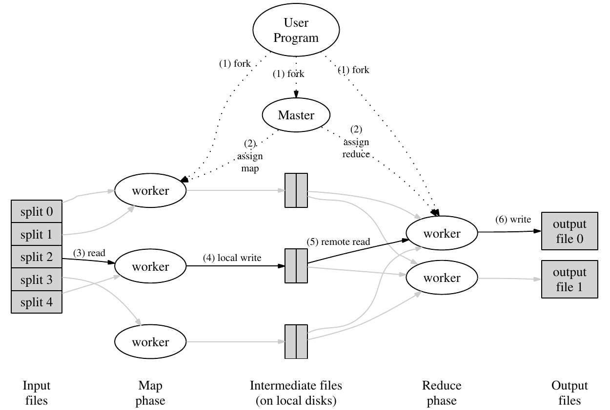

# MIT 6.824 分布式系统 | Lab1：MapReduce

本文是本人学习`MIT 6.824 Lab 1`的笔记，包含了我自己的实现和理解。本系列其它文章、及本系列详细说明，请看：[MIT 6.824 分布式系统 | 材料准备和环境搭建](https://zhuanlan.zhihu.com/p/260470258)

本文md源码：[AnBlog](https://github.com/Anarion-zuo/AnBlogs/blob/master/6.824/lab1-mapreduce.md)

`Lab 1`的说明在 [Lab1 Notes](https://pdos.csail.mit.edu/6.824/labs/lab-mr.html)，需要阅读论文[MapReduce](https://pdos.csail.mit.edu/6.824/papers/mapreduce.pdf)。请以这篇说明和论文为主，以本文为辅。在阅读本文之前，务必先通读这篇说明和论文。后面的`Lab`也是一样，直接阅读本文，就是直接看答案了，少很多乐趣和收获。若实在无法阅读英文，再姑且直接阅读本文。

`6.824`所有`Lab`都使用`Golang`为主要编程语言，若你不熟悉，可以快速看看[Golang官方入门](http://tour.golang.org/)。我只花了半小时左右学习`Go`语言，就写出了这个`Lab`，证明要让代码`work`，不是特别困难。当然，要让代码优雅高效，充分学习`Go`语言还是非常有必要的。

# `MapReduce`框架

在正式看`Lab`材料之前，先简单概括以下`MapReduce`的原理。你应该已经阅读过[MapReduce论文](https://pdos.csail.mit.edu/6.824/papers/mapreduce.pdf)，如果没有，最好先阅读。



这是论文中讲解`MapReduce`的流程图，基本上解释清楚了。

**输入**数据以文件形式进入系统。一些进程运行`map`任务，拆分了原任务，产生了一些**中间体**。一些进程运行了`reduce`任务，利用中间信息产生最终输出。`master`进程用于分配任务，调整各个`worker`进程。原任务**可拆**，是原任务能够写成**分布式**的原因。

**输入**数据以什么形式进入系统，原任务应如何**拆分**，**中间体**如何保存和传输，`master`和`worker`之间如何通信和调度，**中间体**如何转化为最终输出。这些都是设计的考量，没有一定之规了。

# 任务总览和说明

`Lab 1`要求我们实现一个和[MapReduce论文](https://pdos.csail.mit.edu/6.824/papers/mapreduce.pdf)类似的机制，也就是数单词个数`Word Count`。在正式开始写分布式代码之前，我们先理解一下任务和已有的代码。

用于测试的文件在`src/main`目录下，以`pg-*.txt`形式命名。每个`pg-*.txt`文件都是一本电子书，非常长。我们的任务是统计出所有电子书中出现过的单词，以及它们的出现次数。

## 非分布式实现

这个任务非常简单，如果不写成**分布式**的，我们可以很快做出，一个实现在`src/main/mrsequential.go`中。将所有文章中的单词分出，保存到一个类似数组的结构中。将这些单词排序，从而相同单词在数组中连续地出现在一起。排序完成后，遍历这个数组，由于相同的单词相邻地出现，统计单词个数就很简单了。

我们可以尝试运行`mrsequential.go`，看看最终的输出是什么样子的。

```shell
cd src/main
go build -buildmode=plugin ../mrapps/wc.go
go run mrsequential.go wc.so pg*.txt
```

输出文件在`src/main/mr-out-0`，文件中每一行标明了**单词**和**出现次数**。

`go run mrsequential.go`之后的两项是传给`mrsequential`的命令行参数，分别是一个**动态库**和所有电子书。电子书不需要解释。

在进入`Go`程序之后，动态库由代码主动加载进来。在`src/main`目录下命名为`mr*.go`的几个代码文件中，都有`loadPlugin`函数。如果你使用`Goland`作为主要`IDE`，编辑器会提示*重复函数声明*。在这里，我们给`mrsequential`加载的是在`src/mrapps`目录下的`wc.go`编译得到的动态库。

文件`wc.go`以及`mrapps`目录下的其它几个文件，都定义了名为`map, reduce`的函数，这两个函数在`mrsequential.go`中加载并调用。给`mrsequential`绑定不同的`*.so`文件，也就会加载不同的`map, reduce`函数。如此实现某种程度上的**动态绑定**。

`mrsequential`实现的是**非分布式**的`Word Count`，采用的算法就是上面描述的。这个文件的输出将作为之后测试的**标准**。

## 我们的任务

我们的代码主要写在`src/mr`目录下的几个文件，这几个文件由`src/main`目录下两个文件`mrmaster.go, mrworker.go`调用。这两个文件的作用是启动进程、加载`map, reduce`动态库，并进入定义在`src/mr`目录下的主流程。

测试时，启动一个`master`和多个`worker`，也就是运行一次`mrmaster.go`、运行多次`mrworker.go`。

`Master`进程启动一个`rpc`服务器，每个`Worker`进程通过`rpc`机制向`Master`要任务。任务可能包括`map`和`reduce`过程，具体如何给`worker`分配取决于`master`。

每个单词和它出现的次数以`key-value`**键值对**形式出现。`map`流程将每个出现的单词机械地分离出来，并给每一次出现标记为1次。很多单词在电子书中重复出现，也就产生了很多相同**键值对**。还没有对键值对进行合并，故此时产生的键值对的**值**都是1。

已经分离出的单词以键值对形式分配给特定`reduce`流程，`reduce`流程个数远小于单词个数，每个`reduce`流程都处理一定量单词。处理的方式和上面描述的算法类似，对单词排序，令单词在数组中处在相邻位置，再统计单词个数。最终，每个`reduce`流程都有一个输出，合并这些输出，就是`Word Count`结果。`reduce`流程的个数越多，任务就越**并发**。

测试流程要求，输出的文件个数和参数`nReduce`相同，即每个输出文件对应一个`reduce`任务，格式和`mrsequential`的输出格式相同，命名为`mr-out*`。我们的代码应保留这些文件，不做进一步合并，测试脚本将进行这一合并。合并之后的最终完整输出，必须和`mrsequential`的输出完全相同。

查看测试脚本`test-mr.sh`，可以看到合并每个输出`mr-out*`的指令如下，将每个输出文件的每一行按行首单词排序，输出到最终文件`mr-wc-all`中。

```shell
sort mr-out* | grep . > mr-wc-all
```

故每个`reduce`任务不能操作相同的单词，在`map`流程中分离出的相同单词**键值对**应由同一个`reduce`流程处理。

## `Goland`配置

这里稍微讲一下我的`IDE`配置。使用`IDE`配置好处多多，可以不用每次都打命令行，也可以进行断点调试。我对`Golang`和`Goland`都不能说特别熟悉，只是借着以前用`JetBrains`家软件的经验，试着配置，不排除将来更改的可能性。

## 注意的点

-   可能要对一些数据结构加锁`Mutex`
-   成功的实现应至少通过脚本`test-mr.sh`测试

# 设计`MapReduce`框架

从这里开始，我们**阅读**告一段落，正式开始**写**这个`Lab`。先设计`master`和`worker`进程之间的通信方式和任务分配机制，也就是`worker`如何向`master`要任务，`master`又如何选择和分配任务。

这样的设计可能见仁见智，有非常多的选择，不同的选择对效率和稳定性的影响非常大。我选择最简单的**任务队列**方式，即`master`维护了一些**任务队列**，指明哪些任务**未分配**、哪些**已分配正在运行**、哪些**已完成**。`worker`请求到达时，就给`worker`分配一个**未分配**的任务。

这里暂时不关注具体如何进行`Word Count`，只是研究`master`和`worker`之间管理和分配任务的机制。把这个机制确定下来，剩下的更多是改`mrsequential`而已。

## 任务类和接口

有两种**任务**，`map, reduce`，故应定义一个**任务类**接口，由两个不同的类实现。

```go
type TaskStatInterface interface {
	GenerateTaskInfo() TaskInfo
	OutOfTime() bool
	GetFileIndex() int
	GetPartIndex() int
	SetNow()
}
```

实现类：

```go
type TaskStat struct {
	beginTime time.Time
	fileName  string
	fileIndex int
	partIndex int
	nReduce   int
	nFiles    int
}

type MapTaskStat struct {
	TaskStat
}

type ReduceTaskStat struct {
	TaskStat
}
```

如果你对`Golang`和我一样不熟悉，在这里提醒你，`Golang`中**继承**和**多态**两种机制必须分开。虚函数，或称接口，必须定义在一个`interface`中。在`struct`中写另一个`struct`的名称，前者就可以**继承**后者的属性和方法。

`MapTaskStat, ReduceTaskStat`都继承了`TaskStat`类，也就有了后者的所有属性。这些属性的含义在后面解释。

`MapTaskStat, ReduceTaskStat`都覆写了`TaskStatInterface`的一些方法，也就使用了`TaskStatInterface`的多态。这些方法的含义在后面解释。

我还定义了一个**任务队列**类，是一个由`TaskStatInterface`组成的数组，可以方便地进行进队列`Push`和出队列`Pop`操作。

```go
type TaskStatQueue struct {
	taskArray []TaskStatInterface
	mutex     sync.Mutex
}

func (this *TaskStatQueue) lock() {
	this.mutex.Lock()
}

func (this *TaskStatQueue) unlock() {
	this.mutex.Unlock()
}

func (this *TaskStatQueue) Size() int {
	return len(this.taskArray)
}

func (this *TaskStatQueue) Pop() TaskStatInterface {
	this.lock()
	arrayLength := len(this.taskArray)
	if arrayLength == 0 {
		this.unlock()
		return nil
	}
	ret := this.taskArray[arrayLength-1]
	this.taskArray = this.taskArray[:arrayLength-1]
	this.unlock()
	return ret
}

func (this *TaskStatQueue) Push(taskStat TaskStatInterface) {
	this.lock()
	if taskStat == nil {
		this.unlock()
		return
	}
	this.taskArray = append(this.taskArray, taskStat)
	this.unlock()
}
```


## 申请任务

`worker`向`master`通过`rpc`机制申请一个任务。约定这个`rpc`只有返回值，命名为`AskTask`，在`worker`中这样调用：

```go
func CallAskTask() *TaskInfo {
	args := ExampleArgs{}
	reply := TaskInfo{}
	call("Master.AskTask", &args, &reply)
	return &reply
}
```

这基本上是从`CallExample`方法复制的。完成之后，`master`返回给`worker`的信息放在变量`reply`中。

在`master`中应有一个名为`AskTask`的方法，处理来自`worker`的请求。这个方法检查是否有未完成的`map`或`reduce`任务。

```go
func (this *Master) AskTask(args *ExampleArgs, reply *TaskInfo) error {
	// check for reduce tasks
    ...
    // check for map tasks
    ...
    // should exit?
    ...
}
```

若有未完成的`map`任务，即`map`**任务队列**长度非0，则给`worker`分配这个任务。

```go
// check for map tasks
mapTask := this.mapTaskWaiting.Pop()
if mapTask != nil {
    // an available map task
    // record task begin time
    mapTask.SetNow()
    // note task is running
    this.mapTaskRunning.Push(mapTask)
    // setup a reply
    *reply = mapTask.GenerateTaskInfo()
    fmt.Printf("Distributing map task on %vth file %v\n", reply.FileIndex, reply.FileName)
    return nil
}
```

若有未完成的`reduce`任务也是同理。

```go
reduceTask := this.reduceTaskWaiting.Pop()
if reduceTask != nil {
    // an available reduce task
    // record task begin time
    reduceTask.SetNow()
    // note task is running
    this.reduceTaskRunning.Push(reduceTask)
    // setup a reply
    *reply = reduceTask.GenerateTaskInfo()
    fmt.Printf("Distributing reduce task on part %v %vth file %v\n", reply.PartIndex, reply.FileIndex, reply.FileName)
    return nil
}
```

若所有任务都已分配，还要查看是否都运行完成。若所有分配出去的任务未完全运行完成，说明未来可能还有新的任务产生，`worker`应等待片刻后再进行请求。

```go
// all tasks distributed
if this.mapTaskRunning.Size() > 0 || this.reduceTaskRunning.Size() > 0 {
    // must wait for new tasks
    reply.State = TaskWait
    return nil
}
```

若所有分配的任务都已经完成，且没有为分配的任务，则认为整个流程均已经完成，`master`将退出，也令`worker`退出。

```go
    // all tasks complete
    reply.State = TaskEnd
    this.isDone = true
    return nil
```

以上所有代码块合并在一起，就是完整的`AskTask`方法。

`worker`应不断尝试向`master`获得新任务，对`master`返回的信息进行相应处理。

```go
func Worker(mapf func(string, string) []KeyValue,
	reducef func(string, []string) string) {

	for {
		taskInfo := CallAskTask()
		switch taskInfo.State {
		case TaskMap:
			workerMap(mapf, taskInfo)
			break
		case TaskReduce:
			workerReduce(reducef, taskInfo)
			break
		case TaskWait:
			// wait for 5 seconds to requeset again
			time.Sleep(time.Duration(time.Second * 5))
			break
		case TaskEnd:
			fmt.Println("Master all tasks complete. Nothing to do...")
			// exit worker process
			return
		default:
			panic("Invalid Task state received by worker")
		}
	}

}
```

## 任务完成

`worker`每完成一个任务，都向`master`汇报，让`master`进行对应处理。同样使用`rpc`机制实现这个通信，主要由`worker`向`master`传递信息。`worker`中调用`rpc`的代码和之前相似。

```go
func CallTaskDone(taskInfo *TaskInfo) {
	reply := ExampleReply{}
	call("Master.TaskDone", taskInfo, &reply)
}
```

`master`应将任务从`running queue`中取出删除。

```go
func (this *Master) TaskDone(args *TaskInfo, reply *ExampleReply) error {
	switch args.State {
	case TaskMap:
		fmt.Printf("Map task on %vth file %v complete\n", args.FileIndex, args.FileName)
		this.mapTaskRunning.RemoveTask(args.FileIndex, args.PartIndex)
		break
	case TaskReduce:
		fmt.Printf("Reduce task on %vth part complete\n", args.PartIndex)
		this.reduceTaskRunning.RemoveTask(args.FileIndex, args.PartIndex)
		break
	default:
		panic("Task Done error")
	}
	return nil
}
```

需要特殊处理的是，当所有`map`任务都完成，`master`应启动`reduce`任务。实现方式是，在`master`初始化时，只初始化`map`任务，不处理`reduce`任务。检查到`map`任务都完成时，在`reduce`任务队列上添加对应新任务。

则`TaskDone`方法应改为：

```go
func (this *Master) TaskDone(args *TaskInfo, reply *ExampleReply) error {
	switch args.State {
	case TaskMap:
		fmt.Printf("Map task on %vth file %v complete\n", args.FileIndex, args.FileName)
		this.mapTaskRunning.RemoveTask(args.FileIndex, args.PartIndex)
		if this.mapTaskRunning.Size() == 0 && this.mapTaskWaiting.Size() == 0 {
			// all map tasks done
			// can distribute reduce tasks
			this.distributeReduce()
		}
		break
	case TaskReduce:
		fmt.Printf("Reduce task on %vth part complete\n", args.PartIndex)
		this.reduceTaskRunning.RemoveTask(args.FileIndex, args.PartIndex)
		break
	default:
		panic("Task Done error")
	}
	return nil
}
```

## 任务初始化