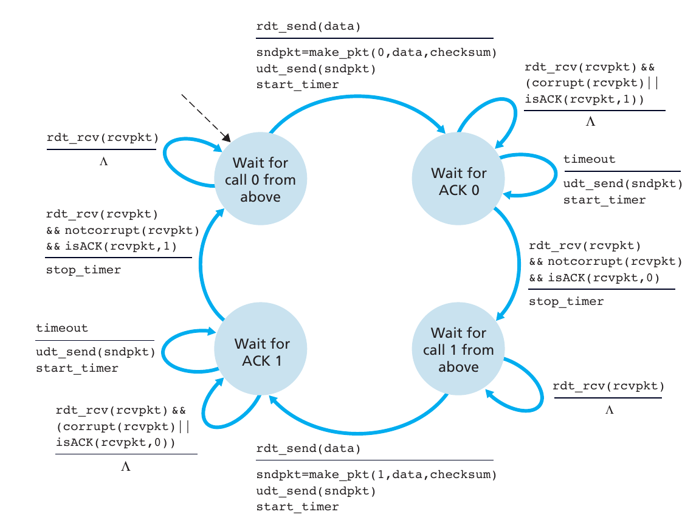

#! https://zhuanlan.zhihu.com/p/264448558

# MIT 6.824 分布式系统 | Lab 2A：Raft选举状态机

本文是本人学习`MIT 6.824 Lab 2A`的笔记，包含了我自己的实现和理解。本系列其它文章、及本系列详细说明，请看：[MIT 6.824 分布式系统 | 材料准备和环境搭建](https://zhuanlan.zhihu.com/p/260470258)

本文md源码：[AnBlog](https://github.com/Anarion-zuo/AnBlogs/blob/master/6.824/lab2a-raft-elect.md)

我将配合代码、文字、和简单的示意图讲解，整个算法非常复杂，我不能把所有代码全搬到文章里面。文章中呈现的代码应看做**伪代码**，而不是可以直接运行的代码。其中很多部分不会详细展开讲解，一方面是没有必要、避免啰嗦，另一方面要尽量缩减篇幅，你不必过于*刨根问底*。

本文的上一个版本是我一年前写的，去年做完了6.824的lab，但是后面的懒得写出来，有一些问题一直没有解决。最近再捡起来，重新实现了Lab2的部分，发现重新写的代码甚至比之前写的还丑，各种锁和函数混在一个文件里面足足有一千多行。即便如此，我还是坚持把各个test的要求满足了，真正体会了什么叫“屎山”。不能说花的时间很久，也就是一天多，只能说很痛苦。

痛定思痛，我好好想了一下，彻底更换思路，先写了一个简单的状态机框架，再在状态机的基础上操作，只用了两个多小时就完成了所有内容。一开始就找对方向非常重要啊！

为了给你提供尽量多的帮助，同时保持你的学习机会，我将给你提供充分的**准备工作指引**，为你增加效率。当然，如果你执意要看答案，不想自己思考，你也可以直接看，虽然少了很多乐趣。

# 准备工作

在开始写代码之前，请务必做好充分准备。这些准备工作很多，请你尽量做充分，准备中的工作量能顶好几倍之后的代码工作量，减少bug出现概率。做`Lab 2A`的准备工作尤为重要，`Lab 2`的其它部分也依赖这部分的知识，我们需要一个好的开始。

准备工作主要包括两部分，先理解`Raft`算法，再看看给好代码的结构。

## 学习`Raft`

讲义中给了很多参考资料，`Raft`算法本身非常复杂，需要花较多精力理解。推荐你按如下顺序阅读这些材料：

1. [官网简单介绍](https://raft.github.io/)，只需要看到`Raft Visualization`标题之前。
2. [一个很棒的可视化](http://thesecretlivesofdata.com/raft/)，慢慢把所有动画放完。
3. [Raft论文](https://pdos.csail.mit.edu/6.824/papers/raft-extended.pdf)，主要看`Figure 2`和`Section 5`。
4. [6.824助教写的注意事项](https://thesquareplanet.com/blog/students-guide-to-raft/)

还有一些材料可以选择性阅读：

- [6.824课程视频](https://www.bilibili.com/video/BV1R7411t71W?p=6)
- [Raft作者博士论文](https://raw.githubusercontent.com/ongardie/dissertation/master/book.pdf)

如果你需要中文材料，可以参考知乎上的这些文章：

- 本文

- https://www.zhihu.com/question/29597104

- https://zhuanlan.zhihu.com/p/110168818

请你花长时间，仔细研究以上材料，确保你能独立地在脑海中放出像[一个很棒的可视化](http://thesecretlivesofdata.com/raft/)那样的动画，充分理解`Raft`算法。讲解`Raft`算法不是本文的主要内容，如果以后有兴致，再写一篇文章，下次一定！

## 看看代码和任务总览

`Lab 2A`主要代码写在文件`src/raft/raft.go`。目录`src/raft`下的其它文件都是为**测试**服务的，测试主要流程在`test_test.go`。

理解测试的内容是非常重要的。到头来，无论是Raft论文还是老师上课讲解，讲的都是`specification`而不是`implementation`，一个人心中能写出一千个Raft。测试是对实现的终极规定，告诉你，通过就是对的，不通过就是错的。一切最终都是以测试为准。

下文详细解释了每个测试流程都干了什么。

## 在开始写代码之前

按惯例，除了论文还要阅读[Lab 2 Notes](https://pdos.csail.mit.edu/6.824/labs/lab-raft.html)，如果你还没阅读的话。前面没有指出来，是因为[Lab 2 Notes](https://pdos.csail.mit.edu/6.824/labs/lab-raft.html)和**学习Raft**这件事情关系不大。现在指出来，是因为[Lab 2 Notes](https://pdos.csail.mit.edu/6.824/labs/lab-raft.html)里面讲了很多代码介绍和要求，需要你特别注意。在这里归纳出几点：

- `Lab 2A`主要和`leader`选举机制有关。
- 主要编程指引在[Raft论文](https://pdos.csail.mit.edu/6.824/papers/raft-extended.pdf)的`Figure 2`中，必须按照它的逻辑严格执行，最好不自己发挥。
- 使用的`RPC`命名和`Figure 2`中相同，用`RequestVote`**索取选票**，用`AppendEntries`实现**心跳信号**。
- 有一些和**等待**有关的参数需要小心选取。

除此之外，基于我自己写这个`Lab`的经验，再提醒你一下：

- 没有理解清楚算法流程不要硬上，多看看论文，反复琢磨总是能懂的！
- 不要先追求**效率**或**优雅**，很多错误就是这么来的，先追求**正确！**
- 多线程代码不要用**断点调试**了，可以尝试在终端`print`一些信息，像这样：

```
[Peer 1 Leader term 2] sending heartbeat signal to peer 2
[Peer 1 Leader term 2] all heartbeats sent, sleeping for 120 then send heartbeats again
[Peer 0 Follower term 2] got heartbeat message from leader peer 1 at term 2
[Peer 1 Leader term 2] heartbeat response from peer 0 received in 138.851µs success true
[Peer 2 Leader term 1] heartbeat response from peer 0 received in 70.168149ms success true
[Peer 2 Leader term 1] found peer 0 unreachable when sending heartbeats
[Peer 2 Leader term 1] sending heartbeat signal to peer 0
```

- 我的完整实现请看[我的GitHub仓库](https://github.com/Anarion-zuo/MIT-6.824)，本文的代码在分支`lab2-sm`，**不要照抄！！！**

如果怎样都调不通，可以依次尝试：

1. 调整**等待时间**参数
2. 检查`GetState`方法是否正确
3. 阅读终端输出信息，看出错误

说了这么多，你可以开始写代码了。在你写好之前，**请不要继续阅读本文**。后文中的一些结论，我花了很长时间才发现，本来一起列在上面了，后来还是觉得不要**剧透**太多，给你留多一点发挥的空间，才能学到更多，不应该把这个机会就这样抢走。

# 测试流程

和2A有关的3个测试，满足要求的难度从小到大。以下是它们做的事情。

`TestInitialElection`测试启动后Raft集群是否能够选出一个`leader`，并检查在网络稳定的情况，也就是不应该发生心跳信号等待超时的情况下，是否能保持原来的`leader`和`term`状态不变。

`TestReElection`测试在上一个测试的基础上，检查发生`leader`离线情况的行为。先等待集群产生一个`leader`，然后让这个`leader`离线，检查集群能否再产生一个`leader`。若能，令原来的`leader`上线，检查`leader`不应该发生变化，因为后来的`leader`的`term`大于原来的`leader`。如果满足要求，令一个`leader`和一个`follower`离线，检查此时集群不应该再产生新`leader`，因为超过半数的服务器离线了。

`TestManyElections`测试是上一个测试的现实版本。每次随机令2个服务器离线，检查集群状态是否符合要求。如此重复10次。为了确保测试的准确性，我把这个重复次数改成1000,只需要改变量`iters`就可以。10次通过了是运气好，1000次通过了就是真的对了。

可以点进`config.go`里面多看看这些测试是怎么实现的，这里就不展开了。

一定不能满足于有时通过，有时不通过。不通过的时候应该仔细研究终端输出的log，而不是猛调各种等待时间，我一开始就是这么干的，没什么用。贪图快速只能给自己在未来带来无穷无尽的痛苦。

你可以按照如下顺序逐步进行。先尝试让代码通过`TestInitialElection`，实现最基本的选举`leader`。然后实现`follower`计时器超时的情况，从而通过`TestReElection`。最后用`TestManyElections`修修补补。

一定要把`TestManyElections`重复次数设置得很大，确保真的没有一点点错误。最后得到的结果可以是这样的，其实没有错误，只是运行时间太长了。

```
6 Follower term 1755 votedFor 4 | server 4 unreachable
5 Follower term 1755 votedFor 4 | server 6 unreachable
    config.go:290: test took longer than 120 seconds
--- FAIL: TestManyElections2A (1058.38s)

FAIL
```

# 找bug

多线程场景下，用断点调已经不现实了。当然是用`Print`系列函数输出信息，然后用火眼金睛看出来。不要使用`log.Print`系列，因为会有表达时间的前缀，我们不需要这个信息。用`fmt`就好。

我把输出信息分成两个部分，前半部分显示`Raft`服务器状态，后半部分是具体的信息。

```
2 StartElection term 1754 votedFor 2 | sending RequestVote to 5
2 StartElection term 1754 votedFor 2 | sending RequestVote to 6
2 StartElection term 1754 votedFor 2 | sending RequestVote to 3
0 Follower term 1753 votedFor 4 | encounters larger term 1754, transfer to follower, grant vote
1 Follower term 1753 votedFor 4 | encounters larger term 1754, transfer to follower, grant vote
2 StartElection term 1754 votedFor 2 | server 0 reply ok true grant true
6 Follower term 1753 votedFor 4 | encounters larger term 1754, transfer to follower, grant vote
```

可以整一个函数，封装输出`Raft`服务器状态的部分。

```go
func (sm *RaftStateMachine) print(format string, vars ...interface{}) {
	if !sm.printFlag {
        // 方便关掉输出
		return
	}
	sm.printMu.Lock()
	s := fmt.Sprintf(format, vars...)
	fmt.Printf("%d %s term %d votedFor %d | %s\n", sm.raft.me, sm.stateNameMap[sm.curState], sm.currentTerm, sm.votedFor, s)
	sm.printMu.Unlock()
}
```

不要对多线程抱侥幸心理，《这个不加锁应该没事吧》《我运气不会这么差吧》。`go test`运行时一定要加`-race`选项，检查所有非互斥的读写行为。

# 找死锁

如果像我一样写成状态机，死锁发生的可能性不大。如果你使用的是各种锁和条件变量的写法，死锁找起来还是很头疼的。

解决死锁问题最好的方法当然是不要让他出现。确保每次加锁的顺序一直，对于锁A和锁B，要么在所有情况下都是先A后B，要么都是先B后A，不要一会这样一会那样，只要出现一次加锁顺序不一致，就一定会发生死锁。

推荐[这个库](https://github.com/sasha-s/go-deadlock)。封装了各种锁，确保每次加锁的顺序是一致的，不一致就会在终端输出信息。

```
POTENTIAL DEADLOCK: Inconsistent locking. saw this ordering in one goroutine:
happened before
inmem.go:623 bttest.(*server).ReadModifyWriteRow { r.mu.Lock() } <<<<<
inmem_test.go:118 bttest.TestConcurrentMutationsReadModifyAndGC.func4 { _, _ = s.ReadModifyWriteRow(ctx, rmw()) }

happened after
inmem.go:629 bttest.(*server).ReadModifyWriteRow { tbl.mu.RLock() } <<<<<
inmem_test.go:118 bttest.TestConcurrentMutationsReadModifyAndGC.func4 { _, _ = s.ReadModifyWriteRow(ctx, rmw()) }

in another goroutine: happened before
inmem.go:799 bttest.(*table).gc { t.mu.RLock() } <<<<<
inmem_test.go:125 bttest.TestConcurrentMutationsReadModifyAndGC.func5 { tbl.gc() }

happend after
inmem.go:814 bttest.(*table).gc { r.mu.Lock() } <<<<<
inmem_test.go:125 bttest.TestConcurrentMutationsReadModifyAndGC.func5 { tbl.gc() }
```

# 状态机

系统是有限状态机，就是说系统对外只表现出有限的几个状态，状态之间相互转移的中间状态不可见。外界操作使得系统从一个状态转移到另一种状态，转移过程中进行一些处理。**外界操作**可以相互平行地理解为：

- 系统检测到发生了某件事情，系统应对这件事情改变自己的状态。
- 系统接收到来自外界的指令，按照指令改变自己的状态。

**自顶向下**中非常有名的图也是状态机。



无论采用多么非常复杂的加锁机制，都是为了实现一个状态机。与其采用超级烦人的锁、条件变量、或者`chan`，还不如直接写一个简单的状态机框架。

状态机的主体是一个循环取指令、执行指令的循环，*指令*就是可能让状态机的状态发生变化的输入。在执行*指令*的时候给状态上锁。

```go
func (sm *StateMachine) machineLoop() {
    for {
        trans := <-sm.transCh
        sm.rwmu.Lock()
        dest := trans.transfer(sm.curState)
        if dest != notTransferred {
            sm.stateWriter.writeState(dest)
        }
        sm.rwmu.Unlock()
    }
}
```

给`chan`发射实现了`transfer`方法的对象，作为*指令*。

```go
type StateMachine struct {
    ...
    transCh          chan SMTransfer
    ...
}

func (sm *StateMachine) issueTransfer(trans SMTransfer) {
    go func() {
        sm.transCh <- trans
    }()
}
```

研究清楚Raft之后产生各个状态之间相互转移的图，黑字表示状态和使得状态发生转移的指令，红字表示产生这些指令的外部输入，和状态转移过程中产生的输出。

对着这个图定义状态和转移操作。状态定义成枚举类型就可以，转移操作严格按照Raft论文中的Figure 2实现。具体的代码请看[这个目录](https://github.com/Anarion-zuo/MIT-6.824/tree/lab2-sm/src/raft)。

```go
type SMState int

// 几个状态
const notTransferred SMState = -1
const startElectionState SMState = 900
const followerState SMState = 901
const sendAEState SMState = 902

type RaftStateMachine struct {
    StateMachine

    // raft的状态
    currentTerm int
    votedFor    int
    // ...
}
```

需要更改状态的操作全部由某种转移操作实现，确定好是哪个之后，通过`chan`传给状态机执行。

```go
// 举个例子
// 超过半数投票给我
if *voteCount+1 > rf.peerCount()/2 {
    if !*elected {
        // 我就当选
        rf.machine.issueTransfer(rf.makeMajorElected())
        *elected = true
    }
}
```

# 选举过程

这里就没什么好说的了，亦步亦趋按照论文Figure 2的来，不要自己发挥。这里稍微提醒你几个地方。

## 异步发送

发送`RequestVote`应该是异步的，主流程不应该阻塞到所有`reply`都收到再继续进行。原因有一下两个方面。

1. 不需要收到所有选票就可以选出`leader`，只需要超过半数。
2. RPC放弃发送的时间太长了。
3. 最重要的，论文的表述是`election timeout`，说明在`follower`和`candidate`情况下，发送`RequestVote`的时机都是计时器到点。

所以，你的发送大概应该长这样。

```go
for i := 0; i < rf.peerCount(); i++ {
    if i == rf.me {
        // 不发给自己
        continue
    }
    go rf.sendRequestVote(i)
}
```

`AppendEntries`也是这个道理。你可以在另一个线程中等待这些线程结束，这样也不会阻塞到主流程。可以像这样。

```go
// On conversion to candidate, start election
// Increment currentTerm
currentTerm++
// Vote for self
votedFor = trans.machine.raft.me
// Reset election timer
electionTimer.setElectionWait()
electionTimer.start()

// Send RequestVote RPCs to all other servers
go trans.machine.raft.doElect()
// 不阻塞的返回
return StartElectionState
```

## 随机长度发送周期

为了避免两个服务器的节奏太相近，重复好几个周期都产生不出`leader`，在重置定时器的时候应该加入一点随机。特别是像我这样写成状态机的，时间卡的实在是太死了。

```go
func (timer *Timer) setElectionWait() {
    timer.setWaitMs(electWaitMs + rand.Int()%electWaitRandomOffsetMs)
}
```

## 只读指令

写好代码之后，发现有的状态转移过程不会修改状态。为了增加一点点效率，可以把这里写成读写锁。

```go
if trans.isRW() {
   sm.rwmu.Lock()
   dest := sm.transferExecutor.executeTransfer(sm.curState, trans)
   if dest != notTransferred {
      sm.stateWriter.writeState(dest)
   }
   sm.rwmu.Unlock()
} else {
   sm.rwmu.RLock()
   dest := sm.transferExecutor.executeTransfer(sm.curState, trans)
   sm.rwmu.RUnlock()
   if dest != notTransferred {
      sm.rwmu.Lock()
      sm.stateWriter.writeState(dest)
      sm.rwmu.Unlock()
   }
}
```

转移状态的过程之外的其他过程中，经常需要读`Raft`状态的，加读锁就可以。这下运行起来快多了。
