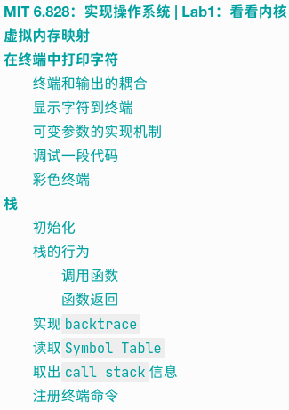
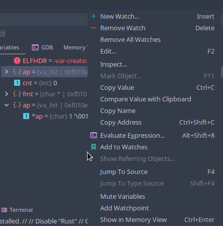
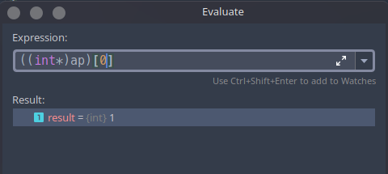
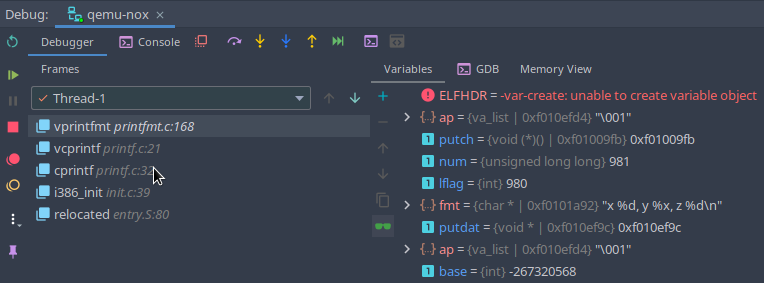

# MIT 6.828：实现操作系统 | Lab1：看看内核

本文为本人学习60828的Lab笔记，对应Lab1 Part3内容，接续上一篇笔记：https://zhuanlan.zhihu.com/p/166413604

写成博客的目的是防止自己走马观花，花了一堆时间还什么都没学到。其他Lab的实现在专栏陆续更新。

[MIT 6.828 实现操作系统](https://zhuanlan.zhihu.com/c_1273723917820215296)

如果你没有阅读上一篇，请务必阅读后再阅读本文。本文中所有内容均依赖上一篇内容。

简单的目录：



本文md文档源码链接：[AnBlogs](https://github.com/Anarion-zuo/AnBlogs/blob/master/6.828/lab1-kernel.md)

# 虚拟内存映射

我们知道，加载内核时，将内核加载到内存中`0x100000`位置上。这是“物理内存地址”`Physical Address`，`Part 2`中研究`elf`文件格式的时候就知道了。编译时产生的地址在`0xf0100000`，这是“虚拟地址”`Virtual Address`。

内核经常被放在较大的地址上，留出较小的地址给其他应用。不是所有的机器都有内核编译时候这么多的内存空间，故要建立“虚拟地址”和“真实地址”之间的映射，从而让内核在物理内存中的真实位置按需改变，而在虚拟内存中的位置保持不变。

这样*让虚拟地址固定，不随运行时变化*的机制，就是虚拟内存机制。这样可以让程序在编译时使用“不存在”的地址，只要映射得当，就可以正常运行，程序员不需要关心运行的物理内存地址，从而简化了开发。不单单是内核，其他程序也可以使用这种机制。虚拟内存由`CPU`硬件实现，一旦开启，之后再寻址，就是按照虚拟内存进行的了。

在下一个Lab中，我们使用`kern/entrypgdir.c`文件，将物理内存`0x0-0xfffffff`映射到了虚拟地址`0xf0000000-0xffffffff`，这使得内核只能使用前`256MB`的内存。此时若开启虚拟内存，尝试访问超出这一范围的地址，CPU进入`page fault`异常，而我们并没有配置这个异常中断的处理函数，内核只能被强行停止。

这个Lab中，我们做简单一些的映射。将虚拟地址`0xf0000000-0xf0400000`映射到物理地址`0x00000000-00400000`，虚拟地址`0x00000000-0x00400000`映射到物理地址` 0x00000000-0x00400000`。这是由`kern/entry.S`60-62行开始实现的。

Lab中有个练习，让我们把62行注释掉，重新编译启动，打断点看看内核会怎样。事实证明，内核进入了一个`panic`函数，这个函数在文件`kern/init.c`58行，显然是出错时会进入的函数。进入这个函数的过程不得而知，单步调试的时候，调试器不再是一行一行前进的，而是在很不稳定地跳跃。这就说明虚拟内存映射没有开启的时候，调用函数会出现奇怪的现象，`call`指令跳转不到想要的位置。

讲义中说，如果不是课程提供的`qemu`，则虚拟机将不断循环重启。事实证明确实是这样。

# 在终端中打印字符

这里重在理解代码之间的联系，了解各个函数之间的调用和耦合关系，以及C语言可变参数的使用方法。讲义中要求我们做到能够回答以下问题：

1.  解释`printf.c`和`console.c`之间的关系，`console.c`暴露了哪些接口？`printf.c`如何调用了这些接口？
2.  解释`console.c`中的一段代码。
```c
if (crt_pos >= CRT_SIZE) {
    int i;
    memmove(crt_buf, crt_buf + CRT_COLS, (CRT_SIZE - CRT_COLS) * sizeof(uint16_t));
    for (i = CRT_SIZE - CRT_COLS; i < CRT_SIZE; i++)
    crt_buf[i] = 0x0700 | ' ';
    crt_pos -= CRT_COLS;
}
```

3.  单步调试一段代码并回答问题：
```c
int x = 1, y = 3, z = 4;
cprintf("x %d, y %x, z %d\n", x, y, z);
```
`cprintf`函数中，变量`fmt`和`ap`的含义分别是什么？按调用顺序列出调用函数`cons_putc, va_arg, vcprintf`的位置，列出`cons_putc`的参数列表，列出`va_arg`调用函数之前和之后指向的区别。弄清楚可变参数的实现机制。

4.  运行一段代码，解释输出情况，像3一样思考。
```c
unsigned int i = 0x00646c72;
cprintf("H%x Wo%s", 57616, &i);
```
5.  解释一段代码`cprintf("x=%d y=%d", 3)`中`y=`之后的输出和原因。
6.  若`gcc`处理`...`可变参数机制发生改变，参数接收顺序颠倒，如何调整函数`cprintf`使得效果不变？
7.  挑战题：制作一个彩色终端 (kill me…)

将`Part 3`单独写成一篇真是明智的选择，每个都是送命题… 以下依次研究。

## 终端和输出的耦合

讲义中要求我们理解`kern/console.c`和`kern/printf.c`接口之间的关系，这里写写我的理解。

在文件`kern/init.c`中调用了`cprintf`函数，这个函数在`kern/printf.c`中。此处要快速查找函数，可以双击`Shift`，`CLion`弹出万能查找窗口。由此猜测`cprintf`应搭建在`console`之上，而不是`console`搭建在一堆`printf`系列函数之上。

`cprintf`参数列表中有`...`，使用了C语言可变参数特性。如果你对这个特性不熟悉，最好先查查。`kern/printf.c`文件下的其它函数，都是为了函数`cprintf`和它的可变参数服务的。

函数`vcprintf`相当于将可变参数列表展开，并传递给在文件`lib/printfmt.c`中的函数`vprintfmt`，这个函数实现了和打印有关的核心算法。

再看看传递的参数。函数`vcprintf`传递了一个函数指针`putch`，也就是`put char`的意思，对应`kern/printf.c`中的`putch`函数。这个函数的功能是将一个字符显示到命令行中，调用了`kern/console.c`中的`cputchar`函数。

总结一下。`cprintf`就是，将格式`fmt`和展开后的可变参数信息，一起传给实现了核心算法的函数`vprintfmt`，并且告知了将字符输出到终端的方法`putch`。

## 显示字符到终端

讲义中让我们解释的代码如下：

```c
if (crt_pos >= CRT_SIZE) {
    int i;
    memmove(crt_buf, crt_buf + CRT_COLS, (CRT_SIZE - CRT_COLS) * sizeof(uint16_t));
    for (i = CRT_SIZE - CRT_COLS; i < CRT_SIZE; i++)
    crt_buf[i] = 0x0700 | ' ';
    crt_pos -= CRT_COLS;
}
```

其实非常简单。这段代码出自文件`kern/console.c`的函数`cga_putc`，函数的目的是在终端显示一个字符。这个函数由`cons_putc`函数调用，相应地又由`cputchar`函数调用，`cputchar`就是暴露给外界的接口，用于在终端显示一个字符。

函数`cons_putc`还调用了另外两个形如`*_putc`形式的函数，是在向其他设备输出这个字符，我们暂时不关心。

回到要解释的这段代码。看到了`if`判断的条件，而且在输出时候出现，猜想应该是处理输出字符超过终端范围。先用函数`memmove`将终端中已有字符往上移动一行，再将超出的部分写到最后一行上。你可以对照着源代码好好体会。

## 可变参数的实现机制

以下参考C文档：[Variadic Functions](https://en.cppreference.com/w/c/variadic)

带有可变参数的函数，参数列表以`...`结尾。编译器提供了一定机制，帮助我们取出`...`中包含的参数。由于给函数的参数在编译时就已经确定，这样的语言特性才是可以实现的。

使用可变参数的模式非常固定，如下：

```c
 va_list args;               // 准备接受参数的列表对象
 va_start(args, fmt);        // 从`...`中取出参数到args中，并指定...之前的参数
 vprintf(fmt, args);         // 将取出的参数列表传给真正的实现函数
 va_end(args);               // 释放参数列表
```

在实现函数中，使用`va_arg(args, int)`取出变量，指定了类型`int`，代表以`int`类型解析当前参数。再次调用`va_arg`时，取出的参数是传入参数中的下一个。可以查看文件`lib/printfmt.c`中的函数`vprintfmt`的实现，里面有很好的例子。

## 调试一段代码

单步调试一段代码：

```c
int x = 1, y = 3, z = 4;
cprintf("x %d, y %x, z %d\n", x, y, z);
```

参数`fmt`和`ap`的含义在前文已经讲得很清楚了，可变参数的使用过程也很清楚了，重点来看`ap`指向的变化，也就是`va_start`做了什么事情。

在`vcprintf`开头打断点，使用`CLion`的调试功能，调用一下`ap`。



点击`Evalueate Expression`，可以在弹出的框框中输入任何表达式，按回车得到值。如下：



猜测`ap`为指针，指向第一个参数的地址。可变参数被连续地存储在栈上，可以从小到大增大索引访问到它们。如上图，索引为`0`时得到`1`，正是`cprintf`接受的第一个可变参数的值！接着改变索引为`1, 2`，得到指向值为`3, 4`，正是接受到的第二、三个变量的值！正如我们所料。

所以，可变参数连续地存储在栈中，`ap`指向的是它们的第一个字节。这样想来，问题`4, 5`就迎刃而解，不需要再多解释了。

## 彩色终端

以后有兴致在来写这个挑战题……

下次一定……

# 栈

最后，研究一下内核的栈。

## 初始化

本标题对应`Exercise 9`，试图弄清楚栈在哪里初始化、如何初始化、初始化在什么位置。

打开文件`kern/entry.S`，按`ctrl+f`查找关键字，找找`stack`这个词出现在哪里，看看每次出现的含义。

77行处将一个宏变量`bootstacktop`的值赋值给了寄存器`esp`。而`bootstacktop`出现在`bootstack`下，`bootstack`出现在`.data`段下，这是数据段。可以肯定，这就是栈了。通过93行`.space`指令，在`bootstack`位置处初始化了`KSTKSIZE`这么多的空间。`KSTKSIZE`在`inc/memlayout.h`里面定义，是`8*PGSIZE`，而`PGSIZE`在`inc/mmu.h`中定义，值为4096。

这样一顿找，我们知道了，栈在内核入口的汇编代码中初始化，是通过一个汇编指令`.space`，大小是`8 * 4096`。接下来看看栈的位置。

查看反汇编代码`obj/kern/kernel.asm`，58显示了`bootstacktop`的值为`0xf010f000`。这就是栈的位置，准确来说，是栈顶，栈将向地址值更小的方向生长。

## 栈的行为

在正式运行一段代码之前，`esp`寄存器需要先初始化，正如前文所说。这个初始化可以是手动完成的，如`kern/entry.S`，也可以是自动完成的，如`call`指令。程序运行时，`esp`保存的地址以下的内存，都是栈可以生长，但尚未生长到的。`esp`表示的是“栈顶地址”`stack top`。

程序“压栈”，就是减小`esp`，并在刚刚`esp`指向的位置上写入数据。

还有一个寄存器`ebp`，意思是`base pointer`，记录的是当前函数栈的开头。没有指令会自动更新`ebp`的值，但是任何C编译器都要遵守这个规定，写汇编的程序员也是，调用函数时必须写指令更新`ebp`寄存器。

### 调用函数

在执行新的函数`callee`代码之前，先保存旧函数`caller`的栈的位置。这样一来，`callee`才可以返回到正确的指令上。通过`ebp`寄存器的值，`Debugger`可以迅速找到调用这个函数的函数，一路找到最开始执行这个函数的函数，这种操作称为`backtrace`。

看到反汇编代码`obj/kern/kernel.asm`中，所有C函数的第一个指令都是`push %ebp`，保存了旧的栈地址。第二个指令都是`mov %esp, %ebp`，将当前栈地址，也就是函数的栈的开头，保存到`ebp`。

### 函数返回

函数返回时，寄存器`eip`，也就是`Instruction Pointer`，跳转到调用本函数的`call`指令的下一个指令，且`esp`增加。栈是向下增长的，所以这其实是在“弹出”。调用函数时，函数接受的参数都被压栈，故返回时相应弹出。

## 实现`backtrace`

这个标题对应`Exercise 10-11`。

Lab中的练习要求我们实现一个`backtrace`函数，能够打印函数调用的地址和传给函数的参数值。其实`CLion`的`Debugger`就有这个功能：



左边栏显示了调用函数的名称和所在文件位置，点击可以让编辑器跳转到所在文件行，非常方便！

我们要实现的函数，就是可以获得函数此时的`ebp`寄存器的值、返回的地址、和获得参数的值。

双击`Shift`键，输入`mon_backtrace`，来到已经准备好的一个函数。函数中写了`Your code here`注释，让我们在这里实现`backtrace`功能。我的实现如下：

```c
uint32_t ebp = read_ebp();                // 拿到ebp的值，类型和函数read_ebp的返回类型一致
int *ebp_base_ptr = (int *)ebp;           // 转化为指针
uint32_t eip = ebp_base_ptr[1];   		  // 拿到返回地址
cprintf("ebp %x, eip %x, args ", ebp, eip);

int *args = ebp_base_ptr + 2;             // 拿到进入函数之前的栈地址

for (int i = 0; i < 5; ++i) {             // 输出参数
    cprintf("%x ", args[i]);
}
cprintf("\n");
```

你当然也可以不用`cprintf`输出结果，直接通过`Debugger`查看变量值。这样有可能失败，因为编译器看到声明的变量没有使用，可能忽略这些变量的存在，进而程序中不包含这些变量。把这些变量传给函数，可以强迫编译器包含这些变量。我们已经尝试取消这种“优化”了，但是还是可能失败。你可以看看反汇编代码，看看变量是不是真的被编译了。要是函数`mon_backtrace`中将`esp`的值保存到`bsp`后没有修改`esp`的值，则说明这些变量被忽略了，在`Debugger`中看不到这些变量。

还要注意的是，看栈顶“下面”的元素，需要增加地址，因为栈是向地址低的方向生长的，栈顶地址比栈其他部分的地址都小。表现为C语言就是在中括号`[]`中使用正数作为索引。

我们把读取到的`ebp`的值转化为了`int*`类型，这样转化使得对指针的加减法步长和栈中元素长度一致。在`x86`机器中，地址和`int`类型同质，长度都是4字节。这样转换之后，无论是加法，还是中括号`[]`索引，改变的地址都是4字节，而不是1字节，可以恰好改变一个元素的长度。

说了这么久注意这个注意那个的，来看打印得到结果：

```shell
ebp f010ef58, eip f01000a1, args 0 0 0 f010004a f0110308 
```

给函数传的3个参数的值均为0，和打印结果一致！

`eip`的值正是调用完函数`mon_backtrace`后一个指令的地址，可以查看反汇编代码`obj/kern/kernel.asm`，调用函数指令如下：

```assembly
		mon_backtrace(0, 0, 0);
f0100093:	83 ec 04             	sub    $0x4,%esp
f0100096:	6a 00                	push   $0x0
f0100098:	6a 00                	push   $0x0
f010009a:	6a 00                	push   $0x0
f010009c:	e8 e1 07 00 00       	call   f0100882 <mon_backtrace>
f01000a1:	83 c4 10             	add    $0x10,%esp
f01000a4:	eb d3                	jmp    f0100079 <test_backtrace+0x39>
```

倒数第二行指令地址正是`0xf01000a1`！

## 读取`Symbol Table`

这个标题对应`Exercise 12`前半部分。

这个练习要求我们研究函数`debuginfo_eip`的实现，弄清楚命名为`__STAB_*`的几个宏的来历和作用，以及将`backtrace`功能作为命令加入`console`功能中。

命名为`__STAB_*`的宏最早在文件`kern/kernel.ld` 中26行出现，`__STABSTR_*`则在下面一点的34行出现。这个连接器的配置文件，要求连接器生成`elf`文件时，分配两个`segment`给到`.stab`和`.stabstr`，正如连接器也分配了`.data`等`segment`一样。

运行`objdump -h obj/kern/kernel`查看分配的`segment`的信息，有关部分如下：

```shell
Idx Name          Size      VMA       LMA       File off  Algn
2 .stab         000037bd  f0102154  00102154  00003154  2**2
                CONTENTS, ALLOC, LOAD, READONLY, DATA
3 .stabstr      00001529  f0105911  00105911  00006911  2**0
                CONTENTS, ALLOC, LOAD, READONLY, DATA
```

运行`objdump -G obj/kern/kernel`，查看符号列表`Symbol Table`，得到有关函数和文件的信息，以下粘贴了部分`kern/monitor.c`文件有关的信息。

```shell
obj/kern/kernel:     file format elf32-i386

Contents of .stab section:

Symnum n_type n_othr n_desc n_value  n_strx String
...  
375    FUN    0      0      f0100882 1790   mon_backtrace:F(0,1)
376    PSYM   0      0      00000008 1603   argc:p(0,1)
377    PSYM   0      0      0000000c 1768   argv:p(0,2)
378    PSYM   0      0      00000010 1780   tf:p(0,5)
379    SLINE  0      59     00000000 0      
380    SOL    0      0      f0100896 601    ./inc/x86.h
381    SLINE  0      214    00000014 0      
382    SOL    0      0      f0100898 1541   kern/monitor.c
...
```

知道了`__STAB_*`的来历，看看它们的作用。文件`kern/kdebug.c`中函数`debuginfo_eip`142行调用了这几个宏，整个函数和同一个文件里面的另一个函数`stab_binsearch`的目的是从`.stab`和`.stabstr`两个`segment`中读取出想要的`debug`信息，装进一个`Eipdebuginfo`结构体中。

## 取出`call stack`信息

我们给命令行添加`backtrace`功能，在命令行输入`backtrace`，得到栈和函数调用的有关信息。在此之前，先要能够获得`call stack`的信息。

修改`mon_backtrace`函数，使其能够根据`eip`返回地址输出函数名、文件名、行号、返回位置相对函数开头的指令地址偏移。添加如下代码：

```c
struct Eipdebuginfo info;
int ret = debuginfo_eip(eip, &info);
cprintf("    %s: %d: %.*s+%d\n",
    info.eip_file, info.eip_line, info.eip_fn_namelen, info.eip_fn_name, eip - info.eip_fn_addr);
```

也就是通过`eip`的值，取出有关的`debug`信息。

为了显示整个`call stack`，将相同过程放入循环，每次更新`eip`和`ebp`的值，直到达到`call stack`顶部。`mon_backtrace`完整代码如下：

```c
int
mon_backtrace(int argc, char **argv, struct Trapframe *tf)
{
    typedef int (*this_func_type)(int, char **, struct Trapframe *);
	// Your code here.
	uint32_t ebp = read_ebp();
	int *ebp_base_ptr = (int *)ebp;           // extract stack base
	uint32_t eip = ebp_base_ptr[1];   // extract just above this stack
	while (1) {
        cprintf("ebp %x, eip %x, args ", ebp, eip);

        int *args = ebp_base_ptr + 2;

        for (int i = 0; i < 5; ++i) {
            cprintf("%x ", args[i]);
        }
        cprintf("\n");

        // 读取debug信息
        struct Eipdebuginfo info;
        int ret = debuginfo_eip(eip, &info);
        cprintf("    %s: %d: %.*s+%d\n",
                info.eip_file, info.eip_line, info.eip_fn_namelen, info.eip_fn_name, eip - info.eip_fn_addr);

        // 判断是否到达call stack顶部
        if (ret) {
            break;
        }

        // 更新各项值
        ebp = *ebp_base_ptr;
        ebp_base_ptr = (int*)ebp;
        eip = ebp_base_ptr[1];
	}

	return 0;
}
```

现在还拿不到`Epidebuginfo`结构体的内容，因为函数`debuginfo_eip`还不完整。在`kern/kdebug.c`180行左右，需要我们自己实现查找行信息，也就是通过指令地址找到发出指令的C代码在`.c`文件中的行。

这里不手把手教了，你需要注意一下几点：

-   弄清楚函数`stab_binsearch`每个参数的含义，一点不含糊。
-   弄清楚`stab`格式，可以参考文件`inc/stab.h`，以及官方文档https://sourceware.org/gdb/onlinedocs/stabs.html#Line-Numbers。
-   理解`Stab`结构体每个成员的含义，参考定义头文件`inc/stab.h`。
-   弄清楚180行之前函数`debuginfo_eip`在干什么。

我在180行下添加如下代码，可以实现效果：

```c
stab_binsearch(stabs, &lline, &rline, N_SLINE, addr);
if (lline <= rline) {
    info->eip_line = stabs[lline].n_desc;
} else {
    info->eip_line = 0;
    return -1;
}
```

在函数`i386_init`中调用`test_backtrace(5)`，运行后得到正确的输出：

```shell
ebp f010ff18, eip f01000a1, args 0 0 0 f010004a f0111308 
    kern/init.c: 18: test_backtrace+92
ebp f010ff38, eip f0100076, args 0 1 f010ff78 f010004a f0111308 
    kern/init.c: 16: test_backtrace+49
ebp f010ff58, eip f0100076, args 1 2 f010ff98 f010004a f0111308 
    kern/init.c: 16: test_backtrace+49
ebp f010ff78, eip f0100076, args 2 3 f010ffb8 f010004a f0111308 
    kern/init.c: 16: test_backtrace+49
ebp f010ff98, eip f0100076, args 3 4 0 f010004a f0111308 
    kern/init.c: 16: test_backtrace+49
ebp f010ffb8, eip f0100076, args 4 5 0 f010004a f0111308 
    kern/init.c: 16: test_backtrace+49
ebp f010ffd8, eip f01000f4, args 5 1aac 660 0 0 
    kern/init.c: 42: i386_init+73
ebp f010fff8, eip f010003e, args 3 1003 2003 3003 4003 
    kern/entry.S: 83: <unknown>+-5
ebp 0, eip f000ff53, args f000e2c3 f000ff53 f000ff53 f000ff54 f000ff53 
    <unknown>: 0: <unknown>+-5
```

## 注册终端命令

讲义中提示我们，要注册终端命令，只需要在`kern/monitor.c`开头定义的全局变量`commands`数组中添加一个项即可，格式可以对照已经存在的项。猜想指令的三个属性表示指令名、说明、调用的函数。依葫芦画瓢增加一行：

```c
static struct Command commands[] = {
	{ "help", "Display this list of commands", mon_help },
    { "kerninfo", "Display information about the kernel", mon_kerninfo },
    { "backtrace", "Trace back call stack", mon_backtrace },
};
```

启动虚拟机，在终端中输入`help`，得到如下内容：

```shell
help - Display this list of commands
kerninfo - Display information about the kernel
backtrace - Trace back call stack
```

正如我们所料！

这样就可以运行一下新加入的`backtrace`，得到如下内容：

```shell
ebp f010ff58, eip f0100ab7, args 1 f010ff80 0 f0100b1b f0100aca 
    kern/monitor.c: 152: monitor+328
ebp f010ffd8, eip f0100101, args 0 1aac 660 0 0 
    kern/init.c: 46: i386_init+86
ebp f010fff8, eip f010003e, args 23 1003 2003 3003 4003 
    kern/entry.S: 83: <unknown>+-5
ebp 0, eip f000ff53, args f000e2c3 f000ff53 f000ff53 f000ff54 f000ff53 
    <unknown>: 0: <unknown>+-5
```

至此，我们完成了这个Lab的几乎所有内容！

