#! https://zhuanlan.zhihu.com/p/166413604

# MIT 6.828：实现操作系统 | Lab1：快来引导一个内核吧

本文是本人学习6.828的第一篇Lab笔记，对应Lab1的内容。写成博客的目的是防止自己走马观花，花了一堆时间还什么都没学到。其他Lab的实现在专栏陆续更新。

[MIT 6.828 实现操作系统](https://zhuanlan.zhihu.com/c_1273723917820215296)

一个操作系统是非常复杂而深刻的，作为在校学生，整天打打框架调调参实在不是个事儿，不如来学学怎么写操作系统吧。6.828是MIT的操作系统导论课，网上流传了一个录制质量不高的版本，可能可以在B站找到。这门课教了操作系统的原理，并带学生简单实现了操作系统的主要部分。

要学习6.828的Lab，最好已经对C语言非常熟悉，而且上过了诸如`计算机组成原理`和`操作系统`等等课程，否则可能非常吃力，看着大佬的讲义不明所以。

如果你真的想好好学习操作系统的知识、好好操作，那么最好直接阅读6.828提供的课程讲义和Lab讲义，*链接在下面*。如果你阅读英文还有障碍，可以姑且看我的博客。虽然我对我的表达能力很自信，但是我写博客的目的不是教给别人什么东西，而是逼迫自己认真操作、认真阅读。如果你的知识背景和我类似，你看我的博客将非常畅快，否则最好还是看原始的讲义。

这是**校准**你英文水平的好机会！将来要在计算机科学有关领域深耕，起码要具备顺畅阅读6.828讲义的能力，无论是专业术语的理解，还是英语本身的理解，这个讲义都是很好的试金石。如果你还不能够顺畅阅读，最好提高对自己英语水平的要求，调整学习节奏。

如果你觉得自己很会C语言，就来写操作系统吧！

如果你觉得自己基础知识很好，就来写操作系统吧！

本文md文档源码链接：[AnBlogs](https://github.com/Anarion-zuo/AnBlogs/blob/master/6.828/lab1.md)

【更新 2020.9.9】

我开**新坑**了：[CS143：编译原理 | 环境搭建HelloWorld](https://zhuanlan.zhihu.com/p/226190284)

**感谢各位捧场**。


【更新 2020.8.29 凌晨】

明天就要开学，现在的脑瓜昏昏欲睡，本来想看看`The Go Programming Language`也看不进去了，来修饰一下之前写的博客。从发出本文到现在已经将近一个月了，随着`Lab`的推进，我对这个项目的理解更加深刻。回头再来看这篇文章，发现了很多非常不专业的表述，一一修正了。

对比现在的状态和刚开始做这个`Lab`时候的状态，有很明显的差别。不管是做什么项目，刚开始时常常只见树木不见森林，纠结在一些无关紧要的细节上，以实现出结果为目标，对后面的工作没有预期。写代码全靠尝试，通过就是成功，而对代码的理解放到了其次。认识片面，浪费精力，徒增烦恼。而我已经通读过一些操作系统课程的教科书，不是一点认识没有，还有这样不成熟的行为，不该不该。

# 材料准备

我选择2018版本的课程材料学习。从2020开始，MIT 6.828有较大变动，原来的一门课被拆成两门，其中要写代码的部分作为研究生实验课单独讲授，本科生导论课写代码成分下降。

>   **Fall 2020**: 6.828 and 6.S081 will be offered as two separate classes. 6.S081 (Introduction to Operating Systems) will be taught as a stand-alone AUS subject, and will provide an introduction to operating systems. 6.828 will be offered as a graduate-level seminar-style class focused on research in operating systems. 6.828 will assume you have taken 6.S081 or an equivalent class.

课程的时间安排在[6.828/Fall 2018](https://pdos.csail.mit.edu/6.828/2018/schedule.html)，每次课都有对应的*Lab*，也就是我们想要的东西。

第一次Lab介绍了课程使用的材料，汇总在这里：

-   代码仓库：https://pdos.csail.mit.edu/6.828/2018/jos.git
-   汇编参考书：https://pdos.csail.mit.edu/6.828/2018/readings/pcasm-book.pdf
-   阅读作业：https://pdos.csail.mit.edu/6.828/2018/reference.html
-   工具说明书：https://pdos.csail.mit.edu/6.828/2018/labguide.html
-   课程讲义：https://pdos.csail.mit.edu/6.828/2018/xv6/book-rev11.pdf

本文是Lab1的实现笔记，原Lab讲义在https://pdos.csail.mit.edu/6.828/2018/labs/lab1/，你可以对照着来阅读和操作。

# Part 1: Hello World

Lab1的讲义分成了3个部分，我们一一来看。`Part 1`就是`HelloWorld`，让内核跑起来，并应用`gdb`调试。如果你觉得操作有些复杂，可以参考如下思维导图的总结：

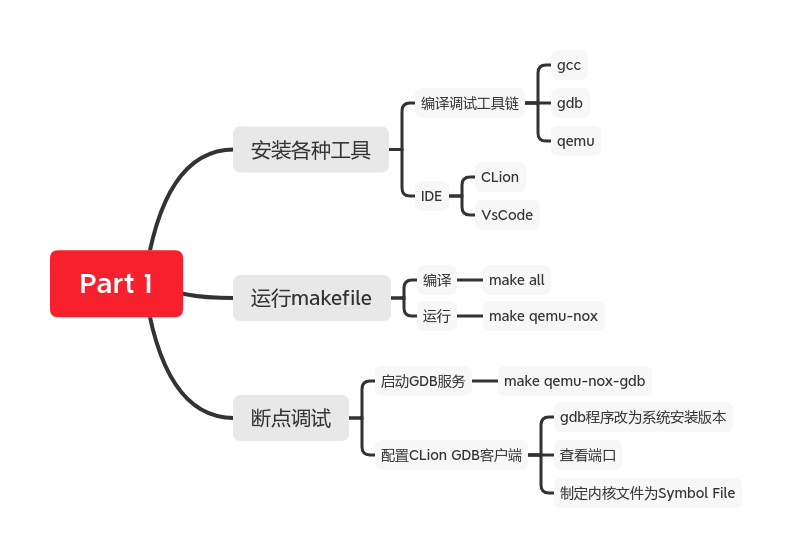

## 环境搭建

第一步自然是`git clone`，官方仓库是https://pdos.csail.mit.edu/6.828/2018/jos.git。每次`Lab`都有一个新的分支，在开始新的`Lab`之前，需要`merge`到新的分支。

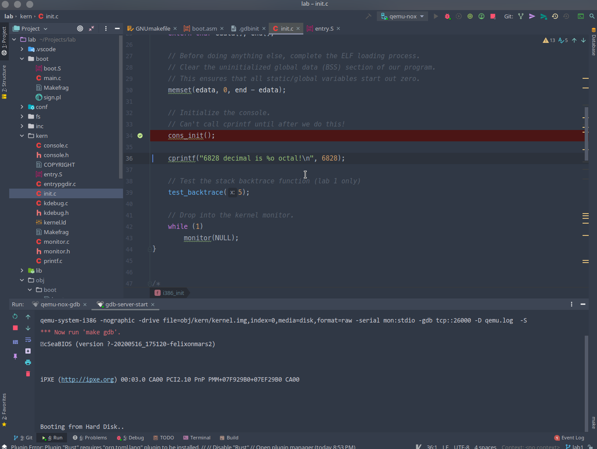

和官方讲义中不同，我没有直接使用命令行中的`GDB`，而是使用了IDE，方便操作。当然，需要的工具还是要安装的。

推荐使用类Unix环境进行开发，有方便的包管理工具，而且和官方环境一致，不太会出现莫名其妙的错误。以下罗列需要的软件，可以直接复制进包管理工具进行安装：

-   `gcc, g++`
-   `gdb, gdbserver`
-   `qemu`

接下来的操作，我使用了IDE，你也可以不使用，直接打命令行给人感觉很大佬。使用IDE还是省事很多。有两款可供选择，`CLion`和`VSCode`。选择哪个也是见仁见智的，我选择了更方便的`CLion`，下面展示配置`CLion`的过程。

首先安装`CLion`支持`makefile`的插件，新版本貌似默认安装了一个内嵌版本，如果没有，在插件市场安装：

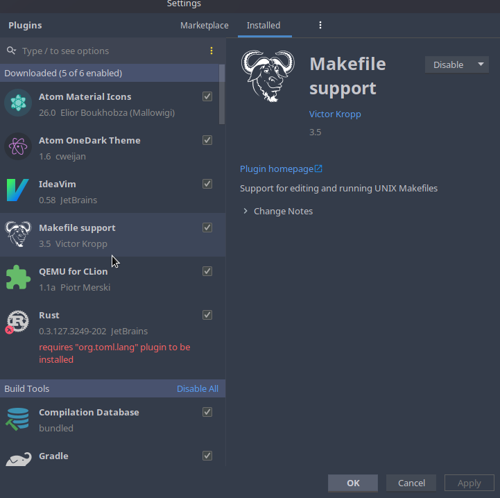

安装完成之后侧边栏有一个`make`菜单，显示了当前目录下所有`makefile`的所有`target`：


按照讲义指引，应先运行`make all`，编译生成内核文件。可以在终端中运行，也可以直接双击侧边栏中的`all`同样可以执行。这时候我们应该得到了一个`obj`目录。里面有一些编译好的文件。

此时直接运行`make qemu-nox`可以启动内核，进入内核的`shell`。此时的`shell`还很原始，只能输入`help`和`kerninfo`两个指令，你可以试着运行看看。

```shell
K> kerninfo
kerninfo
Special kernel symbols:
  _start                  0010000c (phys)
  entry  f010000c (virt)  0010000c (phys)
  etext  f0101a1d (virt)  00101a1d (phys)
  edata  f0112060 (virt)  00112060 (phys)
  end    f01126c0 (virt)  001126c0 (phys)
Kernel executable memory footprint: 74KB
```

至此，大概完成了`HelloWorld`，还不能断点调试，我们接着配置。

## 断点调试内核

手打命令行实在太繁琐，有IDE可以直接打断点看变量值不香吗？

按照讲义指引，启动调试分两步，先通过`qemu`启动一个`gdb`服务端，再用客户端访问。

为了方便，我们创建一个新的`Configuration`：

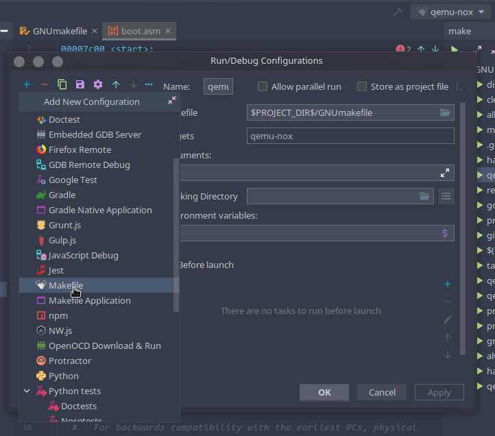

点击图中右上角下拉框，选择`Edit Configurations`，得到这个窗口。点击窗口左上角加号，新建一个`MakeFile`的配置，具体如下：


其中指定了相应`MakeFile`路径，以及要执行的`target`。配置完成之后，在下拉框中选中刚刚配置好的`Configuration`，点击绿色箭头运行：

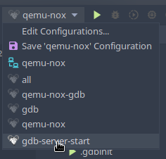

相当于执行了`make qemu-nox-gdb`。输出了一些信息：

```shell
/usr/bin/make -f /home/anarion/Projects/lab/GNUmakefile qemu-nox-gdb
***
***
qemu-system-i386 -nographic -drive file=obj/kern/kernel.img,index=0,media=disk,format=raw -serial mon:stdio -gdb tcp::26000 -D qemu.log  -S
*** Now run 'make gdb'.
```

提示我们运行`make gdb`。如果是在命令行中直接通过`gdb`调试，我们可以直接运行`make gdb`。这里我们暂时不使用讲义中推荐的`make gdb`启动`gdb`客户端的方式，而使用`CLion`自带的`Remote GDB Server`配置，以求简单。之后会展示如何让`CLion`使用`make gdb`所使用的配置文件。我们还需要增加一个`Configuration`，和之前不同的是，这次增加的是`GDB Remote Debug`。

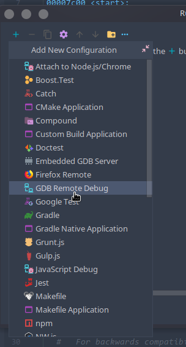

输入相应配置：

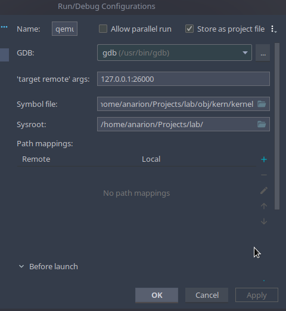

解释一下我的配置，从上到下依次解释：

1.  `GDB`：默认的`gdb`是`CLion`自带的，我把它改成了系统安装的，和`qemu`启动的服务保持一致，将`GDB`选项中的路径填为`/usr/bin/gdb`就好。
2.  `'target remote' args`：指定了调试服务器的IP和端口，IP是localhost自然不用多说，这里的端口要和`qemu`启动的端口一致。`qemu`启动的端口是`makefile`中的一个小算法推演出来的，目的是防止端口被占用。我们打开项目根目录下的`.gdbinit`文件，在22行左右可以看到端口号，我的是26000号端口，你的很可能也是这个。
3.  `Symbol file`：指定了所谓*符号文件*，这个文件应该具有要被调试的程序的所有`symbol`，且知道每个`symbol`对应C语言源文件的位置，才能够实现断点之类的操作。这样的文件没必要再去生成，直接制定为编译生成的内核程序。
4.  剩下的配置没所谓了。

这些配置在使用`make gdb`启动客户端时不会生效，因为`CLion`配置和`gdb`本身的配置是相互独立的（废话）。我们之后展示如何配置使得`make gdb`使用的配置文件生效，同时也可以使用`CLion`进行调试。不管使用哪种方法，都是在创建一个客户端，使用由`qemu`开启在端口`26000`的`gdb`服务。

应用配置之后，试一下断点是否有效。在`kern/init.c`文件中的`i386_init`函数第一行打断点，这是`i386`架构的内核的入口，相当于C常用的`main`函数。先启动之前配置的`makefile`配置，再运行刚刚配置好的`Configuration`。

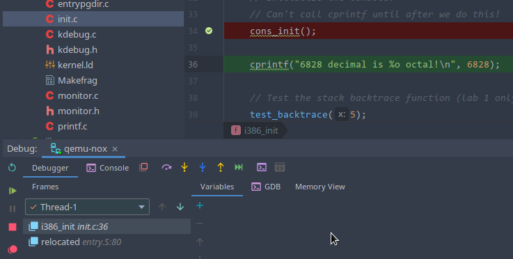

没有问题！

你也可以看看`call stack`中处于当前函数上方的`relocated`函数，这是一个由`x86`汇编定义的函数，点击`call stack`可以跳转到相应汇编代码。

```asm
relocated:
	# Clear the frame pointer register (EBP)
	# so that once we get into debugging C code,
	# stack backtraces will be terminated properly.
	movl	$0x0,%ebp			# nuke frame pointer
	# Set the stack pointer
	movl	$(bootstacktop),%esp
	# now to C code
	call	i386_init

	# Should never get here, but in case we do, just spin.
spin:	jmp	spin

```

可以看到，这个`relocated`函数调用了我们的入口`i386_init`！紧接着是一个叫做`spin`的函数，不断跳向自己，是个死循环。这样一来，当`i386_init`出错返回时，内核进入停滞状态。

到这里，我们完成了Lab讲义中的`Part 1`部分，我们让内核成功启动了！

## 使用配置文件`.gdbinit`和各种细节

在终端中运行`gdb`时，`gdb`查找当前目录下是否有名为`.gdbinit`的文件，若有则自动读取配置，可以简化在终端中写`gdb`参数的操作。在这个项目中，运行`make qemu-nox-gdb`后会自动生成一个。

在此之前，需要放开安全限制，让`gdb`放心地读当前目录下的文件。在当前用户家目录下创建`.gdbinit`文件，配置如下内容：

```shell
set auto-load safe-path /
```

这个配置让`gdb`放心地加载存在于任何目录下的配置文件。此时再运行`gdb`，无论是通过终端还是`CLion`，当前目录下的配置文件都会自动加载。

我们来看看这个`.gdbinit`。通过看`MakeFile`，发现它是由一个模板生成出来的，命令为：

```makefile
.gdbinit: .gdbinit.tmpl
	sed "s/localhost:1234/localhost:$(GDBPORT)/" < $^ > $@
```

就是复制了一份模板文件`.gdbinit.tmpl`，并设置了端口号。知道了`.gdbinit`的来历，我们就可以开始调`CLion`的配置了。

需要注意的是，要修改`.gdbinit`配置文件的最佳办法是修改`.gdbinit.tmpl`模板文件，而不是直接修改`.gdbinit`文件。

改配置的目的是避免配置之间的冲突。`.gdbinit`中的配置可以删除，但`CLion`中的有些配置必须存在，故我们要将这些配置在`CLion`中实现，并且在`.gdbinit`和`.gdbinit.tmpl`中删除这些配置。

具体来说，`target remote`在`CLion`中必须配置，故我们在`.gdbinit`和`.gdbinit.tmpl`中在`22,23`行将相应配置注起来，也就是在行首加一个`#`。后面的`symbol file`和`sysroot`配置可以删掉，在配置文件末尾有`symbol file`的配置，可以根据需要进行修改。至此，我们就改好了`CLion`使用配置文件的配置。

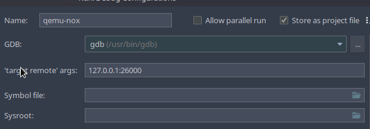

还必须将`CLion`的`gdb`设置为系统安装的`/usr/bin/gdb`，否则不会自动读取家目录`~`下的配置文件，进而无法读取当前目录下的配置文件。除了修改`Configuration`中的`gdb`可执行文件路径，也可以修改默认`toolchains`的`Debugger`。

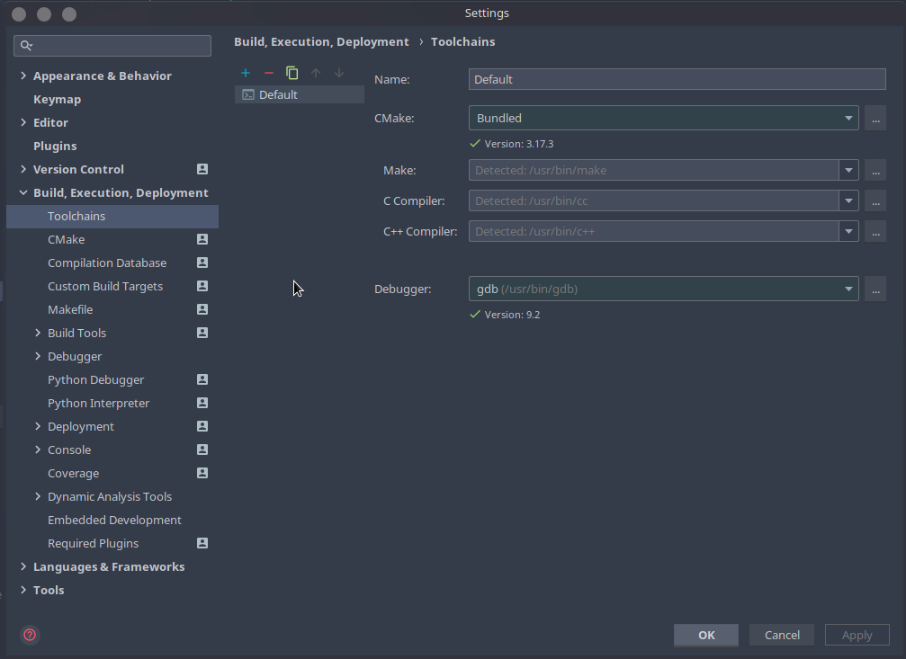

`.gdbinit`中指定的`Symbol File`才能参与调试。**内核**和**引导器**没有编译在同一个文件中，默认情况下，`Symbol File`指定的是**内核**而不是**引导器**。若需要在`boot`目录下的文件中打断点，就必须更改`Symbol File`为**引导器**的编译结果`obj/boot/boot.out`。一个`gdb`配置文件只能设置一个`Symbol File`，后出现的配置会覆盖前出现的配置。我`Google`了设置多个`Symbol File`的方法，尝试之后没有成功，也就没有接着往这方面探索。

至此，我们使用讲义中使用的`.gdbinit`配置文件达到了和原来相同的效果。

# Part 2：引导

第二部分讲引导的过程，也就是*内核如何启动*。

引导分为几个阶段，从ROM中加载`BIOS`、通过`BIOS`初始化IO、`BIOS`跳转到引导器、引导器跳转到内核。可以对照如下思维导图阅读：

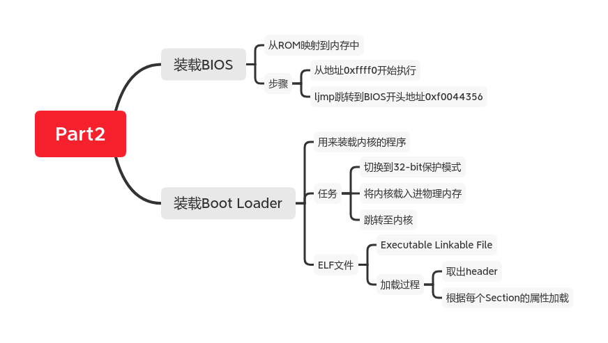

## 从上电到BIOS

要知道处理器是如何启动的，我们就来看看第一个执行的指令是什么。我们在`boot/boot.S`的第一行打断点，并且在`.gdbinit`末尾中将`obj/boot/boot.out`添加为一个`symbol file`。`symbol file`只能有一个，原来的`obj/kern/kernel`被覆盖，从而使上一行配置失效。

启动调试后，`gdb`输出如下信息，可以在`Debug Session`中查看。

```shell
The target architecture is assumed to be i8086
[f000:fff0]    0xffff0:	ljmp   $0x3630,$0xf000e05b
0x0000fff0 in ?? ()
[   0:7c00] => 0x7c00 <start>:	cli    

Breakpoint 4, start () at boot/boot.S:15
15	  cli                         # Disable interrupts
```

第一个执行的指令是`ljmp `，地址在`0xffff0`，写成`(CS:IP)`形式就是`[f000:fff0]`。我们可以得到如下信息：

-   计算机启动后从`0xffff0`开始执行指令，也就是`CS=0xf000,IP=0xfff0`。
-   第一个执行的指令是一个跳转，跳转至`CS=0x3630,IP=0xf000e05b`，也就是`0xF0044356`。

这里还要介绍一下`(CS:IP)`和物理内存地址相互转化的规定，在所谓真实模式`real mode`下，换算的规则是：

```c
phy_addr = 16 * segment + offset = 16 * CS + IP
```

物理内存的`0xf0000-0x100000`这一段是所谓`BIOS`映射的，对这一段的读取就是在读取`BIOS`。物理内存地址并不是全都被内存芯片所包含，一些设备可以通过操作一些物理地址进而进行操作。如`BIOS`就是被映射到一段已知的地址上去了。

所谓`BIOS`就是`Basic IO Setup`，是引导内核不可或缺的一部分。CPU启动后`Program Counter`所在的地址`0xffff0`和`BIOS`映射区的顶部`0x100000`只差`16`,16个字节并不能做什么，也就需要`ljmp`一下，跳转到`BIOS`的开头开始执行。`BIOS`把处理器所能够触及的设备都初始化了一遍，完成之后从存储设备中加载**内核引导器**，也就是我们接下来看的。

现在的电脑可以通过其他的方式引导，而不一定使用`BIOS`，故`BIOS`在很多地方写作`BIOS Legacy`。

## 内核引导器Boot Loader

曾经的存储设备容量较小，软盘(Floppy)或磁盘(Magnetic Disk)被划分为多个512字节的区块(sector)，每次读写一定同时操作一整个区块。这样的设备常用BIOS引导内核，而今天的硬盘划分的区块更大，内存更大，每次操作的粒度也没有限制，所以采用的引导方式有所不同。6.828所使用的引导方式，依旧是BIOS，以求简单。

`BIOS`初始化IO完成之后，查看各个存储设备，包括软盘、磁盘、SSD，以及USB连接的各种设备，找到*可以引导*的 (Bootable) 设备，将这个设备的第一个区块`sector`读取进入内存，并开始执行读取进来的内容。

在本项目中，`BIOS`读进来的是**内核引导器**，而不是内核本身。`BIOS`引导了内核引导器，内核引导器再引导内核。如果要使用`BIOS`，就必须将内核引导器放置在设备的第一个`sector`中，这样`BIOS`才能够找到。我们的项目中，内核引导器是两个文件，一个是汇编代码`boot/boot.S`，一个是C文件`boot/main.c`。它一共做了两件事情：

1.  让CPU进入保护模式`protected mode`。正如之前所说，CPU启动时处于真实模式`real mode`，这样可以很方便地运行`BIOS`。要使用所有的硬件功能，还是要切换到`protected mode`才可以。
2.  将内核读进内存。内核存在于硬盘上的某个位置，引导器一定知道内核在哪里、有多大，并且将内核读取进入内存中，然后开始执行内核。这也是`ELF`文件的加载。

将`obj/boot/boot.out`设置为`gdb`的`symbol file`，在`boot/boot.S`中设置断点，就可以调试这个引导程序。文件`obj/boot/boot.asm`是这个引导器的反汇编代码，可以对照着汇编代码和C语言代码一起阅读，更加方便。

## 讲义里的练习

Lab讲义中的练习让我们尝试通过断点走一遍整个`Boot Loader`流程，走完应该可以回答以下问题：

-   CPU从什么时候开始执行32-bit的代码？是什么导致了从16-bit到32-bit的切换？
-   内核引导器最后执行和最先执行的指令是什么？干了什么事情？
-   内核的第一个指令的地址是什么？
-   内核引导器如何知道应该将多大的磁盘空间拷贝进内存？这个信息存放在哪里？

以下依次回答。

### 切换到32bit

这个问题很好回答，看看源代码，注释都已经标注好了。文件`boot/boot.S`开头的注释的第一行，说明了这个文件的作用。也就是切换至32-bit保护模式，并跳转到C代码。

第10行`.set CR0_PE_ON 0x1`说明CPU进入保护模式，第57行后进入32-bit模式。

这里要注意的是，`.`开头的汇编指令并不是真实的指令，而是写给编译器`Assembler`的指令，告诉`Assembler`一些信息。如`.set CR0_PE_ON 0x1`就是一个给编译器定义的变量，也就是“宏变量”`Macro`，在之后55行处通过`$`取得`PROT_MODE_CSEG`的值，但是CPU执行指令时只把这里当做`0x8`。

这样看来，57行也不是对CPU的指令，而是对编译器的，告诉编译器从这里开始要产生32-bit模式的机器码。刚好在这之前，也就是在函数`protcseg`执行之前，CPU进入了32-bit模式。也就是说，55行的`ljmp`指令就是让CPU进入保护模式的指令！如果你不理解这个切换的机制，可以通过以上推理知道这确实是这样的。

查看反汇编代码`obj/boot/boot.asm`77行，可以看到，`ljmp`指令被转化成了两个指令，第二个指令计算了一个加法，把结果存在寄存器`bh`中。可以推测，是第一个指令让CPU进入了32-bit模式。

更具体的讲解请看[PC Assembly Language](https://pdos.csail.mit.edu/6.828/2018/readings/pcasm-book.pdf)。

### 引导器最后的指令和内核的第一个指令

打好断点，一直向前，就可以来到引导器的最后一个指令。

我们来到`boot/main.c`中`bootmain`函数的最后一行代码：

```c
((void (*)(void)) (ELFHDR->e_entry))();
```

这里将一个变量转化为函数指针，并调用这个函数。也就是令程序跳转到相应地址。看反汇编代码307行，程序跳转到地址`*0x10018`。

```asm
((void (*)(void)) (ELFHDR->e_entry))();
7d71:	ff 15 18 00 01 00    	call   *0x10018
```

我们可以猜测，这一定是内核的入口。要注意的是，这个`call`跳转的不是`0x10018`而是`*0x10018`。从地址`0x10018`中读取出跳转地址。真正的跳转地址在运行时决定，我们在`bootmain`函数最后一行打断点，并监听`ELFHDR`的值，可以看到`ELFHDR->e_entry`的值为`1048588`。转化为十六进制，就是`0x10000c`。

查看反汇编代码`obj/kern/kernel.asm`，可以看到，19行显示，内核第一个指令的地址是`0xf010000c`，而C代码中函数跳转是到`0x10000c`。

这个区别**虚拟地址**和**物理地址**的不同导致的。**虚拟地址**为`ELF`文件在产生时，连接器给函数绑定的地址。连接器也给这个`ELF`文件中其他很多变量绑定了地址，这些地址都是**虚拟地址**，整个由`ELF`文件定义的程序生活在**虚拟地址**的世界中。将文件加载进内存并开始执行后，处理器最终依据**物理地址**执行，若从**虚拟地址**到**物理地址**的映射不正确，加载的程序就不能正确执行。关于如何建立这样的**地址映射**，以后的`Lab`再关心。`Lab1`已经完成了这样的映射，内核若能正确加载，就能够正确执行。

### 装载内核和内核大小

`bootmain`函数的主要功能是将内核从硬盘读取进内存，这是由函数`readseg`实现的，具体可以给`bootmain`函数打断点，调试看看。

```c
void
readseg(uint32_t pa, uint32_t count, uint32_t offset)
```

函数从硬盘`offset`指定的位置开始，读取`count`字节的数据，到内存中`pa`位置。在`bootmain`中调用形式为`readseg((uint32_t) ELFHDR, SECTSIZE*8, 0)`，可见是从硬盘的最开头读取了8个`SECTSIZE`这么多的内容到内存中制定位置`ELFHDR`。其中，`ELFHDR`指定为`0x10000`，是内核的开头，正如反汇编文件`obj/kern/kernel.asm`的第一个指令换算前的地址正是`0x10000`。读取了8个区块，区块大小`SECTSIZE`指定为512，则总大小为`8 * 512 = 4096`，这是一个`page`的大小。

读取进来的是一个**镜像**，也就是`ELF`文件的部分内容。之所以是**部分**，是因为我们还不知道整个内核的大小，但是这里读取进来的信息至少包含了**文件头**，真正的读取还要根据文件头中包含的信息执行。

这就是接下来的操作。

## 内核结构和装载

编译后内核文件是`ELF`格式的，可以使用`objdump`查看结构。可以说，加载内核的过程就是一种加载`elf`文件的过程。

```bash
# objdump -h obj/kern/kernel                                  

obj/kern/kernel:     file format elf32-i386

Sections:
Idx Name          Size      VMA       LMA       File off  Algn
  0 .text         00001a1d  f0100000  00100000  00001000  2**4
                  CONTENTS, ALLOC, LOAD, READONLY, CODEzhong
  1 .rodata       000006bc  f0101a20  00101a20  00002a20  2**5
                  CONTENTS, ALLOC, LOAD, READONLY, DATA
  2 .stab         0000375d  f01020dc  001020dc  000030dc  2**2
                  CONTENTS, ALLOC, LOAD, READONLY, DATA
  3 .stabstr      00001529  f0105839  00105839  00006839  2**0
                  CONTENTS, ALLOC, LOAD, READONLY, DATAr
  4 .data         00009300  f0107000  00107000  00008000  2**12
                  CONTENTS, ALLOC, LOAD, DATA
  5 .got          00000008  f0110300  00110300  00011300  2**2
                  CONTENTS, ALLOC, LOAD, DATA
  6 .got.plt      0000000c  f0110308  00110308  00011308  2**2
                  CONTENTS, ALLOC, LOAD, DATA
  7 .data.rel.local 00001000  f0111000  00111000  00012000  2**12
                  CONTENTS, ALLOC, LOAD, DATA
  8 .data.rel.ro.local 00000044  f0112000  00112000  00013000  2**2
                  CONTENTS, ALLOC, LOAD, DATA
  9 .bss          00000661  f0112060  00112060  00013060  2**5
                  CONTENTS, ALLOC, LOAD, DATA
 10 .comment      00000012  00000000  00000000  000136c1  2**0
                  CONTENTS, READONLY
```

可以看到，`.text`区的`VMA`是`0xf0100000`，也就是内核反汇编文件`obj/kern/kernel.asm`中显示的第一个指令的地址，之前出现过多次了。`VMA`就是`Virtual Memory Address`，并不是真正载入内存的地址。真正载入内存的地址是`LMA`，也就是`Load Memory Address`，是`0x100000`，也就是引导器载入内存的位置。这就是为什么引导器最后跳转到`0x100000`，而不是反汇编代码中的`0xf0100000`。这解释了之前可能存在的疑惑。

至于为什么要这样映射，是要避免地址过大的情况。有些机器并没有`0xf0100000`这个地址，因为没有这么大的内存设备。虚拟内存将内核的这段空间映射到`BIOS`内存上方的空间中，使得内存很小的机器也可以装载内核。

我们知道了，`.text`这个`segment`应该被加载到内存中`0x100000`的位置，长度为`0x1a1d`，也就是`6685`，末尾地址应为`0x100000 + 0x1a1d = 0x101a1d`。

以上显示的信息存在`ELF`文件头中，将`ELF`镜像的开头作为一个结构体，就可以读取相应的属性，正如`ELFHDR`。

我们再对照着引导器的结构看看：

```bash
# objdump -h obj/boot/boot.out

obj/boot/boot.out:     file format elf32-i386

Sections:
Idx Name          Size      VMA       LMA       File off  Algn
  0 .text         0000018c  00007c00  00007c00  00000074  2**2
                  CONTENTS, ALLOC, LOAD, CODEwei
  1 .eh_frame     0000009c  00007d8c  00007d8c  00000200  2**2
                  CONTENTS, ALLOC, LOAD, READONLY, DATA
  2 .stab         00000684  00000000  00000000  0000029c  2**2
                  CONTENTS, READONLY, DEBUGGING
  3 .stabstr      0000043f  00000000  00000000  00000920  2**0
                  CONTENTS, READONLY, DEBUGGING
  4 .comment      00000012  00000000  00000000  00000d5f  2**0
                  CONTENTS, READONLY
```

`VMA`和`LMA`的值是相同的，引导器的地址不需要换算，编译产生的地址和加载到内存中的地址相同。这使得硬件可以直接执行这个文件，不需要额外的换算。

我们还可以看看内核的文件头：

```bash
# objdump -x obj/kern/kernel                                   

obj/kern/kernel:     file format elf32-i386
obj/kern/kernel
architecture: i386, flags 0x00000112:
EXEC_P, HAS_SYMS, D_PAGED
start address 0x0010000c

Program Header:
    LOAD off    0x00001000 vaddr 0xf0100000 paddr 0x00100000 align 2**12
         filesz 0x00006d62 memsz 0x00006d62 flags r-x
    LOAD off    0x00008000 vaddr 0xf0107000 paddr 0x00107000 align 2**12
         filesz 0x0000b6c1 memsz 0x0000b6c1 flags rw-
   STACK off    0x00000000 vaddr 0x00000000 paddr 0x00000000 align 2**4
         filesz 0x00000000 memsz 0x00000000 flags rwx
```

得到了`Program Header`文件头，上面省略了余下的一些输出内容。每个`LOAD`都是一个`ELF`对象，里面包含了相对本文件的索引`off`、虚拟内址`vaddr`、物理地址`paddr`、对齐`align`、对象在文件和内存中的大小`filesz, memsz`。

这个`header`在`bootmain`函数中通过`readseg`函数加载到了内存中，位置在`0x10000`，并通过一个宏`ELFHDR`索引。`header`中存放的数据采用的是默认的对齐方式，所以可以直接通过一个`struct Elf`指针访问各个属性。

在文件头`struct Elf`中，我们拿到了关于结构体`struct Proghdr`数组的信息`e_phoff`。从这个数组的成员中，我们拿到了关于每个`segment`的信息，也就可以把它们正式从硬盘中拷贝到内存中的指定位置。

第一个`segment`对象的地址存放在`ELFHDR->e_phoff`中，是从硬盘中读入的原始数据。转化为指针如下：

```c
ph = (struct Proghdr *) ((uint8_t *) ELFHDR + ELFHDR->e_phoff);
```

也就是加上了一个偏置。同样利用`elf`文件的数据，查出这个“对象数组”的长度，也就可以遍历这个`Proghdr`数组了：

```c
for (; ph < eph; ph++)
    readseg(ph->p_pa, ph->p_memsz, ph->p_offset);
```

`ph`是个`struct Proghdr`类型的指针，直接`++`让地址的值前进相应地址长度，非常方便。

至此，内核完全加载完毕。

# Part 3：再看看内核

本文已经太长，新开一篇文章继续写`Part 3`。

写完`Part 3`发现新开一篇文章十分明智，`Part 3`篇幅直逼本文。链接如下：https://zhuanlan.zhihu.com/p/168787600

