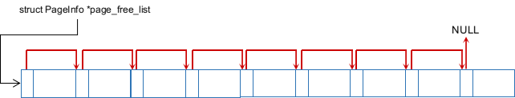

# MIT 6.828：实现操作系统 | Lab 2 Part 1：内核内存管理

本文为本人学习6.828的Lab笔记，对应`Lab2 Part1`的内容，接续上一篇笔记：

如果你没有阅读上一篇，请务必阅读后再开始本文阅读。其它Lab笔记在专栏持续更新：

[MIT 6.828 实现操作系统](https://zhuanlan.zhihu.com/c_1273723917820215296)

本文md文档源码链接：[AnBlogs](https://github.com/Anarion-zuo/AnBlogs/blob/master/6.828/lab2-part1.md)

这个`part`的主要内容是初始化内核的内存分配器，下一个`part`关注虚拟内存映射等等方面的内容。如果你对内核分配器不感兴趣，可以直接跳过本文，阅读下一篇对应`Part 2`的内容。

相比Lab1，这个Lab难度更大，更加复杂，也是所有Lab中的基础，课程安排中给这个Lab安排了两周的时间。故我用3篇文章写这个Lab，分别对应`Part 1, 2, 3`，以求清晰有条理。本文对应`Part 1`，处理内核的物理内存映射。

Lab 2讲义：https://pdos.csail.mit.edu/6.828/2018/labs/lab2/

在开始之前，按照讲义中要求，通过`git`拿到这个Lab的代码资源。在将`Lab1`中代码`commit`之后，依次执行以下代码：

```shell
% git pull
% git checkout -b lab2 origin/lab2
% git merge lab1
```

其中，最后一步可能需要手动调整文件，解决冲突。若`IDE`配置有关的文件有冲突，务必解决，否则`IDE`部分功能受到影响。

如果取得代码操作正确，应该多了这些文件：

```shell
inc/memlayout.h
kern/pmap.c
kern/pmap.h
kern/kclock.h
kern/kclock.c
```

那么我们开始吧。

# 回顾：内核内存映射

在`Lab 1`中，我们做了一个虚拟内存映射，将`0xf0000000-0xf0400000`映射到物理地址`0x00000000-00400000`，总共大小为`4MB`。如果访问任何超出这个范围的虚拟地址，`CPU`都会出错。

在之后写代码时，代码中的地址都是虚拟地址，翻译成物理地址的过程是硬件实现的，我们不应该想着如何直接操作物理地址。但是，有时将地址转化物理地址可以方便一些操作，在文件`inc/memlayout.h`和`kern/pmap.h`中提供了一些宏和函数，方便我们做这样的地址换算。

首先提供了宏`KERNBASE`，注释说所有物理地址都被映射到这里，值为`0xf0000000`，正是我们映射的地址。所谓所有，就是已经映射过的地址，不包括还没映射的地址。

宏函数`KADDR`调用了函数`_kaddr`，将物理地址转化成内核地址，或称虚拟地址，也就是在物理地址的数值上加上了`KERNBAE`。此时的“所有”物理地址，范围还很小，因为其它的内存映射还没有建立，故可以这样简单地操作。其它内存映射建立之后，物理地址转化为虚拟地址的过程将很复杂。

相应的反向过程将虚拟地址转化为物理地址，宏函数`PADDR`做了这样的事情。也就是在输入的虚拟地址上减去`KERNBASE`，非常简单。

# Part 1任务总览

`Lab 2 Part 1`让我们完成内核内存初始化，而用户区`User Level`内存初始化在后面的`part`中完成。

初始化操作集中在文件`kern/pmap.c`的函数`mem_init`中，在内核初始化函数`i386_init`中调用。在这个`part`中，我们开始写这个函数以及它将调用的函数，只需要写到`check_page_alloc`函数的调用之前即可。`check_page_alloc`这一行之上进行的操作汇总如下。

1.  直接调用硬件查看可以使用的内存大小，也就是函数`i386_detect_memory`。
2.  创建一个内核初始化时的`page`目录，并设置权限。
3.  创建用于管理`page`的数组，初始化`page`分配器组件。
4.  测试`page`分配器组件。

需要我们写的函数有：

1.  `boot_alloc`，`page`未初始化时的分配器。
2.  `page_init, page_alloc, page_free`，`page`分配器组件。
3.  `mem_init`，总的内存初始化函数。

分配器的运行过程十分简单，但是初始化十分困难。因为讲义中没有统一的材料清晰说明内核内存布局设计，需要我们通过代码探索。后文中的内存布局部分，就是我探索的结果。写出来十分简短，但是探索的过程非常困难。建议你先自己看看代码，揣摩内核的内存分布，再来看看我的结果，体会这个过程也很重要。

# 两个内存分配器

`Part 1`中只要求我们完善内核使用的分配器，而暂时不考虑用户内存分配。内核初始化完成后，使用的分配器为`page`分配器。

在`page`分配器初始化完成之前，内核在初始化的过程中使用`boot_alloc`函数分配内存，也可称为`boot`分配器。这个分配器非常原始，在`page`分配器初始化完成后，务必不可调用`boot_alloc`分配内存，以免出现莫名其妙的错误。

以下只大概介绍分配器的简单实现思想和使用，`page`分配器的初始化需要考虑很多，在后面单独介绍。

## `page`分配器

这里要管理的内存，是虚拟地址`0xf0000000-0xf0400000`对应的内存，总共只有`4MB`，称为内核区块`Kernel Page`。由于不涉及真正的`page table`操作，故这里的`page`代表“一块固定长度的内存”，而不是操作系统领域经常说的页`page`。

将这`4MB`的内存分成相同长度的区块，可以让我们很方便地管理内存。这样做的具体原因可以参考各大操作系统教科书，这里只讲实现了。

内存管理组件维护一个链表，称为`free list`，这个链表将所有未分配的`page`连起来。需要分配内存时，将链表头部对应的`page`返回，并将链表头部更新为链表中的下一个元素。

在`inc/memlayout.h`中定义了这样的结构体：

```c
struct PageInfo {
	// Next page on the free list.
	struct PageInfo *pp_link;

	uint16_t pp_ref;
};
```

其中的指针`pp_link`就是链表中常用的`next`指针。

要了解此类内存管理的方法，可以看侯捷老师的课程：[C++内存管理](https://www.bilibili.com/video/BV1Kb411B7N8)

创建一个`PageInfo`数组，用一个`pages`指针接受，数组中每个元素都对应一个`page`。`pages`指针是数组的开头，在`mem_init`函数中，使用另一个分配器`boot_alloc`初始化。长度为`npages`，是当前内存配置下，CPU可以使用的`page`数量。`npages`在函数`i386_detect_memory`中初始化，在后面更详细描述。

初始化函数`page_init`将所有的`pp_link`初始化指向与自己相邻的`PageInfo`，如下：



这样初始化的操作是在`kern/pmap.c`中完成的，具体的过程后文讲解。大概来说，初始化就是拉了这样一个链表，并且将指针`page_free_list`指向链表的开头。分配内存时，若读取`page_free_list`指针得到`NULL`，则说明分配器已经给完了它能够管理的内存，再也给不出来了。

分配器组件的函数都是在操作`PageInfo`指针，也就是`pages`数组中的元素，而不是直接操作每个`page`的地址。如分配函数`page_alloc`返回的是一个`PageInfo`，释放`page`的函数`page_free`接受的也是一个`PageInfo`指针。

`PageInfo`指针可以很容易地转化为真正`page`对应的地址。我们将地址`0xf0000000-0xf0400000`均匀划分成一个个`page`，每个`page`长度为`4096Bytes`。只要给定想要的`page`的索引，也就是指定要第几个`page`，我们就可以计算得到这个`page`开头的地址。这个索引，可以用简单的指针减法得到`pp - pages`。

在文件`kern/pmap.h`中，已经写好了一个函数`page2kva`，接受一个`PageInfo`指针，返回得到相应`page`的虚拟地址。我们可以直接使用这个函数进行换算，方法和上面讲的完全相同。

内核的其他代码通过函数`page_alloc`从`free list`取出一个`page`，返回当前`page_free_list`指针，并零`page_free_list`指针指向原链表中的下一个元素。

讲义中要求我们实现文件`kern/pmap.c`中的函数`page_alloc`，如下：

```c
struct PageInfo *
page_alloc(int alloc_flags)
{
	// Fill this function in
	// Here begins my code

	// out of memory
	if (page_free_list == NULL) {
	    // no changes made so far of course
	    return NULL;
	}
	struct PageInfo *target = page_free_list;
	page_free_list = page_free_list->pp_link;     // update free list pointer
    target->pp_link = NULL;                       // set to NULL according to notes
	char *space_head = page2kva(target);          // extract kernel virtual memory
	if (alloc_flags & ALLOC_ZERO) {
        // zero the page according to flags
        memset(space_head, 0, PGSIZE);
	}

	return target;
}
```

要“释放”一个`page`，也就是将这个`page`放回链表。将`page_free_list`指针指向这个`PageInfo`结构体，并设置这个结构体的`pp_link`为之前的`page_free_list`指针。放回链表的这个`page`也就变成了`free list`的开头。

讲义中要求我们实现文件`kern/pmap.c`中的函数`page_free`，如下：

```c
void
page_free(struct PageInfo *pp)
{
	// Fill this function in
	// Hint: You may want to panic if pp->pp_ref is nonzero or
	// pp->pp_link is not NULL.
	if (pp->pp_ref != 0 || pp->pp_link != NULL) {
	    panic("Page double free or freeing a referenced page...\n");
	}
	pp->pp_link = page_free_list;
	page_free_list = pp;
}
```

## 前`page`分配器`boot_alloc`

`page`分配组件完成初始化之前，使用`boot_alloc`函数分配内存，`pages`数组就是这个函数分配的。

`boot_alloc`也算不上分配器。函数接受一个参数，代表要多少字节内存。函数将这个字节数上调到`page`大小的边界，也就是调整为离这个字节数最近的4096的整数倍，以求每次分配都是以`page`为单位的。

实现非常简单，如下：

```c
static void *
boot_alloc(uint32_t n)
{
	static char *nextfree;	// virtual address of next byte of free memory
	char *result;

	if (!nextfree) {
		extern char end[];
		nextfree = ROUNDUP((char *) end, PGSIZE);
		cprintf("end:  0x%lx\n", end);
	}

	// special case according to notes
	if (n == 0) {
	    return nextfree;
	}

	// note before update
	result = nextfree;
	nextfree = ROUNDUP(n, PGSIZE) + nextfree;

	// out of memory panic
	if (nextfree > (char *)0xf0400000) {
	    panic("boot_alloc out of memory, nothing changed, returning NULL...\n");
	    nextfree = result;    // reset static data
	    return NULL;
	}

	return result;
}
```

第一次调用这个函数时，必须初始化`nextfree`指针。这个初始化也很简单，确定了内核本身在内存中的位置后，让`boot_alloc`函数在内核所占空间的内存之后的第一个`page`开始分配。表现为代码，就是从连接器中拿到内核的最后一个字节的地址`end`，将这个指针的数值上调到4096的整数倍。

这个`end`指针是连接器产生的，可以看连接配置文件`kern/kernel.ld`的53行左右，`end`指向内核的最后一个字节的下一个字节。

# 内核内存布局和分配器初始化

这里正式讲解`page`分配器的初始化，也就是`page_init`函数的实现，正确初始化之后的分配器才可以正确使用`page_alloc, page_free`等函数。要知道分配器如何初始化，就要理解内核内存的布局`Layout`。

## 获得物理内存信息

在初始化内存组件的函数`mem_init`中，首先调用了函数`i386_detect_memory`获得了内存硬件信息。追踪一下这个函数的调用，底层实现在`kern/kclock.c`中，通过一系列汇编指令向硬件要信息。汇编指令如何执行的，我们暂且不关心。

最终得到的内存信息是两个整数`npages, npages_basemem`，分别代表现有内存的`page`个数，以及在“拓展内存”之前的`page`个数。什么是拓展内存，接下来介绍。

## 内存布局

你最好先自己通过代码探索一下内存布局的设计，而不是直接来看我的结果。看代码固然很繁琐，我在这里花了非常多时间才完全搞明白，但是有锻炼才有提升，这也是我们写操作系统的目的。

如果你已经自己操作过、思考过了，那么请看我的结果。

在文件`kern/memlayout.h`中，有一个虚拟内存的布局示意图，这个示意图主要描绘用户区内存分配，而不是这里关心的内核区内存分配，故我们暂时不细看它。地址`0xf0000000`以上的区域，也就是我们现在已经映射的区域，是我们关心的区域。宏`KERNBASE`就是`0xf0000000`，同时这个地址也是内核栈的开端。以下为了讲述方便，所有地址都是物理内存。

模仿这个布局示意图，我画了一个从`KERNBASE`开始的内存布局图，下面的描述可以对照着这个图阅读。

```c
/*
 * Kernel Page Map:
 *                     .                              .
 *                     .       Managable Space        .
 *                     .                              .
pages ends 0x158000 -->+------------------------------+
 *                     |                              |
 *                     .                              .
 *                     .   pages management array     .
 *                     .                              .
 *                     |                              |
 *  pages 0x118000 ->  +------------------------------+
 *                     |        Kernel is here        |
 *    EXT 0x100000 ->  +------------------------------+
 *                     |                              |
 *                     |          IO Hole             |
 *                     |                              |
 * BASEMEM 0xa0000 ->  +------------------------------+
 *                     |    Basic Managable Space     |
 *    KERNBASE ----->  +------------------------------+
 */
```

我们从`KERNBASE`开始想起。回顾`Lab 1`我们知道，内存`0xf0000-0x100000`是`BIOS`映射区，在这之前又是`ROM`映射区，这段空间不能使用，不能被分配器分配出去。查看讲义，我们知道，地址`0xa0000-0x100000`是`ROM, BIOS`等`IO`使用的内存，不可以被分配，初始化时应排除这部分空间。在文件`inc/memlayout.h`中，宏`IOPHYSMEM`定义了这段`IO`段内存的开头。

在`IOPHYSMEM`之前还有一些内存没有分配，这部分内存是可以使用的。函数`i386_detect_memory`得到的`npages_basemem`就是这一段的长度，初始化`page`分配器时应该包含这一段。可以验证一下，`npages_basemem`的值为160，这么多个`page`总的大小为`160 * 4096 = 655360 = 0xa0000`，确实是`IOPHYSMEM`！

从`0x100000`开始以上的内存就是内核，可以回顾`Lab 1`中探索内核结构的结果，内核的`.text`区的虚拟地址为`0xf0100000`，物理地址正是`0x100000`。文件`inc/memlayout.h`中定义的宏`EXTPHYSMEM`就是`0x100000`，意思是`BIOS`以上的内存，称为“拓展区”，其上限由RAM硬件大小决定。

如果你不记得内核的装载方式，可以使用指令`objdump -h obj/kern/kernel`查看。

```shell
% obj/kern/kernel:     file format elf32-i386

Sections:
Idx Name          Size      VMA       LMA       File off  Algn
  0 .text         00002a4d  f0100000  00100000  00001000  2**4
                  CONTENTS, ALLOC, LOAD, READONLY, CODE
  1 .rodata       00000bd0  f0102a60  00102a60  00003a60  2**5
                  CONTENTS, ALLOC, LOAD, READONLY, DATA
  2 .stab         000050d1  f0103630  00103630  00004630  2**2
                  CONTENTS, ALLOC, LOAD, READONLY, DATA
  3 .stabstr      00001bc3  f0108701  00108701  00009701  2**0
                  CONTENTS, ALLOC, LOAD, READONLY, DATA
  4 .data         00009300  f010b000  0010b000  0000c000  2**12
                  CONTENTS, ALLOC, LOAD, DATA
  5 .got          00000008  f0114300  00114300  00015300  2**2
                  CONTENTS, ALLOC, LOAD, DATA
  6 .got.plt      0000000c  f0114308  00114308  00015308  2**2
                  CONTENTS, ALLOC, LOAD, DATA
  7 .data.rel.local 00001000  f0115000  00115000  00016000  2**12
                  CONTENTS, ALLOC, LOAD, DATA
  8 .data.rel.ro.local 00000060  f0116000  00116000  00017000  2**5
                  CONTENTS, ALLOC, LOAD, DATA
  9 .bss          00000681  f0116060  00116060  00017060  2**5
                  CONTENTS, ALLOC, LOAD, DATA
 10 .comment      00000012  00000000  00000000  000176e1  2**0
                  CONTENTS, READONLY
```

内核占用了拓展区的开头，之后在初始化分配器时调用了几次`boot_alloc`，同样占用了一些拓展区，这些空间都不应该被分配器管辖！分配器应该管辖最后一次调用`boot_alloc`分配的空间之后的空间，这个空间开头的地址可以直接通过`boot_alloc(0)`得到。

剩余的内存可以自由使用，分配器初始化是应该把链表拉到剩余的空间去。

## 分配器初始化

初始化就是拉链表，并注意排除不应该纳入分配器管辖的空间。总结上面对内存布局的研究，纳入分配器管辖的总共有两部分，分别是`basemem`部分，也就是`0x0-0xa0000`，和`boot_alloc`最后分配的空间的后面的部分，或者叫做即将分配的空间。

`boot_alloc`即将分配的空间可以给函数传0直接得到，这是函数的特殊处理。由于`boot_alloc`以`page`为单位分配，这样得到的地址是一个`page`的首地址，这个`page`的索引可以轻易获得：

```c
i = PADDR(boot_alloc(0)) / PGSIZE;
```

最后分配得到的应该如下图所示，其中`basemem`部分省略了指针指向。


完整实现如下：

```c
void
page_init(void)
{
	// Don't mark reference count!
	pages[0].pp_ref = 0;
    pages[0].pp_link = NULL;
    page_free_list = &pages[0];
    // base memory
    size_t i = 1;
    for (; i < npages_basemem; i++) {
		pages[i].pp_ref = 0;  // Don't mark reference count!
		// connect the previous page
		pages[i].pp_link = page_free_list;
		page_free_list = &pages[i];
	}
    
	// extended pages after kernel
	i = PADDR(boot_alloc(0)) / PGSIZE;
	for (; i < npages; ++i) {
        pages[i].pp_ref = 0;  // Don't mark reference count!
        // connect the previous page
        pages[i].pp_link = page_free_list;
        page_free_list = &pages[i];
	}
	// the 0-indexed page must exists
	if (npages > 0) {
	    // first page marked used
	    pages[1].pp_link = NULL;
	}
}
```

到这里就完成了`Part 1`。