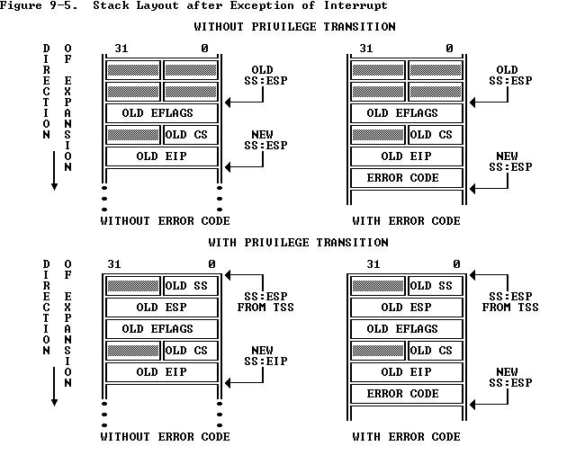

#! https://zhuanlan.zhihu.com/p/194501828
# MIT 6.828：实现操作系统 | Lab 3A：为进程加载ELF文件

本文为本人实现`6.828 Lab`的笔记，接续上一篇：

https://zhuanlan.zhihu.com/p/192886969

`Lab`其他部分在专栏不定期更新，环境搭建请看第一篇：

https://zhuanlan.zhihu.com/p/166413604

本文对应内容为实现`Lab 3A Exercise 2`的内容，主要和`ELF`文件的加载有关。要实现本文有关的`Exercise`，前提是已经能够正确使用内存管理组件，所以前面的`Lab`务必完成。可以想象，要是上了这门课，而没有完全跟上，落了一点点，都是不可能从后面乱入的。

如果你还没有完成`Lab 3A`之前的`Lab`，包括这个`Exercise 2`的`env_setup_vm`函数，请务必完成。鉴于本文涉及的内容没有直接的测试函数，我也没有自己进行任何形式的测试，故本文可能有错误。但`Lab`后续内容会很快验证本文的正确性，若发现错误将第一时间前来更正。

【更新】果然有错误，错误还不小，主要在**加载ELF**这个标题下，已经更改为正确版本。当然，不排除将来还会有改动。测试是多么重要。

本文md文档源码链接：[AnBlogs](https://github.com/Anarion-zuo/AnBlogs/blob/master/6.828/lab2-3A-elf.md)

# 任务总览

这个`Exercise`要求实现几个函数，目的是完成**创建进程**的前期工作，也就是加载**可执行文件**，并准备好用户地址空间。进程由一个结构体`struct Env`描述，具体在文件`inc/env.h`中。

我们没有加载真的可执行文件，因为还没有文件系统。这个`Lab`使用的`ELF`文件是通过连接器嵌入到内核这个**可执行文件**中的。`ELF`文件有多个`ProgHdr`，对应多个区块，每个区块都有指定好的虚拟地址和长度，我们只需要从`ELF`中读取出这些信息，把数据拷贝到相应位置就可以。

有内存空间才能执行指令，在拷贝`ELF`文件中的各个部分到指定位置之前，需要通过已有的分配器给进程足够多的`page`，用于存放`ELF`文件镜像。光是`ELF`文件中的内容还不够，进程执行还需要栈，我们也要给进程栈分配空间，并映射到指定**虚拟地址**。

# `ELF`文件结构

如果你想要直观的展示，网上有很多`ELF`文件的结构图，鉴于知乎最近不能放图，也就不放在这里了。个人认为，代码的表现里更强。可以看头文件`inc/elf.h`中的结构体定义：

```c
struct Elf {
	uint32_t e_magic;	// must equal ELF_MAGIC
	uint8_t e_elf[12];
	uint16_t e_type;
	uint16_t e_machine;
	uint32_t e_version;
	uint32_t e_entry;
	uint32_t e_phoff;
	uint32_t e_shoff;
	uint32_t e_flags;
	uint16_t e_ehsize;
	uint16_t e_phentsize;
	uint16_t e_phnum;
	uint16_t e_shentsize;
	uint16_t e_shnum;
	uint16_t e_shstrndx;
};
```

我们已经认识过`ELF`结构，也就是在**内核引导器**部分。如果你还是不太理解，可以在这里复习一下。同样地，后面加载`ELF`文件的时候，也可以参考之前**内核引导器**的代码。

`ELF`文件开头放置的是一系列`header`，包括整个`ELF`的`header`，以及后面一个个区块的`header`，这些`header`不直接包含和运行有关的数据，只包含**元数据**，从而帮助我们更好加载真正的数据。`ELF Header`中指定了每个区块`segment`的位置，以及`segment`的长度，从而让我们方便地找到并索引。

这些区块`segment`是编译器和连接器定义的，每个都有各自的含义。如`.text`为代码区，包含要执行的指令；`.data`代表已经初始化的全局变量，`.bss`代表未初始化的；等等等。要让进程正确执行，必须把这些区块加载到正确的位置上。也就是我们接下来干的事情。

# 加载`ELF`

函数`load_icode`的任务是把内核代码中的一个`ELF`镜像加载到指定的地址，也就是把一个个的**区块**`Prog`加载好。

需要注意以下几点：

-   加载之前首先验证`e_magic`是否正确。
-   看清楚结构体中每个属性的含义，不要张冠李戴。
-   `ELF`镜像中的**虚拟地址**指的是用户地址空间，而不是当前采用的内核地址空间，需要把指定的用户地址空间换算为内核地址空间，再进行拷贝。
-   可以参考**内核引导器**的代码。

在本文之前的一个版本中，我专门写了函数`memcpy_pgdir, memset_pgdir`，通过前几个`Lab`的`page_*`函数手动进行用户地址映射。这是我对`x86`地址映射机制理解不足导致的，现已更改为更加优雅的版本。

`x86`可以非常方便地切换`Page Directory`，只要修改寄存器`cr3`就可以触发切换。项目中提供了`lcr3`函数，方便进行这一操作。在开始拷贝`ProgHdr`对应的区块之前，先将地址映射切换为用户的，而不是继续使用内核的。这样可以方便地利用`memset, memcpy`对长区间进行操作。

我们能这样做的原因是，用户地址映射继承自内核地址映射，依旧能够使用原内核地址映射的配置。而当前正处在内核态下，访问内核区的地址没有对用户态的限制。

故在遍历`struct ProgHdr`之前，先切换至用户地址空间`e->env_pgdir`，之后切换回内核地址空间`kern_pgdir`。

我的代码如下：

```c
static void
load_icode(struct Env *e, uint8_t *binary)
{
	struct Elf *elfHeader = (struct Elf *)binary;
	if (elfHeader->e_magic != ELF_MAGIC) {
	    panic("Elf binary sequence not valid at header magic number...\n");
	}
	// load each segment
	struct Proghdr *ph = (struct Proghdr *)(binary + elfHeader->e_phoff), *phEnd = ph + elfHeader->e_phnum;
	for (; ph < phEnd; ++ph) {
        if (ph->p_type != ELF_PROG_LOAD) {
            // does not load this type according to Hints
            continue;
        }
        // read information on mapping
        if (ph->p_memsz < ph->p_filesz) {
            panic("ELF size in memory less than size in file...\n");
        }
        // allocate space before copying
        region_alloc(e, (void *)ph->p_va, ph->p_memsz);
        // copy to virtual address
        memcpy((void *)ph->p_va, binary + ph->p_offset, ph->p_filesz);
        // set the rest to 0s according to Hints
        memset((void *)(ph->p_va + ph->p_filesz), 0, ph->p_memsz - ph->p_filesz);
    }
    // switch back to kernel address mappings
    lcr3(PADDR(kern_pgdir));
    // set runnable status
    e->env_status = ENV_RUNNABLE;
	// set entry in trap frame
	// other parts of env_tf is set in function env_alloc
	e->env_tf.tf_eip = elfHeader->e_entry;

	// Now map one page for the program's initial stack
	// at virtual address USTACKTOP - PGSIZE.
	region_alloc(e, (void *)(USTACKTOP - PGSIZE), PGSIZE);
}
```

遍历`struct ProgHdr`的数组，根据`ProgHdr`结构体们的取值把`ELF`镜像加载到指定区域。

-   判断这个`ProgHdr`是否要求加载对应的区块。
-   将二进制代码通过参数指针`binary`拷贝到由`e->env_pgdir`定义的地址`va`下。
-   设置进程为可运行的，设置进程入口地址为`ELF`文件中指定好的地址。
-   为进程准备一个栈，映射用户地址空间到虚拟地址`USTACKTOP`。

用到了`region_alloc`函数，我们接着来看。

## 为进程分配一段内存

`region_alloc`函数用于为进程分配一段内存，以`page`为单位进行分配，用户权限自然是可读可写。

由于分配是以`page`为单位，函数要将输入的数字向上或向下`roundup`到`page`的边界。务必小心这个操作的正确性，想清楚到底应该`roundup`哪个变量。

我的代码如下：

```c
static void
region_alloc(struct Env *e, void *va, size_t len)
{
	if ((uintptr_t)va >= UTOP) {
	    panic("Mapping virtual address above UTOP for user environment...\n");
	}
	void *rva = ROUNDDOWN(va, PGSIZE);
	void *rva_end = ROUNDUP(va + len, PGSIZE);
    // corner case: rva_end overflows
	if (rva > rva_end) {
	    panic("region_alloc: requesting length too large.\n");
	}
	for (; rva < rva_end; rva += PGSIZE) {
	    struct PageInfo *pp = page_alloc(0);
	    if (pp == NULL) {
	        panic("Allocation for user environment page failed...\n");
	    }
	    // ++pp->pp_ref;
	    int ret = page_insert(e->env_pgdir, pp, rva, PTE_W | PTE_U);
	    if (ret == -E_NO_MEM) {
	        panic("Allocation for user environment page table failed...\n");
	    }
	}
}
```

需要注意的是`7-8`的`roundup, rounddown`，不能直接拿`len`来`roundup`。

边界情况就是输入的数值不正确，超出了`32-bit`范围，发生溢出`overflow`。

# 上下文切换`Context Switch`

函数`env_run`是上下文切换的一部分，其他部分有待实现。这个函数接受一个`struct Env`对象，让CPU从内核切换到这个`Env`代表的进程。主要包括以下操作：

1.  更改当前进程和新进程的状态，切换有关的全局变量。
2.  更改寄存器`cr3`，切换`Page Directory`。
3.  跳转到进程入口。

我的代码如下：

```c
void
env_run(struct Env *e)
{
	// panic("env_run not yet implemented");
	// Step 1
	if (curenv) {
	    if (curenv->env_status == ENV_RUNNING) {
            curenv->env_status = ENV_RUNNABLE;
        }
	}
    curenv = e;
    curenv->env_status = ENV_RUNNING;
	++curenv->env_runs;
	// check permissions
	// change of page directory should be in env_pop_tf
    lcr3(PADDR(curenv->env_pgdir));
    // Step 2
	// this call does not return
	env_pop_tf(&curenv->env_tf);
}
```

我的操作没有一次成功，`debugger`提示在`lcr3`后无法访问地址。我以为是新的`Page Directory`没有设置好权限，于是回去把权限设置到最宽松。问题依然存在，我就尝试把`lcr3`的调用移到`env_pop_tf`函数里面，依旧不能解决问题。

这个问题不是程序无法访问某个变量的地址，而是无法访问指令的地址。我打印`curenv->env_pgdir`在`env_pop_tf`函数地址处的权限，发现`Page Table Entry`有权限，但`Page Directory Entry`显示不存在，也就是`PTD_P`位没有设置。这可能是之前`page_*`系列函数做错了。

找了很久，发现是`pgdir_walk`函数中写错了，导致参数`pgdir`没有正确调用，反倒调用了全局变量`kern_pgdir`。之前的`check_*`函数都是在用内核地址映射进行测试，也就没有发现这个错误。

还是不能全信`check_*`啊。

## 仔细看看最后执行的几个指令`env_pop_tf`

函数`env_pop_tf`接受一个指针，包含了和进程有关的信息。函数做了这些事情：

1.  将栈寄存器`esp`设置为参数`tf`指针的值。
2.  基于刚刚设置的`esp`，进行一系列`pop`操作，创造中断栈形式。
3.  `iret`触发中断返回。

函数中的汇编代码是行内嵌入的`inline assembly`，不同编译器的处理可能不相同，`gcc`以及对应的`GNU Assembler`的规则可以参考[Extended Asm](https://gcc.gnu.org/onlinedocs/gcc-6.3.0/gcc/Extended-Asm.html)。把函数`env_pop_tf`中的汇编代码整理如下：

```assembly
movl tf, %esp
popal
popl %es
popl %ds
addl $0x8, %esp
iret
```

指令`popa`从栈上按一定顺序取值，并分配到各个寄存器中。它对应的指令是`pusha`，也就是把当前所有寄存器的指令压入栈中。它们都是精简的指令，十分方便，需要注意的是要维持正确的顺序，否则寄存器不能得到对应的值。

顺序问题已经由项目中已有代码解决了，文件`inc/trap.h`中声明的`struct PushRegs`结构体，声明属性的顺序和`popa`弹出的顺序一致。若一个`PushRegs`结构体存在于栈上，弹出之后，对应的值会正确地去到对应的寄存器。将`esp`的值设置为一个不是栈的地址，就是要方便地执行`popa`操作。

要详细观察中断发生之前的行为，可以在函数`env_pop_tf`开头设置断点，利用`si`指令一个个指令向前走，最终会正确地来到在`user/hello.c`编写的函数中。

由于`trap`还没有正确配置，不能从用户态进入内核态，故在`hello.c`调用函数`cprintf`的时候无法正确执行。可以通过`break`指令在要触发中断的`int`指令之前打断点，以确定整个加载进程的过程是正确的。

## 利用中断返回跳转到进程

函数`env_run`中配置好进程有关的结构体后，就要把处理器控制权交给进程。这是由`iret`指令实现的。

中断发生时，处理器将一些信息压栈，正如`call`指令也会压栈一样，就是为了方便中断处理完成后，返回到之前执行的指令。压栈后的栈结构如下：



其中`Error Code`的存在我们暂时不关心，不影响这里的理解。

`iret`指令执行时，根据栈上寄存器的值，就可以恢复原先指令的执行。`eip`为指令地址，`esp`为栈顶地址，分别将这两个值恢复到寄存器，就可以进行切换。利用`iret`指令的行为，我们可以手动制造一个栈，从而更加自由地进行切换和跳转。

仔细对比`struct Trapframe`的结构，可以发现，在函数`env_pop_tf`中，先进行的几次`pop`操作，将`uint32_t tf_trapno`之前的几个属性弹出了，紧接着的是`tf_err`，也就是`error code`。再依次对比结构体后面的属性，和中断栈上的顺序一致。`iret`就是基于这样产生的**栈**进行了**假的中断返回**。

可以试着进行一些验证。在进入`env_pop_tf`之前，看看结构体各个属性的值，再看看`iret`之后各个寄存器的值。