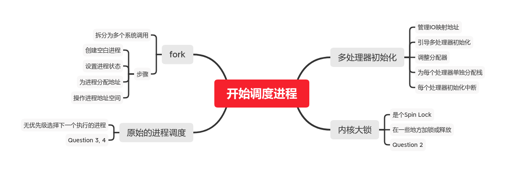

#! https://zhuanlan.zhihu.com/p/228485847
# MIT 6.828：实现操作系统 | Lab 4A：多处理器、内核锁、简单进程调度

本文为本人实现`6.828 Lab`的笔记，`Lab`其他部分在专栏不定期更新，环境搭建请看第一篇：

[MIT 6.828：实现操作系统 | Lab1：快来引导一个内核吧](https://zhuanlan.zhihu.com/p/166413604)

本文md文档源码链接：[AnBlogs](https://github.com/Anarion-zuo/AnBlogs/blob/master/6.828/lab4A-multicpu.md)

本文思维导图：



# 多处理器初始化

之前的`Lab`，我们假定只有一个单核CPU在工作，这不是现今常见情况。这个`Lab`的第一件事就是将内核移植到多处理器环境。

机器的主板上有多个处理器，上电后，其中一个启动，称为`Bootstrap Processor (BSP)`，`BSP`必须引导其它处理器的初始化。其它处理器称为`Application Processor (AP)`，具体哪个处理器成为`BSP`，由硬件决定，我们不关心。

处理器之间的通信通过每个处理器伴随的`APIC`实现，这是个新的`IO`设备，映射了一段地址。操作这个`IO`设备的代码主要在`kern/lapic.c`。

## 为`APIC`映射地址

这个标题对应`Exercise 1`，我们实现文件`kern/pmap.c`中的函数`mmio_map_region`。这个函数管理内存映射`IO`地址，输入一个在范围内的物理地址，函数返回一个虚拟地址，那个物理地址就被映射到了这个虚拟地址上。

这也可以算一个分配器，非常原始，原理和`boot_alloc`类似。从`MMIOBASE`开始分配，每次分配都是以`page`为单位的。故函数维持了一个全局变量，表示当前分配到的地址，并将参数上调到`4096`的边界。这些操作和`boot_alloc`一样。

```c
void *
mmio_map_region(physaddr_t pa, size_t size)
{
	physaddr_t pa_begin = ROUNDDOWN(pa, PGSIZE);
	physaddr_t pa_end = ROUNDUP(pa + size, PGSIZE);
	if (pa_end - pa_begin >= MMIOLIM - MMIOBASE) {
	    panic("mmio_map_region: requesting size too large.\n");
	}
	size = pa_end - pa_begin;
	boot_map_region(kern_pgdir, base, size, pa_begin, PTE_W | PTE_PCD | PTE_PWT);
	void *ret = (void *)base;
	base += size;
	return ret;
}
```

## 引导其它处理器

`BSP`初始化完成之后，就要引导各个`AP`初始化。

初始化操作在文件`kern/init.c`中的函数`boot_aps`中开始。大概来看，`BSP`将引导器拷贝到指定区域，并通过`APIC`令其它`AP`从那个地址启动。**引导器**的想法和`Lab 1`中的操作类似，由于内核已经在内存中，也就不用再拷贝了。

`AP`引导器的代码在文件`kern/mpentry.S`，和`Lab 1`中的`BSP`的引导器很相似。`mpentry.S`让处理器跳转到函数`mp_main`，直接进入内核的执行，没有再拷贝什么。

函数`lapic_startup`向指定处理器发送信号，触发了中断，让处理器从指定地址开始执行。`APIC`更具体的操作细节我们就不关心了。

在`mpentry.S`中，连接器创建了两个全局`symbol`，`mpentry_start, mpentry_end`，标记了`AP`引导器的开头和结束。下一个标题，我们要调整分配器，不分配`AP`引导器占用的地址。

## 分配器不管理引导器占用地址

这个标题对应`Exercise 2`，我们修改文件`kern/pmap.c`中的函数`page_init`，在拉链表的时候避开`AP`使用的引导器的地址。

```c
void
page_init(void)
{
	// free pages!
	// Don't mark reference count!
	pages[0].pp_ref = 0;
    pages[0].pp_link = NULL;
    page_free_list = &pages[0];
    // compute boundries on MPENTRY_PADDR
    size_t npages_before_mp = MPENTRY_PADDR / PGSIZE;
    // do base memory
    size_t i = 1;
    for (; i < npages_before_mp; i++) {
		pages[i].pp_ref = 0;  // Don't mark reference count!
		// connect the previous page
		pages[i].pp_link = page_free_list;
		page_free_list = &pages[i];
	}
    // skip MPENTRY_PADDR
    // compute new begin
    extern unsigned char mpentry_start[], mpentry_end[];
    size_t mpentry_len = mpentry_end - mpentry_start;
    size_t mpentry_npages = mpentry_len / PGSIZE, mpentry_more = mpentry_len % PGSIZE;
    if (mpentry_more) {
        ++mpentry_npages;
    }
    i = npages_before_mp + mpentry_npages;
    for (; i < npages_basemem; i++) {
        pages[i].pp_ref = 0;  // Don't mark reference count!
        // connect the previous page
        pages[i].pp_link = page_free_list;
        page_free_list = &pages[i];
    }
    // skip kernel data
	// compute new begin
	i = PADDR(boot_alloc(0)) / PGSIZE;
	for (; i < npages; ++i) {
        pages[i].pp_ref = 0;  // Don't mark reference count!
        // connect the previous page
        pages[i].pp_link = page_free_list;
        page_free_list = &pages[i];
	}
	// the 0-indexed page must exists
	if (npages > 0) {
	    // first page marked used
	    pages[1].pp_link = NULL;
	}
}
```

把地址分成多段，不能占用`mpentry`和`mmio`和内核。确定好每个边界，以及将边界上调到`4096`的倍数。

## 各处理器栈初始化

处理器同时运行，不能共享一个栈，每个处理器都要有自己的栈。当然，这种区分是在虚拟地址层面上的，不是在物理地址层面上的，不同虚拟地址可以映射到相同物理地址，也可以映射到不同。在这里，我们当然希望能够映射到不同地址上。

主要工作在函数`mem_init_mp`，这个函数在`mem_init`初始化完成`BSP`使用的栈后调用，为各个`AP`映射栈地址。

讲义和代码注释要求我们给每个栈分配`KSTKSIZE`大小，中间流出`KSTKGAP`作为保护，使得一个栈溢出一定不会影响相邻的栈。

```c
static void
mem_init_mp(void)
{
	for (int i = 0; i < NCPU; ++i) {
        boot_map_region(kern_pgdir,
                        KSTACKTOP - i * (KSTKSIZE + KSTKGAP) - KSTKSIZE,
                        KSTKSIZE,
                        (physaddr_t)PADDR(percpu_kstacks[i]),
                        PTE_W);
    }
}
```

使用`boot_mp_region`就像在函数`mem_init`中一样，非常简单。

## 各处理器中断初始化

在文件`kern/trap.c`中函数`trap_init_percpu`对每个`AP`的中断进行初始化。上一个`Lab`留下的版本，不能正确地在多处理器情况下运行。我们需要做一些小更改，让函数正确初始化每个`AP`的中断。

上一个`Lab`中，函数`trap_init_percpu`在函数`trap_init`中调用，`trap_init`在`i386_init`中调用。这是给`BSP`初始化中断。

`AP`内核入口函数`mp_main`调用了`trap_init_percpu`，这是给各个`AP`初始化中断。在`BSP`调用的`trap_init`函数中，**中断描述符表**已经初始化完成了，在各个`AP`中也就没比要再做，故没有调用`trap_init`。

只需要将`trap_init_percpu`的变量`ts`改为当前处理器的`Task State Segment`就可以，其它操作和上个`Lab`相同。需要注意计算出当前处理器的栈的正确地址，不再是`KSTACKTOP`了。

```c
void
trap_init_percpu(void)
{
	// Setup a TSS so that we get the right stack
	// when we trap to the kernel.
	struct Taskstate *ts = &thiscpu->cpu_ts;
	ts->ts_esp0 = KSTACKTOP - thiscpu->cpu_id * (KSTKSIZE + KSTKGAP);
	ts->ts_ss0 = GD_KD;
	ts->ts_iomb = sizeof(struct Taskstate);

	// Initialize the TSS slot of the gdt.
	gdt[(GD_TSS0 >> 3) + thiscpu->cpu_id] = SEG16(STS_T32A, (uint32_t) (ts),
					sizeof(struct Taskstate) - 1, 0);
	gdt[(GD_TSS0 >> 3) + thiscpu->cpu_id].sd_s = 0;

	// Load the TSS selector (like other segment selectors, the
	// bottom three bits are special; we leave them 0)
	ltr(GD_TSS0 + (thiscpu->cpu_id << 3));

	// Load the IDT
	lidt(&idt_pd);
}
```

每个处理器的`GDT, TSS, IDT`都使用了相同操作。

# 内核大锁

内核在多个处理器上初始化时应该有一些同步机制，从而确保内核只会在其中一个处理器上运行。当有用户进程令一个处理器进入内核时，其它处理器可以继续运行用户进程，但其它处理器不可以进入内核，必须等到当前进入内核的处理器退出才进入。

这个锁称为`Big Kernel Lock (BKL)`内核大锁，很多商业系统都采用过这个设计。

我们目前的内核大锁非常简单，是用`Spin Lock`实现的。不断扫描变量的值，直到值发生改变为止。

## 使用大锁

在这些函数中，我们需要添加`lock/unlock`：`i386_init, mp_main, trap, env_run`。这些添加非常简单，不值一提，但它们的意义值得思考。

`i386_init, mp_main`函数的`lock`都发生在初始化完成，准备通过`sched_yield`进入用户进程之前。这时候加锁，让处理器依次加载用户进程，保证同一时刻只有一个处理器在内核态运行。

其它操作内核锁发生在进入和退出内核态的时候。处理器进入内核态后处在函数`trap`，故在`trap`开头加锁，等待其它处理器退出内核态。处理器要进入用户态时放开锁，也就是在`env_run`的最后，允许其它处理器进入内核态。

其它加锁方式可能更优待效率，但比`Spin Lock`复杂很多。不论如何，这些`lock/unlock`操作都是为了保证内核只运行在一个处理器上。

## 为什么要用不同栈

本标题对应`Question 2`。如果一次只有一个处理器运行内核，为什么每个处理器都要一个单独的栈？

这是个挺简单的问题。因为并不是真的**只有一个处理器运行内核**，处理器进入内核态之后才调用`lock_kernel`，进而抢锁。在中断发生进入`trap`函数时，这个处理器就已经在使用内核的代码了，只是可能没有运行真正的内核，而是在跑一个`while`循环，这也还是内核。要处理这样同时跑内核的情况，自然要多个栈。

# 简单进程调度

`JOS`还要实现一个简单的进程调度。说是**简单**，是因为不支持`Preemptive Multitasking`，后面的`Lab 4B`会实现这一点。

我们的调度算法依赖用户进程自动放弃处理器使用权。用户进程发出`yield`系统调用，主动让内核切换到另一个进程。内核按进程创建顺序，选择下一个执行的进程。这个算法非常简单，实现也只是基于之前写好的一系列函数。

## 找到下一个进程来执行

`yield`是内核操作，故需要使用系统调用。用户进程调用的函数在文件`lib/syscall.c`，对应的系统调用入口在`kern/syscall.c`，并相应调用了文件`kern/sched.c`中的函数`sched_yield`也就是我们要实现的。

`sched_yield`从当前进程开始遍历整个进程数组`envs`，找到第一个状态是`ENV_RUNNABLE`的进程，并切换到这个进程。要是没找到，可以尝试继续执行当前进程。若当前进程不再可执行，就让处理器开始等待。

注意处理无当前进程的特殊情况，也就是内核刚刚初始化完成，第一次尝试进入用户进程的时候。

完整代码如下，注释也很完整。

```c
void
sched_yield(void)
{
	struct Env *idle;

	size_t i = 0;
	if (curenv) {
	    // above 0 is for special case when no env is running at init time
        i = ENVX(curenv->env_id) + 1;
	}
	while (1) {
	    if (i == NENV) {
	        // switch back when hit end
	        i = 0;
	    }
	    idle = &envs[i];
	    if (idle == curenv) {
	        // no need for worrying NULL idle, for it is impossible.
	        // finished a cycle
	        if (curenv->env_status == ENV_RUNNING) {
	            // current env still runnable
	            // context switch
                env_run(idle);
	        }
	        // no runnable env found
	        break;
	    }
	    if (idle->env_status == ENV_RUNNABLE) {
	        // a runnable env found
	        // context switch
	        env_run(idle);
	    }
        ++i;
    }
	// sched_halt never returns
	sched_halt();
}
```

## 回顾`env_run`

本标题对应`Question 3, 4`。这两个问题在之前实现`env_*`系列函数的时候，我就在博客中写过了。

在函数`env_run`通过`lcr3`切换`Page Directory`之后，后面的代码依旧可以访问`envs`数组的成员。这是因为`envs`在`kern_pgdir`中被设置为用户态只读，而每个进程的`Page Directory`都是由`kern_pgdir`为模板复制出来的，也就可以**读取**这段地址。

老进程的状态保存在它对应的`Env`结构体中，在系统调用触发中断时就完成保存了，不必多说。

# `fork`系统调用准备

`fork`是`Unix`系统常见的系统调用，`duplicate`当前进程的环境，从而启动一个新的进程。

`JOS`采用微内核，`fork`不封装在一个完整的系统调用中完成，而是拆成多次系统调用分别完成。这样可以让内核架构更加简单，把一些复杂度放到用户态，并交出了一点性能作为代价。

`JOS`将一次`fork`拆成创建进程、修改进程状态、为进程分配并映射内存等等几个步骤，分别对应了一个系统调用，我们要完成它们的处理函数。

## 创建空白进程

用户态调用函数`sys_exofork`，就可以触发这个系统调用，对应内核代码中的`sys_exofork`函数。这个函数是对函数`env_alloc`的封装，并调整得到的`Env`结构体的状态，非常简单。

```c
static envid_t
sys_exofork(void)
{
	struct Env *newEnv;
	// create
	int ret = env_alloc(&newEnv, curenv->env_id);
	if (ret < 0 || newEnv == NULL) {
	    // falied
	    return ret;
	}
    // set not runnable
    newEnv->env_status = ENV_NOT_RUNNABLE;
    // set registers
    newEnv->env_tf = curenv->env_tf;
    // set child return value 0
    newEnv->env_tf.tf_regs.reg_eax = 0;
    return newEnv->env_id;
}
```

这还只是分配得到了一个`Env`结构体，还没有任何东西。

## 设置进程状态

要使得进程从`sys_exofork`创建得到的状态`ENV_NOT_RUNNABLE`变为别的状态，也需要一个系统调用来实现。这个系统调用`sys_env_set_status`就是对一个`Env`结构体赋值的封装。

在赋值发生之前，内核必须做一系列检查，保证用户提供的参数和内核自身的状态，可以完成这个用户进程交给内核的任务，否则可能导致内核执行出错。这也是所有系统调用的共同点，通常就是对一个函数的封装，在调用这个函数之前，先做一系列检查。

```c
static int
sys_env_set_status(envid_t envid, int status)
{
	// check if status is valid
    switch (status) {
        case ENV_RUNNABLE:
        case ENV_NOT_RUNNABLE:
            break;
        default:
            // not valid
            return -E_INVAL;
    }
    // check if envid is valid
    struct Env *env;
    int ret = envid2env(envid, &env, 1);
    if (ret < 0 || env == NULL) {
        return ret;
    }
    // do set status
	env->env_status = status;
    return 0;
}
```

## 为进程分配地址

`sys_page_map`通过分配器拿到一些`page`，并把它们映射到进程地址空间。

这个系统调用是对`page_alloc`和`page_insert`的封装，并且也进行了一系列完整的检查。阅读代码注释就可以明白，不需要过多解释检查的过程。

```c
static int
sys_page_alloc(envid_t envid, void *va, int perm)
{
    int ret;

    // check envid
    struct Env *env;
    ret = envid2env(envid, &env, 1);
    if (ret < 0 || env == NULL) {
        return ret;
    }
    // check va bounary
    ret = check_va_bound_round(va);
    if (ret < 0) {
        return ret;
    }
    // check permission
    ret = check_user_page_perm(perm);
    if (ret < 0) {
        return ret;
    }
    // allocate
    struct PageInfo *phypage = page_alloc(1);
    if (phypage == NULL) {
        // out of memory
        return -E_NO_MEM;
    }
    ret = page_insert(env->env_pgdir, phypage, va, perm);
    if (ret < 0) {
        // no memory for new page table
        // must roll back
        page_free(phypage);
        return ret;
    }
    // success
    return 0;
}
```

使用了`check_va_bound_round, check_user_page_perm`封装了要重复使用的检查，代码如下：

```c
static int
check_user_page_perm(int perm) {
    if ((perm & (PTE_U | PTE_P)) != (PTE_U | PTE_P)) {
        // these 2 must be set
        return -E_INVAL;
    }
    if ((perm | PTE_SYSCALL) != PTE_SYSCALL) {
        // others must not be set
        return -E_INVAL;
    }
    return 0;
}

static int
check_va_bound_round(void *va) {
    if ((uintptr_t)va >= UTOP || (uintptr_t)va % PGSIZE != 0) {
        return -E_INVAL;
    }
    return 0;
}
```

之后也要用到。

## 拷贝映射和取消映射

`sys_page_map`将一个进程的`Page Directory`拷贝给另一个进程，让另一个进程获得相同的**地址空间**。这是对`page_insert`的封装。

`sys_page_unmap`取消进程已有的映射，这是对`page_remove`的封装。

同样要做一些检查，使用了上面的函数`check_va_bound_round, check_user_page_perm`，非常简单，不再赘述。

```c
static int
sys_page_map(envid_t srcenvid, void *srcva,
	     envid_t dstenvid, void *dstva, int perm)
{
	int ret;

	// check envids
	struct Env *srcenv, *dstenv;
    ret = envid2env(srcenvid, &srcenv, 1);
    if (ret < 0) {
        return ret;
    }
    ret = envid2env(dstenvid, &dstenv, 1);
    if (ret < 0) {
        return ret;
    }
    // check memory boundaries
    ret = check_va_bound_round(srcva);
    if (ret < 0) {
        return ret;
    }
    ret = check_va_bound_round(dstva);
    if (ret < 0) {
        return ret;
    }
    // check permissions
    ret = check_user_page_perm(perm);
    if (ret < 0) {
        return ret;
    }
    // check page current permission
    pte_t *srcpte;
    struct PageInfo *pp = page_lookup(srcenv->env_pgdir, srcva, &srcpte);
    if (pp == NULL) {
        // no mapping exists
        return -E_INVAL;
    }
    // check write permission
    if (perm | PTE_W) {
        // non-writable pages should not be granted write permission
        if (!(*srcpte & PTE_W)) {
            return -E_INVAL;
        }
    }
    // insert mapping to dst
    ret = page_insert(dstenv->env_pgdir, pp, dstva, perm);
    if (ret < 0) {
        // no memory for new page table
        return ret;
    }
    // success
    return 0;
}

static int
sys_page_unmap(envid_t envid, void *va)
{
    int ret;

    // check envid
    struct Env *env;
    ret = envid2env(envid, &env, 1);
    if (ret < 0) {
        return ret;
    }
    // check va
    ret = check_va_bound_round(va);
    if (ret < 0) {
        return ret;
    }
    // no error in this call
    page_remove(env->env_pgdir, va);
    return 0;
}
```

至此，我们几乎完成了`Lab 4 Part A`。你可以运行`make grade`，看看`dumbfork`测试是否能通过。