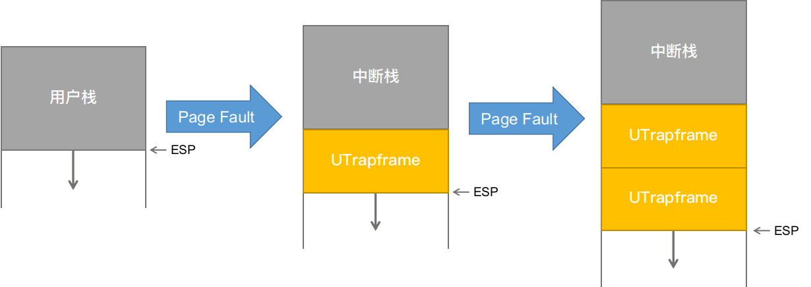

#! https://zhuanlan.zhihu.com/p/250564251
# MIT 6.828：实现操作系统 | Lab 4B：用户进程的缺页中断

本文为本人实现`6.828 Lab`的笔记，`Lab`其他部分在专栏不定期更新，目录、环境搭建和各种说明请看第一篇：

[MIT 6.828：实现操作系统 | Lab1：快来引导一个内核吧](https://zhuanlan.zhihu.com/p/166413604)

请不要从中间乱入本系列文章，最好从头开始阅读。

本文md文档源码链接：[AnBlogs](https://github.com/Anarion-zuo/AnBlogs/blob/master/6.828/lab4B-page-fault.md)

`Lab 4B`部分要求我们实现`fork`系统调用，本文只是前半部分，有关用户进程下的缺页中断`Page Fault`处理。这是实现`fork`非常重要的组件，我们想要实现`Copy On Write`，就不得不使用`Page Fault`机制。

# 中断流程总览

我们已经写了一些`Page Fault`处理流程，在函数`page_fault_handler`下。我们假设内核一定不会出现`Page Fault`，如果出现了，那就是内核有bug。本文完善用户态下的`Page Fault`处理。

和之前一样，任何中断都会进入`trap`函数，`trap`函数通过一次简单的`switch`，将中断分发到相应处理函数。对于`Page Fault`，也就是`page_fault_handler`。目前为止，内核将触发`Page Fault`的进程销毁，这当然不是我们想要的。

`JOS`在内核中做一些准备，然后以用户态进入在文件`lib/pfentry.S`中定义的流程。这个流程跳转到触发`Page Fault`的进程实现定义的一个处理函数，处理完成之后，再进行一些处理，返回到出发`Page Fault`的指令继续执行。`JOS`使用用户态流程处理`Page Fault`，其中需要内核参与的部分，通过`System Call`实现。

具体内核应做哪些准备，如何设置处理函数，如何返回触发中断的指令，就是本文接下来的内容。

# 指定处理函数

这个标题对应`Exercise 8`和`11`。

用户进程通过函数`set_pgfault_handler`给自己设置`Page Fault`的处理函数，这个进程触发`Page Fault`之后，会由指定的函数处理。我们需要完善`set_pgfault_handler`。

在写代码之前，首先看看指定处理函数的设计。

在结构体`Env`中，`Lab 4`新拉取的代码多了一个属性`env_pgfault_upcall`，用来指定一个入口。目前为止，我们总是将这个属性设置为函数`_pgfault_upcall`的地址，这个函数代表`lib/pfentry.S`定义的流程，故所有进程发生`Page Fault`之后，都跳转到这个流程。

在`pfentry.S`的开头，这个流程马上跳转到了函数`_pgfault_handler`。这是个全局函数指针，不像`env_pgfault_upcall`总是接受一个固定的值，`_pgfault_handler`函数指针在函数`set_pgfault_handler`中设置为指定的值。这样一来，虽然`env_pgfault_upcall`的值总是固定，我们还是可以为进程定义不同的`Page Fault`处理函数。

有了这个理解，写代码就很容易了。全局函数指针`_pgfault_handler`没有设置初始值，则初始值是`NULL`，这让我们可以对第一次调用进行特殊处理。第一次调用`set_pgfault_handler`，要为中断时使用的栈分配空间。第一次调用之后，`_pgfault_handler`应设置为传入的函数指针，使得配置生效，并将当前进程的结构体通过系统调用`sys_env_set_pgfault_upcall`进行设置。具体代码如下：

```c
void
set_pgfault_handler(void (*handler)(struct UTrapframe *utf))
{
	int r, ret;

	if (_pgfault_handler == 0) {
		// First time through!
		// allocate an exception stack
        ret = sys_page_alloc(thisenv->env_id, (void *)(UXSTACKTOP - PGSIZE), PTE_U | PTE_W);
        if (ret < 0) {
            panic("Allocate user exception stack failed!\n");
        }
    }
    sys_env_set_pgfault_upcall(thisenv->env_id, _pgfault_upcall);

	// Save handler pointer for assembly to call.
	_pgfault_handler = handler;
}
```

系统调用`sys_env_set_pgfault_upcall`实现也很简单，通过`envid`将当前进程的`Env`结构体查出来，给相应`env_pgfault_upcall`属性赋值就可以。

```c
static int
sys_env_set_pgfault_upcall(envid_t envid, void *func)
{
	int ret;

	struct Env *env;
	ret = envid2env(envid, &env, 1);
	if (ret < 0) {
	    return ret;
	}
	// set func
	env->env_pgfault_upcall = func;
	return 0;
}
```

# 调用处理函数并返回

本标题对应`Exercise 9`，主要代码写在文件`kern/trap.c`中的函数`page_fault_handler`。

联系`pfentry.S`中的汇编代码，在切换至用户态代码之前，当前栈上应有一个`UTrapframe`结构体，栈顶`esp`可以直接作为结构体指针。进入处理函数`_pgfault_handler`之前，将当前栈顶地址压栈作为结构体指针传给处理函数。处理函数`_pgfault_handler`返回之后，栈回到传参动作`pushl %esp`之前的状态。后面的代码让处理器跳转回触发`Page Fault`的指令，恢复之前的执行状态。

我们需要给处理函数在栈上构造好一个结构体，并妥善维护栈结构，方便之后的恢复操作。

## 构造`UTrapframe`结构体

在构造结构体之前，我们需要选择栈。我们为用户态下的`Page Fault`中断专门准备了一个栈`UXSTACKTOP`，`Page Fault`中断处理一定要在这个栈上进行。

在`Page Fault`处理函数中发生`Page Fault`中断，应和其它情况进行不同处理，因为此时的栈已经是中断栈，不需要切换栈。联系之前处理内核中断，从用户态进入内核态需要切换栈和`Page Directory`，而内核中发生的中断不需要。



判断是否为`Page Fault`处理函数引发的`Page Fault`，只需要看看进程栈顶位置就可以了。

```c
struct UTrapframe *utf = NULL;
if (tf->tf_esp < UXSTACKTOP && tf->tf_esp >= UXSTACKTOP - PGSIZE) {
    utf = (struct UTrapframe *)(tf->tf_esp - sizeof(struct UTrapframe));
} else {
    // not recursive faults
    utf = (struct UTrapframe *)(UXSTACKTOP - sizeof(struct UTrapframe));
}
```

`utf`指针指向当前栈顶。将`utf`指针当做`UTrapframe`结构体进行赋值，就可以制造出想要的栈结构。当然，这个栈结构还不可以使用，之后要针对**恢复执行**修改这个结构。

一系列赋值：

```c
// fault info
utf->utf_fault_va = fault_va;
utf->utf_err = tf->tf_err;
// return states
utf->utf_regs = tf->tf_regs;
utf->utf_regs = tf->tf_regs;
utf->utf_eip = tf->tf_eip;
utf->utf_eflags = tf->tf_eflags;
utf->utf_esp = tf->tf_esp;
```

装载后的到栈：

```
                    <-- UXSTACKTOP
trap-time esp
trap-time eflags
trap-time eip
trap-time eax       start of struct PushRegs
trap-time ecx
trap-time edx
trap-time ebx
trap-time esp
trap-time ebp
trap-time esi
trap-time edi       end of struct PushRegs
tf_err (error code)
fault_va            <-- %esp when handler is run
```

其中，`trap-time`应理解为**中断时**，这个栈保存了返回状态，方便之后的返回操作。

## 处理函数返回

上面的栈中保存了要返回到的状态，依次恢复寄存器，就可以恢复原先的执行状态。这里还是有困难。我们不能使用`jmp`进行跳转，因为`jmp`会占用一个寄存器，而跳转之前寄存器已经恢复，不能再更改。我们必须使用`ret`，而要返回到的地址没有直接存在于此时的栈上。这里主要解决运行`ret`的问题，主要代码写在`pfentry.S`后部分。

处理函数返回到`pfentry.S`的代码之后，处理器栈结构和上面代码块中的相同。在准备栈之前，可以先处理其它寄存器。

当前栈上前两个`word`不包含寄存器有关信息，故我们直接忽略：

```assembly
addl $8, %esp
```

紧接着是一系列`General Purpose`寄存器，我们把从栈上取到寄存器里。在这之后，我们不能再操作这些寄存器。

```assembly
popal
```

现在的栈顶是`eip`，我们暂时不处理，先处理下一个`eflags`。从这里开始，就不能再进行任何计算，否则会破坏刚刚恢复的寄存器`eflags`。

```assembly
addl $4, %esp
popf
```

紧接着恢复`esp`寄存器，在这之后，我们回到了中断发生之前使用的栈。

```assembly
movl (%esp), %esp
```

我们在`pfentry.S`结尾执行`ret`，在这之前，必须让执行`ret`时的栈顶具有要跳转到的地址。这是关键所在。

我们手动为被中断的栈再压入一个4字节地址，从而使得上面最后一个代码块设置完`esp`后调用`ret`，可以跳转到这个地址。我们紧接着`_pgfault_handler`返回进行这个操作，避免破坏已经恢复的状态。

我们将中断栈上具有的`esp`值加上4字节，并以新值为地址，向那个地址写入要返回到的地址，也就是中断栈上的`eip`。我们将本标题下第一个代码块扩充成如下代码：

```assembly
addl $8, %esp

movl 0x20(%esp), %eax
movl 0x28(%esp), %ebx
subl $4, %ebx
movl %ebx, 0x28(%esp)
movl %eax, (%ebx)
```

其中，十六进制数字`0x`用于通过当前栈顶，也就是中断栈，获得被中断进程的`esp, eip`，并把它们写到指定区域。

这样一来，切换回被中断栈之后，栈顶是被中断指令的地址。`ret`可以正确地令处理器跳转到那个指令。

这里还需要注意的是，对于在`Page Fault`处理函数中被中断的情况，和在其它地方被中断的情况不同。在处理函数中触发`Page Fault`不会切换栈，进入中断时，`UTrapframe`结构体直接压在原来栈上。如果像上面的代码块那样，直接在`UTrapframe`指定的`esp`上操作，就会覆盖到`UTrapframe`本身，从而导致错误。故在`UTrapframe`压栈时，必须预留4字节空间，避免这个问题。

之前的图应该改一下：


上面确定栈顶`utf`的代码应该做一些修改：

```c
struct UTrapframe *utf = NULL;
if (tf->tf_esp < UXSTACKTOP && tf->tf_esp >= UXSTACKTOP - PGSIZE) {
    // must reserve 4 bytes for return address
    utf = (struct UTrapframe *)(tf->tf_esp - sizeof(struct UTrapframe) - 4);
} else {
    // not recursive faults
    utf = (struct UTrapframe *)(UXSTACKTOP - sizeof(struct UTrapframe));
}
```

# 完整代码

把以上代码整理到这里。

`trap.c`: `page_fault_handler`

```c
void
page_fault_handler(struct Trapframe *tf)
{
	uint32_t fault_va;

	// Read processor's CR2 register to find the faulting address
	fault_va = rcr2();

	// Handle kernel-mode page faults.
    // LAB 3: Your code here.

    if ((tf->tf_cs & 3) != 3) {
        // tf comes from kernel mode
        cprintf("kernel fault va %08x ip %08x\n",
                fault_va, tf->tf_eip);
	    panic("Page fault in kernel mode!\n");
	}

	// LAB 4: Your code here.
	int ret;

    if (curenv->env_pgfault_upcall == NULL) {
        // no upcall
        page_fault_exit(fault_va, tf);
        return;
    }
    if (envtf->tf_esp > USTACKTOP && envtf->tf_esp <= UXSTACKTOP - PGSIZE) {
        // exception stack out of space
        page_fault_exit(fault_va, tf);
        return;
    }
    cprintf("user fault 0x%lx eip 0x%lx esp 0x%lx\n", fault_va, tf->tf_eip, tf->tf_esp);

    // setup stack pointer
    struct UTrapframe *utf = NULL;
    if (tf->tf_esp < UXSTACKTOP && tf->tf_esp >= UXSTACKTOP - PGSIZE) {
        // must leave empty word for recursive faults
        utf = (struct UTrapframe *)(tf->tf_esp - sizeof(struct UTrapframe) - 4);
    } else {
        // not recursive faults
        utf = (struct UTrapframe *)(UXSTACKTOP - sizeof(struct UTrapframe));
    }
    // check user permissions
    user_mem_assert(curenv, utf, sizeof(struct UTrapframe), PTE_W);
    // pass struct UTrapframe as arguments
    // fault info
    utf->utf_fault_va = fault_va;
    utf->utf_err = tf->tf_err;
    // return states
    utf->utf_regs = tf->tf_regs;
    utf->utf_regs = tf->tf_regs;
    utf->utf_eip = tf->tf_eip;
    utf->utf_eflags = tf->tf_eflags;
    utf->utf_esp = tf->tf_esp;
    // new env run
    tf->tf_eip = (uintptr_t)curenv->env_pgfault_upcall;
    tf->tf_esp = (uintptr_t)utf;
    // run env
    env_run(curenv);
}
```

`pfentry.S`

```assembly
.text
.globl _pgfault_upcall
_pgfault_upcall:
	// Call the C page fault handler.
	pushl %esp			// function argument: pointer to UTF
	movl _pgfault_handler, %eax
	call *%eax
	addl $4, %esp			// pop function argument
	
	addl $8, %esp

	movl 0x20(%esp), %eax
	movl 0x28(%esp), %ebx
    subl $4, %ebx
    movl %ebx, 0x28(%esp)
    movl %eax, (%ebx)

	popal

	addl $4, %esp
	popf

	movl (%esp), %esp

	ret
```

# 测试

和往常一样，这个`Lab`提供了一些测试。同样需要我们修改`i386_init`中的`ENV_CREATE`宏的参数，指定存在于`user`目录下的要运行的用户代码。

运行`faultread`，你应该看见进程触发了`Page Fault`中断，处理函数返回之后就正常退出了，应该输出`exiting gracefully`。如果没有输出正常退出有关信息，说明你的代码不能正确处理在正常用户态下发生`Page Fault`的情况。如果正确输出了，不能说明你的代码可以正确处理在`Page Fault`处理函数中触发`Page Fault`的情况。

为了验证你的代码确实能够正确处理一般用户态进入`Page Fault`处理函数的情况，可以再尝试运行`faultdie`。看看是否能够正常输出。

要验证你的代码是否能够处理`Page Fault`处理函数触发`Page Fault`的情况，你需要运行`faultalloc, faultallocbad`。

在继续进行下面的`Lab`操作之前，务必保证以上测试全部通过。