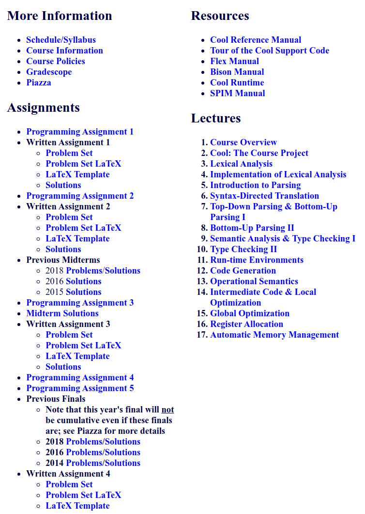
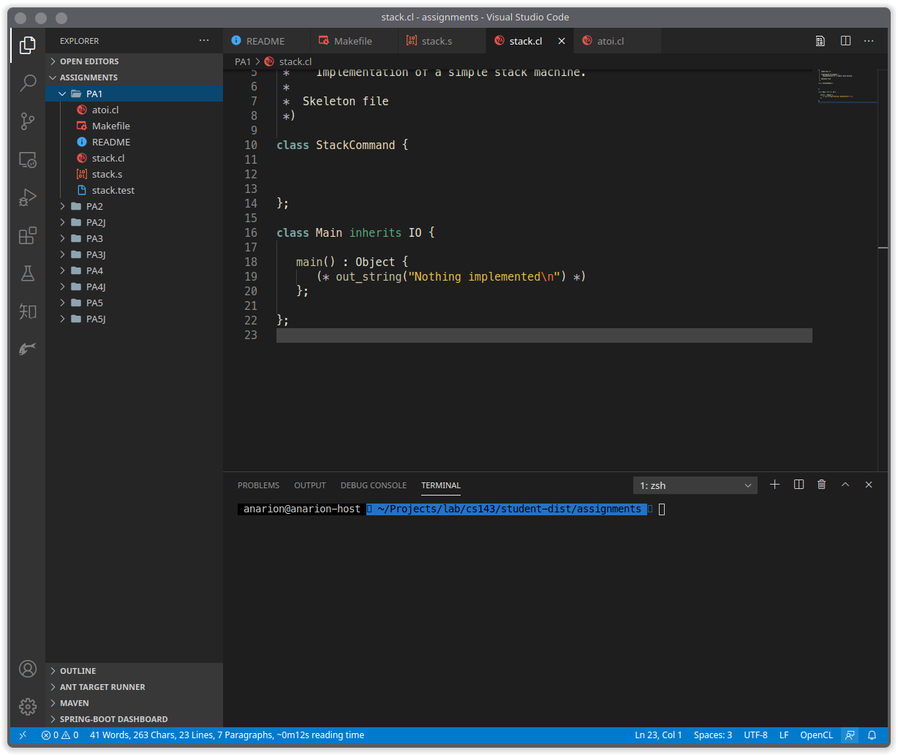

#! https://zhuanlan.zhihu.com/p/226190284
# CS143：编译原理 | 环境搭建HelloWorld

本文是本人新开的坑的第一篇博客，另一个坑请看[MIT 6.828 实现操作系统](https://zhuanlan.zhihu.com/p/166413604)。从另一个坑的第一篇复制两段话：

>   写成博客的目的是防止自己走马观花，花了一堆时间还什么都没学到。
>
>   虽然我对我的表达能力很自信，但是我写博客的目的不是教给别人什么东西，而是逼迫自己认真操作、认真阅读。如果你的知识背景和我类似，你看我的博客将非常畅快，否则最好还是看原始的讲义。

So you have been warned.

本坑在这个专栏：[CS143 编译原理](https://zhuanlan.zhihu.com/c_1286787362224693248)。知乎以后可能把专栏弄没了，故今后本坑中所有文章都有链接指向本文。

CS143是斯坦福的编译原理导论课，常听说这个课的`Assignment`很难，值得一做。各个`Assignment`实现了一个`cool`语言编译器，做完之后，能够加深对编译原理的各个方面的理解。`cool`语言不是真正使用在生产环境中的，只是一个教学用具，语法和`opencl`有点像，你可以使用`opencl`的语法高亮来阅读代码。`VSCode`有为`Cool`语言提供语法高亮的插件。

本文只进行**环境搭建和材料准备**，具体实现在之后的文章中发出。

本文md文档源码链接：[AnBlogs](https://github.com/Anarion-zuo/AnBlogs/blob/master/cs143/pa0-setup.md)

# 专栏目录

我将本系列文章链接按顺序整理在这里，发布新文章后目录自然生长。

[本文](https://zhuanlan.zhihu.com/p/226190284)

[CS143：编译原理｜PA1：熟悉Cool语言](https://zhuanlan.zhihu.com/p/250667235)

[CS143：编译原理｜PA2：正则表达式和词法分析](https://zhuanlan.zhihu.com/p/258385544)

# 更新放在这个标题下面

【更新 2020.9.29】

我又开新坑了：[MIT 6.824 分布式系统 | 材料准备和环境搭建](https://zhuanlan.zhihu.com/p/260470258)

个人认为，**编译原理**对我的帮助不如**操作系统**和**分布式**大，故暂时搁置`CS143`，先专注学习`6.828`和`6.824`的`Lab`。

**感谢各位捧场**

# 官网材料下载

你可能需要两种材料，课程视频和课件作业。前者在B站可以找到，后者的大部分在[课程网站](http://web.stanford.edu/class/cs143/)。然而，斯坦福把这个课从`Cousera`和自家的MOOC上撤掉了，我花了些时间才找到编程作业，在[edx.org](https://courses.edx.org/courses/course-v1:StanfordOnline+SOE.YCSCS1+2T2020/course/)，不知道将来会不会把这个也撤了。

如果`edx`上面的资料也撤了，可以从[我的GitHub仓库](https://github.com/Anarion-zuo/Stanford-CS143)的`skeleton`分支下载，原封不动放着从`edx`上下载解压的内容。这个仓库的`master`分支下放的是我的实现代码，你可以去这个仓库找我的实现代码，我的每篇文章也都会完整贴上对应的实现代码。

如果你真的找不到一些素材，可以在评论区提醒我。

你可以在以上的链接里面到处看看。



我的博客记录我实现各个`Programming Assignment`的历程，当然要引用编译原理的知识，但是不会系统讲解，也不会看`Written Assignment`。如果你还没有系统学习过编译原理，可以参考课程视频进行学习，或配合着一些教科书。

每个`Assignment`有对应的说明`handout`和一些已经写好了的代码`skeleton`，这些都可以在以上两个链接中找到。

# 环境搭建

在[edx.org](https://courses.edx.org/courses/course-v1:StanfordOnline+SOE.YCSCS1+2T2020/course/)中，提供了两种搭建环境的方法，分别是使用虚拟机，和直接在Linux下配置。

如果你目前正在使用Windows作为主要开发环境，可以在`VirtualBox`中导入[提供的虚拟机](https://stanford.box.com/s/28bcmqycmsxme77gi1ep1yo9lo27znrz)。这是个古老的发行版，我没有深入研究过，应该近似`Ubuntu 10.04`或`11.10`。运行这个虚拟机，就可以直接获得配置好的环境。你可以通过`VSCode`远程开发插件在虚拟机上写代码。

如果你目前正在使用Linux作为主要开发环境，可以不使用这个虚拟机。我的`VirtualBox`貌似不能兼容最新版本的Linux内核，而我又不小心更新了。再加上`VSCode`不支持32位架构远程编辑，我也就没有使用虚拟机。以下是Linux下的环境搭建。

在[edx.org](https://courses.edx.org/courses/course-v1:StanfordOnline+SOE.YCSCS1+2T2020/course/)中，提供了一个压缩包[下载链接](https://courses.edx.org/asset-v1:StanfordOnline+SOE.YCSCS1+1T2020+type@asset+block@student-dist.tar.gz)，`wget`这个链接，解压到目录`/usr/class`下。这是官方配置方式。

从我目前为止的使用来看，我们可以把其它文件留在我们想要的地方，而将`bin`子目录下的内容加入环境变量，就可以正常使用课程需要的一些可执行文件，没必要维持那个目录结构。

【更新 2020.9.18】

之后的`PA`需要使用两个工具`flex, bison`，你可能已经注意到了，它们需要我们额外安装。当然，如果你使用了官方虚拟机，就不用自己安装，也不用担心以下要说的问题。

课程使用的`flex`版本较老，没有考虑到`C++`和`C`轻微不兼容问题。或者说，新版本`flex`默认你的代码是与时俱进的。不论如何，为了使用课程提供的代码，我们不得不使用更老的`flex`版本。写在这里提醒你，是因为你的`Linux`包管理工具默认安装最新版本`2.6+`，而你可能对一些错误迷惑不已。

官方虚拟机使用的是`2.5.35`，所以我们最好也这么做。我从[这里](https://src.fedoraproject.org/lookaside/pkgs/flex/flex-2.5.35.tar.bz2/)下载到的压缩包，解压之后`./configure && make && sudo make install`一套连就可以了。

还不清楚`bison`是否有版本要求，之后发现这方面问题再写上来。

【更新结束】

设置好环境变量后，在命令行输入`coolc`，应该可以看到`cool`编译器的输出，提示`Main`入口类不存在。

```shell
Class Main is not defined.
Compilation halted due to static semantic errors.
```

我用`VSCode`，所有`Assignment`都在目录`assignment`下，现在就可以开始了。



# 象征性HelloWorld

你可以自己写一个`Cool`程序，然后用`coolc`编译，用`spim`执行得到的汇编代码。如果要认真操作，你还需研究`coolc`和`spim`的使用。可以暂时不那么复杂，咱就想试一下配置是否正确而已。

进入`assignments/PA1`目录，在这个目录下运行`make test`，可以看到一行输出`Nothing implemented`。这是在文件`stack.cl`下写的，你可以看看`Makefile`。

```java
// stack.cl
class Main inherits IO {
   main() : Object {
      out_string("Nothing implemented\n")
   };
};

// Makefile
test:	compile
	@echo stack.test
	${CLASSDIR}/bin/spim -file stack.s < stack.test
```

能够正确输出，就是配置基本完成了。

之后可能有所调整，不过大概就是这样。

# 有哪些资料

我们想要的是`Programming Assignment`有关的文件，对应代码框架在`assignment`目录下，`assignment`目录下以`J`结尾的子目录是Java版本的实现，我的文章都将使用`C/C++`实现。

每次`PA`的PDF说明在`handouts`目录下，要完整完成各个`PA`，还必须看看课程网站上的`Resources`标题下的链接。具体在之后的文章中提及。

# MOOC版本和正式课程不同

你可能发现了，[课程官网](http://web.stanford.edu/class/cs143/)上的`PA1`和我们下载的`assignments PA1`不相符，课程官网上的`PA1`已经开始写编译器了。这是MOOC版本和正式课程的区别。正式课程如课程官网所示，有4个主要编程作业，最后一个是**加分项**`Extra Credit`，第一个作业就开始写编译器。MOOC版本的第一个编程作业是**熟悉Cool语言**，之后的4个编程作业和正式课程相同。我们在这里下载到的是MOOC版本的材料，也就接着使用这个版本的，反正和正式课程没有特别大的区别。