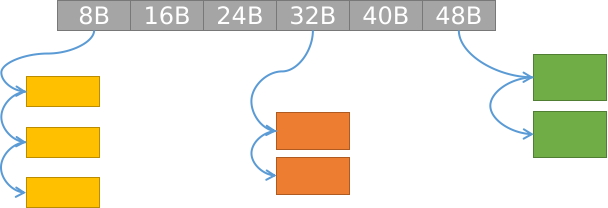

#! https://zhuanlan.zhihu.com/p/453859487

# CSAPP Malloc Lab的一种实现

Malloc Lab是CSAPP和相关课程很早就有的一个Lab，帮助学生理解内存分配器的算法和实现。如果你对`malloc`和它的变体，及内存管理本身有兴趣，那么这个Lab非常适合你。

本文是我实现这个Lab的笔记，目的是帮助自己归纳学到的东西，如果能够帮助到你，那是最好不过。不要看这好像只是*一个*Lab，它还是有一定难度的，即便是花三四天时间潜心研究，可能也只能做出个大概。做好心理准备，对自己有信心，只要学到东西就是进步！

本文从分配器的基本机制讲起，告诉你我的实现方式。还会给你提供一种可能更好的代码测试手段。本文的源码在[这里](https://github.com/Anarion-zuo/AnBlogs/blob/master/csapp/malloc-blocklist.md)。

## 准备

在开始之前，你需要下载好文件，并阅读一些材料。

找到[官网](http://csapp.cs.cmu.edu/3e/labs.html)上Malloc Lab部分，下载`Writeup`和`Self-Study Handout`。`Writeup`是Lab的讲义，`handout`是课程提供的代码文件。

下载好解压到某个目录中，在该目录下`make`，获得一个可执行文件`mdrive`。我们的工作是完善文件`mm.c`，使得`mdrive`做我们想让它做的事情。

在开始写代码之前，先好好阅读`handout`，关注一下几点内容：

- 哪些文件是要写的，哪些文件是帮助我们的

- 哪些函数能调，哪些不能调

- 如何测试，如何知道自己是否正确，有多正确

如果你对内存分配器特别熟悉，现在就可以开始写了。无论如何，我还是建议你先阅读CSAPP书上9.9节和分配器有关的部分，对分配器有一些基本认识。

我写的完整代码在我的[Github仓库](https://github.com/Anarion-zuo/csapp/tree/malloc)中`malloc`分支上，如果你想看的话。建议你不看，看懂我在本文想要表达的意思，然后按照自己的理解自己操作。我的代码很可能是没有整理好的，有很多注释掉的代码，几乎没有可以看的注释。我自己看得都头疼，更不用说别人了。 我可以保证，当前代码一定可以通过原始`handout`中的两个小文件测试，其余不敢保证。

当然，无论这个Lab是不是你的作业，都最好先自己做一做，直接抄是不好的。

## 我的分配器

我实现的分配器严格意义上应归类到书上所谓`Segregated Free Lists`，我在写这个版本的代码时没有按照书上介绍的几个例子实现，而是实现了类似与`C++ STL`的分配器一样的机制。不敢说自己**实现了**STL分配器，只是很久以前看过[侯捷](http://boolan.com/jjhou/)老师的课程，对这方面内容还有印象，就凭记忆大概尝试了以下，效果也是不错。

我的分配器在`handout`中的两个小例子上得分大概是84分左右，我已经满足了。这个得分和具体的数据状况、运行环境等息息相关，我觉得在70分左右都是ok的。

后文会展示，在请求序列非常随机的时候，任何分配器的表现都不会特别好。一些特定的请求序列可以使得一些特定的机制好像更具优势，这种优势当然不是真实的。所以，即便你的实现在`handout`中的两个小例子取得了较高分数，也不能说明你的实现就是高效的。甚至不能说明你的实现是正确的，因为那两个小文件所包含的情形实在是太有限了。

如果你想追求更优秀的得分，就必须实现更复杂的`Segregated`机制。目前为止我不再做更复杂的了，如果我以后有兴致再来研究，到时候来发一篇**CSAPP Malloc Lab的另一种实现**。

## 块分配机制

### 小块分配Segregation

这个单词大概翻译成*分开*，如西方国家以前存在的一些物理上或精神上的种族*隔离*`Racial Segregation`。

好的分配器几乎都有`Segregation`，把`free list`空闲队列分成好几个，每个上面只挂固定长度的空闲块。



如图，我的分配器按8的倍数划分空闲队列，8B的空闲块放在0号队列，以此类推。

```c
#define BLOCK_LIST_MAXIDX 32
struct HeapBlock *blockList[BLOCK_LIST_MAXIDX];
```

进行分配操作时，输入要分配的字节数量，把字节数量上调为8的倍数，计算头节点指针在指针数组中的索引，就知道从哪个链表拿块。这样一来，找空闲块的时候，就不需要花费很多时间搜索。

```c
// 要分配size个数的字节，想知道从哪个链表拿块
int sizeToBlockIndex(size_t size) {
    int index = size / 8, more = size % 8;
    if (more == 0) {
        --index;
    }
    return index;
}
```

拿一块内存，就是从链表上弹一块.

```c
// fetch the head
retnode = *listnode;
// pop linked list
*listnode = (**listnode).next;
```

用户释放内存空间的时候，同样根据块大小，把块放回相应队列。

```c
struct HeapBlock **listnode = &list[index];
block->next = *listnode;
*listnode = block;
```

如果只使用这样的`segregation`机制，就只会存在内部碎片`internal fragmentation`，这当然是不可以的。

一方面，指针数组的长度一定有限，只能使用有限个空闲队列，能够分配的块大小也是有上限的。另一方面，空闲队列里面放的块也要来自某个地方。所以，需要对大块分配另外处理。

### 大块分配

当块大到一定程度，就不能继续用`segregation`机制。那应该用什么呢？我的做法非常简单粗暴，就是直接按块分配。

定义**大块大小**为宏`PAGE_SIZE`，通常是系统虚拟页大小的整数倍，要分配`size`个数的字节时，把`size`的数值上调到`PAGE_SIZE`的整数倍。

```c
unsigned int count = size / PAGE_SIZE, more = size % PAGE_SIZE;
if (more) {
    ++count;
}
// fetch count big blocks
// ...
```

要分配大块，先看系统维护的一个空闲队列。

```c
int fetchABigBlock(struct HeapBigBlock **retp, struct HeapBigBlock **head) {
    if (*head) {
        // not empty
        if (retp) {
            *retp = *head;
        }
        *head = (**head).next;
        return 0;
    }
    // ...
}
```

如果空闲队列为空，直接使用`sbrk`分配。

```c
int allocateOneBigBlock(struct HeapBigBlock **retp) {
    void * p = mem_sbrk(PAGE_SIZE);
    if (p == (void *)-1) {
        // sbrk failed
        printf("sbrk failed... cannot allocate one big block...\n");
        return -1;
    }
    // ...
    if (retp) {
        *retp = block;
    }
    // ...
    return 0;
}
```

用户释放空间时，把大块放回系统空闲队列上。

```c
void returnABigBlock(
    struct HeapBigBlock *block, 
    struct HeapBigBlock **head
) {
    block->next = *head;
    *head = block;
}
```

### 放在一起

有了**小块**和**大块**两种机制，把它们合在一起，就可以正确地解决所有大小的分配了。这里还需要说明小块和大块机制怎样合作。

在初始状态下，各个空闲队列都是空的。

```c
void heapSystemInit(struct HeapSystem *heap) {
    // empty small block list
    for (int i = 0; i < BLOCK_LIST_MAXIDX; ++i) {
        heap->blockList[i] = NULL;
    }
    // empty big block list
    heap->bighead = NULL;
}
```

这种情况下，分配大块的行为上文已经讲清楚了。如果要分配小块，系统观察到小块队列空，则会向大块队列要一个大块，作为小块的基石。由于大块队列也空，系统会先分配一个大块，然后把这个大块交给小块队列。

```c
struct HeapBlock **listnode = &list[index], *retnode;
if (!*listnode) {
    // must allocate a big block
    struct HeapBigBlock *bigblock;
    // fetch a big block
    if (fetchABigBlock(&bigblock, head) < 0) {
        printf("cannot fetch a big block...\n");
        return -1;
    }
    // initialize the big block...
    bigBlockStepInit(bigblock, 8 * (index + 1), ALIGN(sizeof(struct HeapBigBlock)));
    *listnode = bigblock->payload;
}
```

小块队列拿到一个大块后，把大块进行初始化，也就是拉上隐式链表。如果你对这个操作不熟悉，请看CSAPP书9.9节。下图展示了这个过程，帮助你回忆。


要注意最后一块的`next`指针给成空。

```c
void bigBlockStepInit(struct HeapBigBlock *bigblock, unsigned int step, unsigned int offset) {
    bigblock->step = step;
    void *p = (void *)bigblock + offset;
    // begin address
    bigblock->payload = p;
    // make linked list
    for (; p < (void *)bigblock + offset + PAGE_SIZE - step; p += step) {
        struct HeapBlock *node = p;
        node->next = p + step;
    }
    ((struct HeapBlock *)p)->next = NULL;
}
```

更重要的是释放空间`free`时候的行为。理论上，当一个大块上的所有小块都被释放后，这个大块应该被放到大块空闲队列里。要知道大块上的小块是不是都被释放了，要实现一下功能：

- 确定给定小块属于哪个大块

- 确定给定大块上有几个小块被分配了

由于分配大块总是以`PAGE_SIZE`为单位，所以可以通过要释放的地址和堆空间的开头之间的距离，整除`PAGE_SIZE`，来确定小块所属的大块。

```c
struct HeapBigBlock *smallToBig(struct HeapBlock *block) {
    // compute distance to the first allocated big block
    size_t offset = (void *)block - (mem_heap_lo() + ALIGN(sizeof(struct HeapSystem)));
    size_t index = offset / PAGE_SIZE;
    return (mem_heap_lo() + ALIGN(sizeof(struct HeapSystem))) + index * PAGE_SIZE;
}
```

每分配一次小块，都记录。

```c
smallToBig(retnode)->refCount++;
```

每释放一个小块，也记录。引用计数为0时，把大块放入空闲队列。

```c
// ref count
bigblock->refCount--;
if (bigblock->refCount == 0) {
    // can return big block
    returnABigBlock(bigblock, head);
}
```

我后来放弃了这个机制，把这段代码注释起来了。虽然大块上的小块都被释放了，但是它们都处在小块空闲队列上，都处在链表上，在链表上的顺序不是按地址物理顺序排列的，要把他们拿出链表，这个过程是非常复杂的。可能的做法是把链表改成双向循环链表，然后...... 总之我是不实现这块功能了。

## 块的组织

这里再详细说说块作为隐式链表的组织。

小块有2种状态，未分配和已分配。

1. 未分配时，需要在块内放入链表指针。

2. 已分配后，不需要存任何和内存管理有关的信息。

大块有3种状态：

1. 未分配，需要放入链表指针。

2. 正常分配，需要记录块的大小。

3. 分配做成小块，存小块的大小，`payload`开始的地址。

实现小块链表指针的结构体：

```c
struct HeapBlock {
    struct HeapBlock *next;
};
```

实现大块的结构体，同时实现了大块1, 3两种情况：

```c
struct HeapBigBlock {
    unsigned int step;         // which size does this big block serve
    struct HeapBigBlock *next;    // pointer to the next block
    unsigned int refCount;     // how many small blocks are allocated on this big block
    void *payload;             // where the actual payload begins
};
```

实现大块结构体记录块大小：

```c
struct HeapBlockHeader {
    size_t size;
};
```

不同情况下，把指向块的指针强转成对应的类型，从而往块里写东西，并把块分成`header`和`payload`两个部分。

## 更好的测试

`handout`中提供的测试用例实在太少了，连基本的正确性都不能保证。弄清楚两个文件的格式，可以自己产生一些随机的测试用例。

观察`mdriver.c`文件，看到`.rep`文件中的头4行是这样解析的：

```c
fscanf(tracefile, "%d", &(trace->sugg_heapsize)); /* not used */
fscanf(tracefile, "%d", &(trace->num_ids));     
fscanf(tracefile, "%d", &(trace->num_ops));     
fscanf(tracefile, "%d", &(trace->weight));        /* not used */
```

1, 4行两个数字不使用，后面会给成定值。中间两行分别给出分配操作的个数和总的操作个数。需要注意的是，总的堆空间大小是给定的，测试时不要分配得太多，否则会报失败错误。

剩下的行指出了一系列申请和释放操作，`a`开头代表**分配**，`f`开头代表**释放**。我们要生成的主要是这部分。

我的实现在`make_exs.py`这个文件中，可以产生很长的申请大小随机、申请/释放顺序合法且随机的操作序列。申请大小服从均匀分布，你也可以把它改成其它类型的分布。

```python
import random

def allocateStr(id, size):
    return 'a ' + str(id) + ' ' + str(size)

def freeStr(id):
    return 'f ' + str(id)

f = open('longexm.rep', mode='w')

f.write("20000000\n")


# number of allocation
# not too big
# or the testing drive does not allocate sufficient space
# resulting in a segment fault
opcount = 100

# largest possible request
# not too big
# or the testing drive does not allocate sufficient space
# resulting in a segment fault
maxReqSize = 4097


f.write(str(opcount) + '\n')
f.write(str(opcount * 2) + '\n')
f.write('1\n')

sizeList = []
for i in range(opcount):
    # let's allocate
    randomSize = random.randint(1, maxReqSize)
    sizeList.append(randomSize)

allocatedCount = 0
canBeFreed = []
while allocatedCount < opcount:
    aOrF = random.randint(0, 2)
    if aOrF == 0:
        print(allocateStr(allocatedCount, sizeList[allocatedCount]))
        f.write(allocateStr(allocatedCount, sizeList[allocatedCount]) + '\n')
        canBeFreed.append(allocatedCount)
        allocatedCount += 1
    else:
        if len(canBeFreed) > 0:
            toBeFreedIndex = random.randint(0, len(canBeFreed) - 1)
            toBeFreedIndex = canBeFreed.pop(toBeFreedIndex)
            print(freeStr(toBeFreedIndex))
            f.write(freeStr(toBeFreedIndex) + '\n')
while len(canBeFreed) > 0:
    toBeFreedIndex = random.randint(0, len(canBeFreed) - 1)
    toBeFreedIndex = canBeFreed.pop(toBeFreedIndex)
    print(freeStr(toBeFreedIndex))
    f.write(freeStr(toBeFreedIndex) + '\n')

f.close()
```

在上述设定中，运行结果如下：

```
Testing libc malloc
Reading tracefile: longexm.rep
Checking libc malloc for correctness, and performance.

Results for libc malloc:
trace  valid  util     ops      secs  Kops
 0       yes    0%     200  0.000013 14925
Total           0%     200  0.000013 14925

Testing mm malloc
Reading tracefile: longexm.rep
Checking mm_malloc for correctness, efficiency, and performance.

Results for mm malloc:
trace  valid  util     ops      secs  Kops
 0       yes   20%     200  0.000006 32258
Total          20%     200  0.000006 32258

Perf index = 12 (util) + 40 (thru) = 52/100
```

可以看出，我的分配器甚至比`malloc`还快，这只是特殊数据状况导致的，并不能说明我的实现更优秀。
