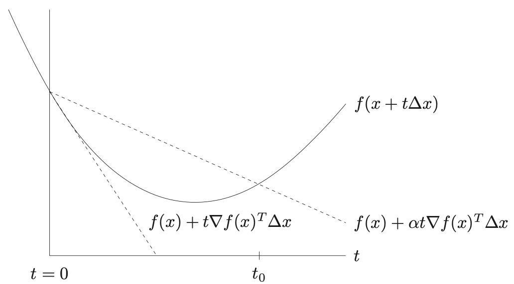
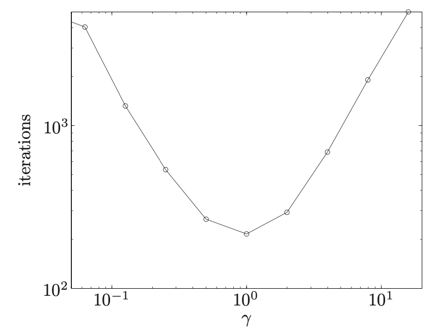
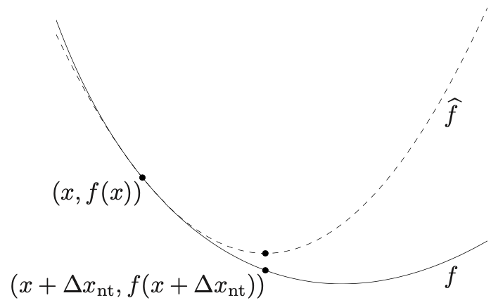

# 无约束凸优化|梯度下降、最速下降、牛顿下降和各种分析

本文是我阅读Boyd凸优化第九章的笔记，更多是给自己留个印象，而不是写教程让别人看懂。如果你的知识背景和我相似，你应该可以畅快地阅读，否则可能有困难。你没必要因此怀疑自己的能力，数学本来就是很复杂很细节的东西，没有必要掌握每个细节。

本文思维导图：

本文md文档链接：[Anblogs](https://github.com/Anarion-zuo/AnBlogs/tree/master/凸优化/basic-algorithms.md)

# 前置知识

## 对偶范数 (Dual Norm)

定义这种范数如下：
$$
\|z\|_*=\sup_z\{z^Tx\;|\;\|x\|\le1\}
$$
这是对于一个给定的范数定义的，这个范数用来限制参数$x$的取值，$\|x\|\le1$。可以认为，对偶范数是对于一个任意范数定义的。衡量了在一个「对偶空间」中，向量$z$能够向前「延伸」的最远距离。

有一个很有用的结论。若原范数为$p$阶范数，它的对偶范数为$q$阶范数，则有$1/p+1/q=1$。

这个结论很好证明，利用「柯西不等式」的推广「Holder不等式」：
$$
\|z\|_q\ge\|x\|_p\|z\|_q\ge z^Tx
$$

## 强凸函数 (Strong Convexity)

我们定义一些函数为「强凸」的，这些函数满足$mI\preceq\nabla^2f(x)\preceq MI,m>0$，也就是矩阵$\nabla^2f(x)-mI$和$MI-\nabla^2 f(x)$是正定矩阵。

对于任意函数$f$，若满足中值定理的条件，有：
$$
f(y)=f(x)+\nabla f(x)^T(y-x)+\frac{1}{2}(y-x)^T\nabla^2f(z)(y-x)
$$
其中$z\in[x,y]$。带入「强凸」的条件，得到强凸函数一定满足的不等式：
$$
f(y)\ge f(x)+\nabla f(x)^T(y-x)+\frac{m}{2}||y-x||_2^2
$$
其中使用了不等式$x^T(\nabla^2f(x)-mI)x\ge0$。可以理解为，*强凸函数就是满足这个不等式的函数*。

不等式右边相对$y$取得最小值时，$y$的取值为$\tilde y=x-\frac{1}{m}\nabla f(x)$，这可以由简单的求导得到，也可以作为「二次函数」的结论记住。

带入$\tilde y$的值得到一个新的不等式，不等式右边和$y$无关：
$$
f(y)\ge f(x)-\frac{1}{2m}||\nabla f(x)||_2^2
$$
至此，为最小值找到了一个下界，$p^*\ge f(x)-\frac{1}{2m}||\nabla f(x)||_2^2$。

把下界写得更明显一些，若梯度存在明显上界$||\nabla f(x)||_2^2\le(2m\epsilon)$，则带入可得更明显的不等式：
$$
f(x)-p^*\le\epsilon
$$
可以通过相同的方法得到最优解$x^*$的一个上界：
$$
\begin{align}p^*&=f(x^*)\ge f(x)+\nabla f(x)^T(x^*-x)+\frac{m}{2}||x^*-x||^2_2\\&\ge f(x)-||\nabla f(x)||_2||x^*-x||_2+\frac{m}{2}||x^*-x||^2_2\end{align}
$$
利用$p^*-f(x)\le0$，简单移项之后：
$$
\frac{m}{2}||x^*-x||_2^2-||\nabla f(x)||_2||x^*-x||_2=||x^*-x||_2(\frac{m}{2}||x^*-x||_2-||\nabla f(x)||_2)\le0
$$
得到了最优解的上界$||x-x^*||_2\le\frac{2}{m}||\nabla f(x)||_2$。

同理可以根据上界证明最小值的上界：
$$
p^*\le f(x)-\frac{1}{2M}||\nabla f(x)||_2^2
$$

# 广义的下降算法

最广泛的下降算法是，选择一个「方向」$\Delta x^{(k)}$，计算得到$x^{(k+1)}=x^{(k)}+t^{(k)}\Delta x^{(k)}$，使得$f(x^{(k+1)})<f(x^{(k)})$成立。

根据凸函数的性质，我们知道，$\Delta x$必须满足$\nabla f(x^{(k)})^T\Delta x^{(k)}<0$。这是由于，对于凸函数，当$f(y)\ge f(x^{(k)})$成立，$\nabla f(x^{(k)})^T(y-x^{(k)})\ge0$必成立（必要条件）。

我们于是有了最广泛的「下降」算法的流程：

1. 从某起始点开始。
2. 确定一个下降方向$\Delta x^{(k)}$。
3. 解一个一元优化问题，确定下降步长$t^{(k)}=\arg\min_tf(x^{(k)}+t\Delta x^{(k)})$。
4. 计算得到新的$x^{(k+1)}$，循环至收敛。

这里有两个可以变化的地方，分别是「选择$\Delta x$的方法」和「选择$t$的方法」。以下讨论选择$t$的方法，相对没那么复杂。选择$\Delta x$的方法不同，会形成非常不同的算法，在后文中更详细讲解。

## 精确查找

优化问题$t^{(k)}=\arg\min_t f(x^{(k)}+t\Delta x^{(k)})$通常可以直接求解，不论如何，一元的优化问题也简单很多。

用常见的线性回归损失函数举例子，$L(w)=||w^Tx^{(i)}-y^{(i)}||_2^2$。带入优化问题：
$$
\frac{d}{dt}L(w+t\Delta w)=\frac{dL}{d(w+t\Delta w)}\frac{d(w+t\Delta w)}{dt}=L'(w+t\Delta w)\cdot\Delta w
$$
令为0，得到最终结果$t^*=(y^{(i)}-w^Tx^{(i)})/\Delta w^T x^{(i)}$。其中$x^{(i)},y^{(i)}$可以「随机」从数据集中取得，做的就是「随机梯度下降」。

## 回溯法 (Backtracking)

回溯法是另一种找$t^{(k)}$的方法，它在每一步迭代找的是「近似」的最优$t^{(k)}$，而不是「精确」的$t^{(k)}$。

将$t$初始化为一个较大的数字，如1。准备常量$\alpha\in(0,0,5),\beta\in(0,1)$，当满足$f(x+t\Delta x)>f(x)+\alpha t\nabla f(x)^T\Delta x$时，不断缩小$t:=\beta t$。

算法的运行可以参考上图。$f(x+t\Delta x)$是个一元函数，我们知道它在$t=0$处的切线可以由$y=f(x)+t\nabla f(x)^T\Delta x$表示，如图中切线。现在切线的斜率上乘一个比1小的数字$\alpha$，得到「割线」，没有切线那么「斜」。

算法启动时，我们尝试性沿着$\Delta x$方向走$t$这么长的距离。我们想要控制$t$，防止走得太远反而令函数值增大。以「割线」和函数的交点为分界，要是$t$过大，就缩小$t=\beta t$，控制$t<t_0$，保证算法收敛。

在大多数情况下，「回溯」和「精确查找」的性能相差不远。

# 梯度下降 (Gradient Descent)

梯度下降算法，只是众多下降算法中的一个。这些算法之间的大区别在于「选择$\Delta x$」不同，而「选择$t$」的操作常常独立于此讨论。

梯度下降十分简单，就是选择$\Delta x=-\nabla f$，选择下降的方向为梯度的反方向。这似乎是理所当然的选择，还有什么比梯度的反方向更好呢？当然是可以有的，我们后面再说。

这里就没必要列出梯度下降的流程了，只是上面「广义的下降算法」流程做了一些小改变而已。

## 证明收敛

这里对梯度下降应用经典的数学分析，证明算法的正确性。如果你觉得这样书卷气太浓，可以跳过至后文更重要的部分。

假设目标函数是「强凸函数」，前文有推导强凸函数的有关结论，如果你刚才跳过了可以回去看看，或者直接跳过本证明。

记一次迭代中的函数$\tilde f(t)=f(x-t\nabla f(x))$，用于在每次迭代中确定$t$。则根据强凸函数的性质：
$$
\tilde f(t)\le f(x)-t||\nabla f(x)||_2^2+\frac{M}{2}t^2||\nabla f(x)||_2^2
$$
不等式右边的最小值在$t=1/M$的时候取得，这是「二次函数」的简单结论。于是得到一个更紧的上界：
$$
\tilde f(t)\le f(x)-\frac{1}{2M}||\nabla f(x)||_2^2
$$

### 若使用「精确查找」确定$t$

当使用精确查找确定$t$时，每次迭代得到一个$t_{exact}$，是关于$t$的优化问题的最优解。则每次迭代更新值$x^{(k+1)}$依旧满足不等式：
$$
f(x^{(k+1)})=\tilde f(t_{exact})\le f(x^{(k)})-\frac{1}{2M}||\nabla f(x^{(k)})||_2^2
$$
两边同时减去最小值$p^*$，并且和不等式$||\nabla f(x)||_2^2\ge2m(f(x)-p^*)$联立：
$$
f(x^{(k+1)})-p^*\le f(x)-p^*-\frac{1}{2M}||\nabla f(x^{(k)})||_2^2\le f(x^{(k)})-p^*-\frac{1}{2M}(2m(f(x^{(k)})-p^*))
$$
整理一下：
$$
f(x^{(k+1)})-p^*\le(1-\frac{m}{M})(f(x^{(k)})-p^*)\le(1-\frac{m}{M})^k(f(x^{(0)})-p^*)
$$
要确定计算精度为$\epsilon$，也就是$f(x^{(k)})-p^*\le\epsilon$，只需要带入上面的不等式，令$\epsilon$和不等式右边相等，得到$k$的取值：
$$
\hat k=-\frac{\log f(x^{(0)}-p^*)-\log\epsilon}{\log(1-\frac{m}{M})}
$$

### 若使用「回溯」确定$t$

这里不详细展开过程了，和上面类似，只是在不等式处有小小修改。给出最终结果：
$$
f(x^{(k+1)})-p^*\le c^k(f(x^{(0)})-p^*),c=1-\min\{2m\alpha,2\beta\alpha m/M\}<1
$$

## 梯度下降的问题

梯度下降对于变量的「尺度」(Scale) 有很大依赖，也可以说是对「坐标系」有很大依赖。要是坐标系的尺度(Scale)没有选择好，算法依旧会收敛，但是收敛的非常慢($10^9$)，使得算法失去价值。

具体看下图：

这样的「等高线图」(Contour) 是令$f(x)$取得不同值时解出$x$得到的，我在后文中将「等高线的形状」描述为「原始空间的形状」或「取值的形状」或「目标函数形状」。这里左图的「形状」是个「椭圆」，右图是个「正圆」。

两个变量尺度差别很大时，可能出现左图这样zigzag弯弯绕的情况。差别不大时，几乎只需要一次迭代，一次对$t$的优化问题，就可以得到答案。

以下以具体例子看看这个问题。

## 条件数 (Condition Number)

假设目标函数为$f(x)=c^Tx-\sum_{i=1}^m\log(b_i-a_i^Tx)$。为了表现出不同变量尺度对算法的影响，做一个换元$x=T\bar x$，其中矩阵$T$为对角矩阵，元素从左上到右下依次为$1,\gamma^{1/n},\gamma^{2/n},…,\gamma^{(n-1)/n}$。目标函数变为$\bar f(\bar x)=c^TT\bar x-\sum_{i=1}^m\log(b_i-a_i^TT\bar x)$。

对这个函数使用梯度下降算法，得到迭代次数和$\gamma$的关系如图：

迭代次数取得最小值时，就是各个变量没有缩放的时候！一旦$\gamma$不为0，迭代次数就会剧烈增加，因为$\gamma$导致的缩放指数级变化！

# 最速下降 (Steepest Descent)

改变「选择$\Delta x$」的方法，就得到不同的算法。「最速下降」的概念应该是比「梯度下降」更大的，梯度下降可以看做最速下降的一种特殊情况。如果你对数学推理很反感，可以看看第一个h2标题，感受梯度下降如何与最速下降联系。

选择$\Delta x=-\nabla f$似乎理所当然，最速下降用的是更加理所当然的直觉：*每次确定$\Delta x$的时候，保证$\Delta x$使得$f(x)$下降最多*。

这是个优化问题：$\arg\min_v\{\nabla f(x)^Tv|\;||v||=1\}$。其中，$||v||=1$是为了满足「单位向量」的规定。若对$v$的长度不加限制，就相当于将选择$\Delta x$和选择$t$合并到了一起，违背了我们的初衷，并不「高效」。

等价的优化问题是：$\arg\min_v\{\nabla f^Tv|\;||v||\le1\}$，让$v$在一个「球」中取值，允许了一定的「长度选择」，这个长度选择在算法收敛之前不会发生太大作用，算法会经常选择$||v||=1$上的解。

以上得到的下降方向称为「归一化的方向」$\Delta x_{nsd}$。我们通过一个仔细设定，选择梯度的「对偶范数」为缩放系数$||\nabla f(x)||_*$，得到「未归一化的方向」$\Delta x_{sd}=||\nabla f(x)||_*\Delta x_{nsd}$。「未归一化」的意思是，$||\Delta x||\le1$不再成立。

选择「对偶范数」作为系数的原因是，这样可以简单地描述$\Delta x_{sd}$和梯度的内积：
$$
\nabla f(x)^T\Delta x_{sd}=||\nabla f(x)||_*\nabla f(x)^T\Delta x_{nsd}=-||\nabla f(x)||_*^2
$$
综上所述，算法在选择「下降方向」时的操作是$\Delta x=||\nabla f(x)||_*\cdot\arg\min_v\{\nabla f(x)^Tv|\;||v||\le1\}$。以下具体选择「范数」，展示计算$\Delta x_{nsd}$和$\Delta x_{sd}$的过程。

## 二阶范数和梯度下降

如果你看上面的数学推理有点懵，这里联系梯度下降，看看如何从梯度下降导向最速下降，看看梯度下降又是如何为最速下降的特殊情况。

最速下降的变化在于$||*||$范数选择的多种多样，梯度下降就是选择「二阶范数」的最速下降，当然最速下降也可以选择其他阶或形式的「范数」。以下看看二阶范数的最速下降的形式。

求$\Delta x_{nsd}$的优化问题为：
$$
\min\nabla f(x)^Tv\qquad s.t.\;||v||_2^2\le1
$$
这个优化问题的解就是$\Delta x_{sd}=-\nabla f(x)$，如果你不想看接下来的数学推理，看到这里就好了。

由拉格朗日乘子法得到目标函数：
$$
L=\nabla f(x)^Tv+\lambda(||v||_2^2-1)
$$
对$v$求梯度：
$$
\nabla L=\nabla f(x)+\lambda2v
$$
得到$v^*=-\frac{1}{2\lambda}\nabla f(x)$，带入到$L$中：
$$
L^*=-\frac{1}{2\lambda}||\nabla f^T||_2^2+\lambda(\frac{1}{4\lambda^2}||\nabla f^T||_2^2-1)=-(\lambda+\frac{1}{4\lambda}||\nabla f||_2^2)
$$
由简单的均值不等式可以看出$L^*\le-2\sqrt{\frac{1}{4}||\nabla f||_2^2}=-||\nabla f||_2$，取等条件为$\lambda=\frac{1}{2}||\nabla f||_2$。对偶问题目标函数的最大值就是梯度的二阶范数！由对偶问题和凸函数的性质，内积$\nabla f^Tv$在取得最优解时的值就是梯度的二阶范数！

要得到最终解，还需要求「对偶范数」。由于取得是「二阶范数」，对偶范数就是二阶范数，$\|\nabla f\|_*=\|\nabla f\|_2$。带入得到最终结果：
$$
\Delta x_{sd}=\|\nabla f\|_*\Delta x_{nsd}=-\nabla f(x)
$$
得到这样的结果还是出人意料的。我本预想这会和$-\nabla f$差一个系数，还要顺势证明那个系数是正数，现在看来分毫不差！

## 范数和坐标系变化

「梯度下降」就是「最速下降」在「二阶范数」下的版本，我们来看更加广泛的情况。

二阶范数是简单的向量内积，我们用「二次型」取代内积，定义一个「P范数」：
$$
\|x\|_P=\sqrt{x^TPx}
$$
$\Delta x_{nsd}$的优化问题为：
$$
\min\nabla f(x)^Tv\qquad s.t.\;||v||_P^2\le1
$$
得到最终结果$\Delta x_{sd}=-P^{-1}\nabla f(x)$，省略具体过程了，和上面二阶范数的情况类似。

利用矩阵和向量变换的知识加以理解。$x^TPx$是另一种内积，相当于将向量$x$先作映射$P^{1/2}x=\bar x$，令自变量去到另一个空间，从而使得$x^TPx=\bar x^T\bar x$。在$\bar x$代表的空间下，还是在对目标函数进行「梯度下降」。而$P=I$单位矩阵的情况就是「不变换」，是一种特殊情况。

无论是采用P范数还是其他范数，本质上都是进行坐标系变换，将自变量映射到另一个空间，从而更好地进行「梯度下降」。梯度下降在原始空间中可能存在缺陷，正如前文所述，要是分量之间的尺度差异过大， 收敛就会非常缓慢。这时，变换坐标系就会很有用。

具体如何变换才是最有用的，这可能见仁见智了。一般来说，要使得「范数」定义的坐标系的「形状」和目标函数自变量取值空间的「形状」相似，如「P范数」的形状是「椭圆」、「一阶范数」的形状是「矩形」。使用和变量空间形状相近的范数，可以「抵消」原始空间对算法效率的影响，从而使得变换后的空间尽量接近「正圆」。

而「最速下降」更多是一种总结，不是具体的算法本身。

## 一阶范数和坐标轴下降法

再介绍一个常用的最速下降的算法，也就是简单地取一阶范数作为求$\Delta x_{nsd}$时候的范数。
$$
\Delta x_{nsd}=\arg\min_v\{\nabla f(x)^Tv|\|v\|_1\le1\}
$$
写出目标函数和它的梯度：
$$
L(v)=\nabla f^Tv+\lambda(\|v\|_1-1),\nabla L=\nabla f+\lambda\text{sign}(v)
$$
其中$\text{sign}(v)$就是向量$v$各个分量的符号$(\pm)$组成的向量，这是对「绝对值」求导得到的。将梯度令为0，得到对于每个分量，都应该有：
$$
\frac{\partial f}{\partial x_j}=-\lambda\text{sign}(v_j^*)
$$
这个表达式有很巧妙的「对称」：
$$
v_j^*\propto-\text{sign}(\frac{\partial f}{\partial x_j})
$$
一阶范数的「对偶范数」是「无穷阶范数」，记$\|\nabla f\|_*=\|\frac{\partial f}{\partial x_i}\|$。可以看出结果：
$$
\Delta x_{sd}=-\frac{\partial f}{\partial x_i}e_i
$$
其中$e_i$为坐标系的「基向量」，也就是令$\Delta x_{sd}$只有一个分量$i$非0，其余分量均为0。上面的结果是「看出来的」，如果你不太安心，可以验证$\nabla f(x)^T\Delta x_{sd}=-||\nabla f(x)||_*^2$确实成立。

这就是「坐标轴下降法」，每次迭代只更新梯度最大的方向，保持其他方向不变。

前文说到，选择范数就是要选择和目标函数形状相近的。当目标函数的形式和范数相近时，我们喜欢选择这样的范数。如L1正则中出现了「一阶范数」，对应的模型经常使用坐标轴下降法求解。

# 牛顿法

选择范数实在是令人头疼的事情，我们有时实在不知道目标函数的形状最好使用什么范数来描述。牛顿法就是会「自适应形状」的算法，相当于在每一步都会用一个椭圆来逼近当前位置目标函数的形状。我们以下具体来看这个问题。

设置每一步$\Delta x_{nt}=-\nabla^2f(x)^{-1}\nabla f(x)$，可以验证$\nabla f(x)^T\Delta x_{nt}=-\nabla f^T\nabla^2f^{-1}\nabla f<0$，这就是牛顿法。和前文的一些「最速下降法」的例子不同，牛顿法使用的是一个变化的矩阵$\nabla^2f$，也就是「Hessian矩阵」或「二阶导数」。根据「凸函数」的性质，$\nabla^2f$一定是「正定矩阵」。

## 各种理解方式

有很多种理解牛顿法的方式，我列举一些，希望能带来直观的认知。

### 最小化二阶泰勒展开

目标函数的二阶展开式如下：
$$
f(x+v)\approx\hat f(x+v)=f(x)+\nabla f(x)^Tv+\frac{1}{2}v^T\nabla^2f(x)v
$$
对$v$求最优解：
$$
\nabla_v\hat f(x+v)=\nabla f+\nabla^2 f v
$$
得到结果$v^*=-\nabla^2f^{-1}\nabla f$，就是牛顿法的「一步」。

由此看来，牛顿法是在最小化每一步的「二阶近似」。如下图，找到$\hat f$的最小值，就是离$f$最小值的更进一步。

### 选择特殊的P范数

牛顿法也可以看做选择了特殊P范数的最速下降，对于P范数，我们在之前最速下降标题下举过例子。

这里让矩阵$P=\nabla^2f$，则范数为$\|u\|_{\nabla^2f}=\sqrt{u^T\nabla^2fu}$。每次更新$x$时，都重新计算了$\nabla^2f$。如果认为P范数就是将变量映射到另一个空间从而更好地梯度下降，那么牛顿法在每一步的映射都不同、都是根据函数当前的形状决定的。范数的形状越接近目标函数的形状，梯度下降的效果就越好，则每一步都使用「二阶展开」逼近的范数，效果肯定比始终不变的范数好很多。并且，越接近最优解，二阶展开和真实目标函数之间的差异越小，从而每次迭代的效率越来越高。

### 牛顿法自适应不受坐标系伸缩影响

牛顿法的每一步都会调整「范数」，这里演示这样的调整如何摆脱了梯度下降的「尺度问题」。

将变量$x$做线性变换$x=Ty$后，以$y$为变量，得到$\Delta y_{nt}$的表达式如下：
$$
\Delta y_{nt}=-(T^T\nabla^2fT)^{-1}(T^T\nabla f)=T^{-1}\Delta x_{nt}
$$
故$x+\Delta x_{nt}=T(y+\Delta y_{nt})$，每次迭代更新值会随着自变量被映射而被映射，算法自动方便了函数，而不是函数来方便算法。

## 下降程度

使用梯度和$\Delta x_{sd}$的内积来衡量一次迭代更新的程度：
$$
\lambda(x)=-\nabla f^T\Delta x_{nt}=\sqrt{\nabla f^T\nabla^2f^{-1}\nabla f}
$$
这是个很重要的量。我们知道，牛顿法每一步都是在使用二阶近似的优化问题代替原来的优化问题，这个量$\lambda$也衡量了近似的优化问题和原问题之间的差距：
$$
f(x)-\hat f(x+\Delta x_{nt})=\frac{1}{2}\lambda^2(x)
$$

## 正确性证明

未完待续…...