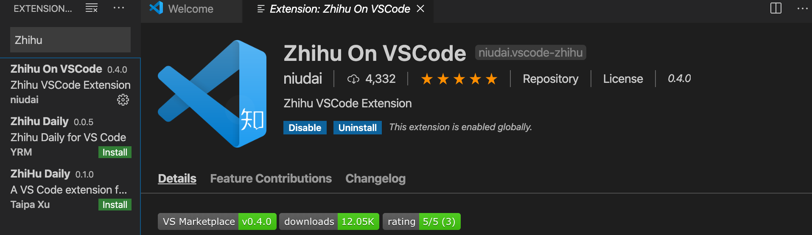
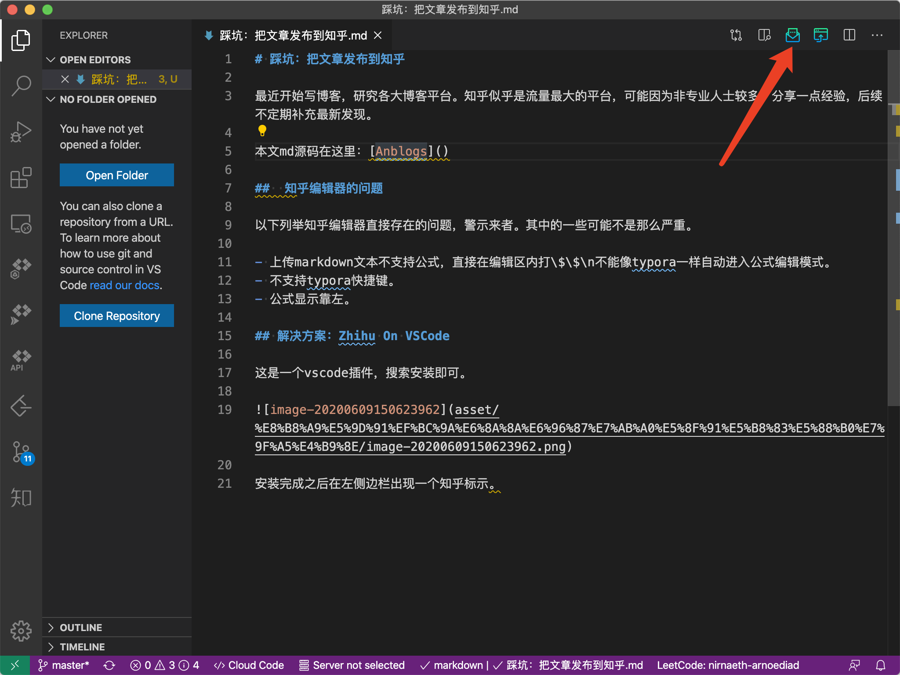
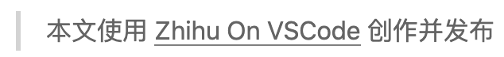
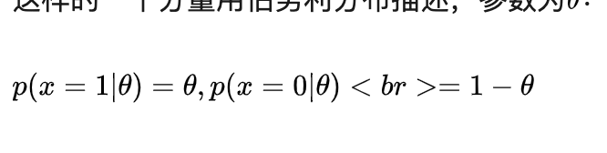
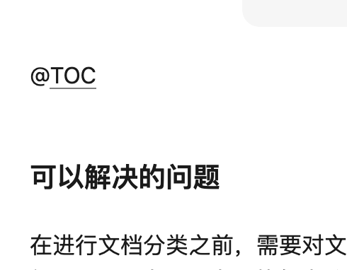
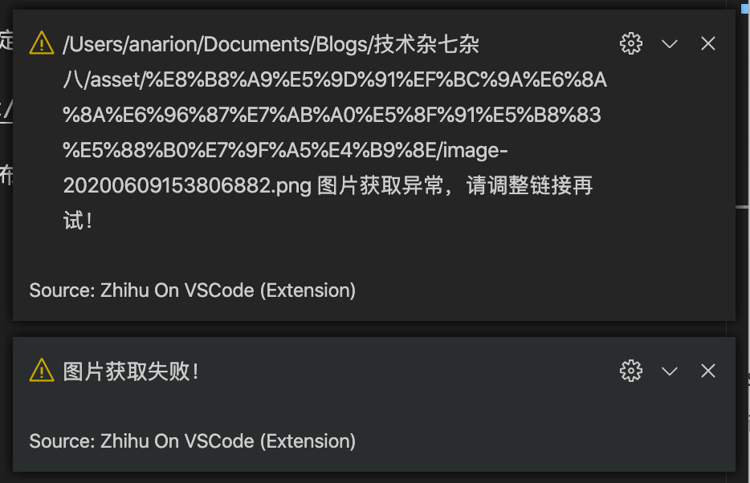
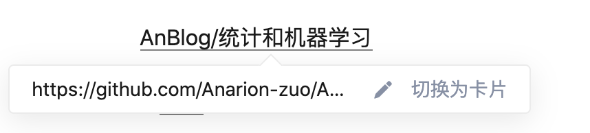
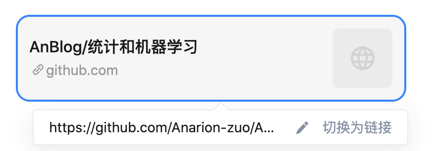
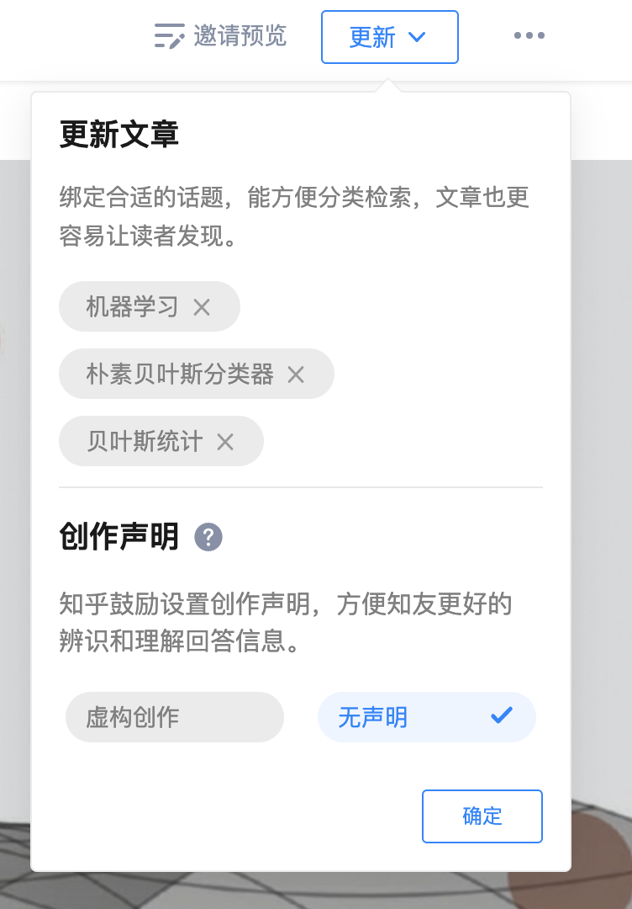

#! https://zhuanlan.zhihu.com/p/146960836
# 踩坑：把文章发布到知乎

最近开始写博客，在研究各大博客平台。知乎似乎是流量最大的平台，可能因为非专业人士较多。本文分享一点发布文章的经验，后续不定期补充最新发现。

本文md源码在这里：[Anblogs](https://github.com/Anarion-zuo/AnBlogs/tree/master/技术杂七杂八/post-onto-zhihu.md)

##  知乎编辑器的问题

以下列举知乎编辑器直接存在的问题，警示来者。其中的一些可能不是那么严重。

- 上传markdown文本不支持公式，直接在编辑区内打\$\$\n不能像typora一样自动进入公式编辑模式。
- 不支持typora快捷键。
- 公式显示靠左。

## 解决方案：Zhihu On VSCode

这是一个vscode插件，仓库在这里：[Zhihu On VSCode](https://github.com/niudai/VSCode-Zhihu)

### 使用 Zhihu On VSCode

搜索安装即可。



安装完成之后在左侧边栏出现一个知乎标示。

用vscode打开md文件，右上方出现发布按钮。



点击按钮，若未登陆则先登陆，登陆后根据指引即可发布。

### 插件暗地里干的事情

使用工具最令人苦恼的莫过于工具背着我们干了事情，想想C++就能理解。这里归纳插件暗地里干的事情。

上传之后，知乎上显示的文章和原文不太一样。

#### 在开头多了一个引用块



尊重插件作者，我保留这个。

#### 在markdown文本的开头多了一行链接

```markdown
#! https://www.zhihu.com/...
```

作者是这样解释的：

> 若你想在特定的问题下回答，或想修改自己的某个原有回答，就将问题/答案链接以 `#! https://...` 的格式放置于答案的第一行，发布时，插件会自动扫描识别，发布至相应的问题下，或修改原有的答案。

如果没有这行链接：

> 若插件没有在首行扫描到链接，则会询问创作者接下来的操作，你可以选择发布新文章，或从收藏夹中选取相应问题，发布至相应问题下。

第一次发布的时候，我们就可以自己在第一行写上链接，方便直接更新我们的文章，要是不存在这样一行，插件会自动补充。

#### 自动识别第一个H1标题为标题

md文档中的第一个#级别的标题被识别成文章的标题，起内容不会添加到正文中。

### 可能的BUG

#### 公式内部换行

Typora中，在\$\$引发的公式块中换行，渲染的公式不会换行。用这个插件发布后，这些换行在页面上显示为\<br\>，十分难受。



不知道这刻意为之还是bug。

#### 目录不能正确显示

一般来说，输入@TOC命令，可以生成一个全文目录，但是这个插件并不能做到。



#### 无法识别中文路径

使用Typora复制图片功能，在当前文件的目录下自动创建一个*asset*目录，其中放复制进文档的图片。当md文档命名中包含中文时，图片路径中也包含中文，插件报错。



再次提醒我们，不管是在写什么，文件路径都不要包含中文！

其他可能的坑不定期补充。

## 发布之后

可以在知乎上对发布好的文章进行一点修饰，发布后在知乎上进入编辑模式操作。

### 链接变卡片

使用markdown语法*\[\]\(\)*产生的链接可以切换为卡片：

 

切换之后可以变回来：



### 添加封面

(我猜)为文章添加封面可以增加流量。点击编辑器顶部的相机即可添加封面，若选择的封面之前使用过，不需要上传自动使用(知乎程序员的优化)。

### 绑定话题和创作声明

进入编辑后，点击右上角「更新」，可以绑定搜索话题，添加创作声明。



点击确定之后，将对文章进行的所有修改发布到知乎上。若直接退出当前页面不点确定，做出的改变可能会保存到草稿箱，也可能不会，不会改变发布的版本。

其他操作不定期补充。
