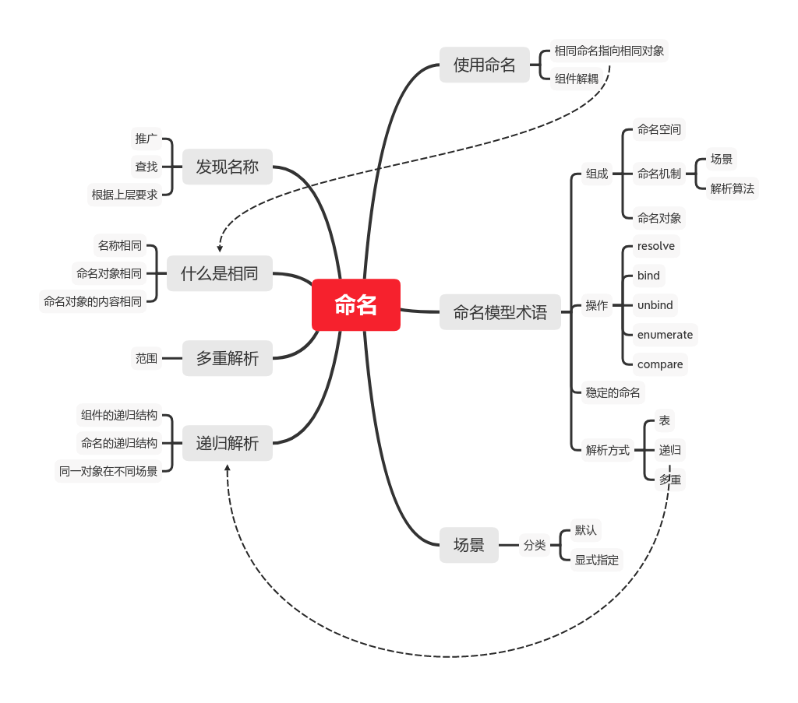
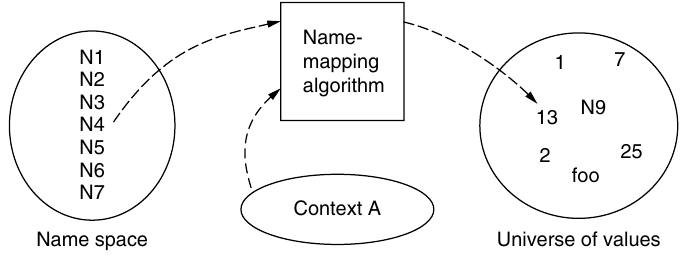
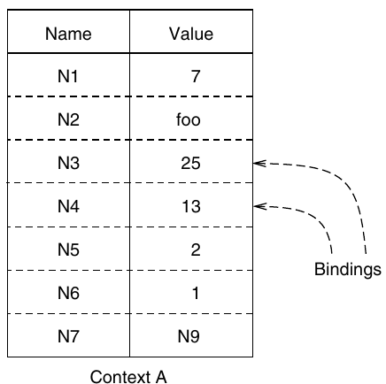
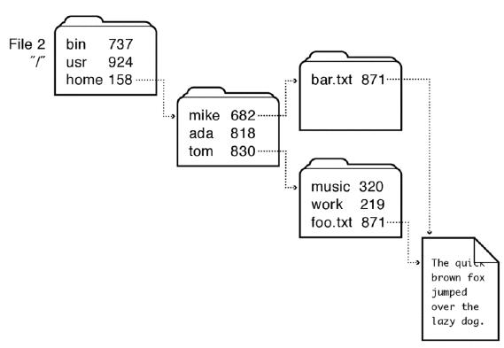
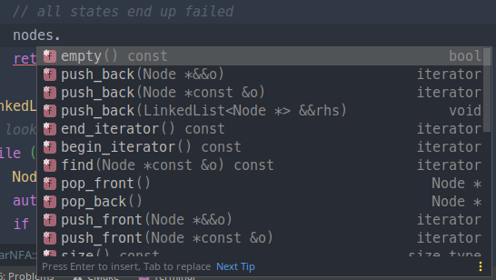

#! https://zhuanlan.zhihu.com/p/301294664
# 翻译 | 和命名有关的设计

本文是[Principles of Computer System Design: An Introduction](https://www.amazon.cn/dp/0123749573)章节`2.2 Naming in Computer Systems`的理解性翻译，不求还原字句，只求写完后我自己真正看懂。主要和**命名**有关，系统讲解**命名**在软件系统设计中使用。只关注抽象概念认识，没有具体算法实现，甚至没有具体代码实例。

本书讲解软件系统设计，非常老道深刻，值得细读，值得写本文。下面正式开始。

本文md源码在这里：[Anblogs](https://github.com/Anarion-zuo/AnBlogs/tree/master/技术杂七杂八/sysdesign-2.2-naming.md)



# 使用命名

在深入看命名`Naming`模型之前，先归纳**命名**如何用在系统设计中。你一定有丰富的使用经验，因为这几乎是最常用的手法，写代码几乎一定要**起变量名**。

一方面，命名是在声明这样一件事：**名字相同的对象是同一个对象**。这里的**相同**不一定是内容上的完全一致，**对象**不一定指**面向对象**的对象，但某种程度上相同的命名一定表达其它形式的**相同**。

另一方面，命名可以令组件之间**解耦**。组件之间的关系可以在很早就通过**命名**确定，而具体实现可以在**相同命名**维持的**相同关系**下不断变化。如函数`{}`可以先留空，或先声明为虚函数。联系上面，**相同**命名表达了**相同关系**，通过稳定的命名来维持组件之间的稳定耦合。

**命名**的价值如此之大，以至于作者花费了一整章讲解，而我也花费了睡前的一个小时来写本文。无论**命名**如何有用，上面基本上概括了它们的用处。

# 命名模型

这里引入一些基本术语，描述一个正式的**模型**。要讨论复杂的东西，一点形式主义`formalism`是必须的，即便它们看上去好像很简单。抽象的术语是为了描述抽象的概念，而不是具体实现。

## 模型的组成

**命名模型**由3部分组成，**命名空间、命名机制**和**命名对象**。系统中所有出现的**名称**共同构成**命名空间**`Name Space`，这些名称都会通过某个**命名机制**`Name Scheme`和一个**命名对象**`Value`相互**绑定**`bound`。

一个系统中通常存在多种**命名机制**，对应多种不同的**场景**`Context`。系统执行时根据不同**场景**，选择不同的**解析算法**`Name-mapping algorithm`，找到不同的**命名对象**。如单词`you`在不同的对话里指代的对象就可能不同。



程序员在命名的时候，心中自动指定了**场景**，也就自动指定了解释命名的机制。如`IP`地址肯定是写给*网络通信*有关组件的，*文件路径*肯定是写给*文件系统*的，这些命名脱离了心目中的**场景**就会失去意义。同样，*文件系统*对它接受的字符串也有一定预设，不能通过不存在的路径找到存在的文件。

当然，有些命名在所有场景下是相同的。在日常用语中，我们可能称它们为**专有名词**，它们的含义不随语境的改变产生明显歧义。如**中国、黄河**等。

根据**场景**执行不同**解析算法**的组件称为**解析器**`resolver`，抽象地说，给解析器传递**场景**和**名称**，解析器就返回相应的**命名对象**。

```pseudocode
value <- RESOLVE(name, context)
```

## 模型操作

对于命名模型，我们可以作如下操作。当然，这些都是抽象的讨论，不是说代码里面一定要写一个`RESOLVE`函数，或是一定要有`context`对象。

-   查看给定**名称**在给定**场景**下绑定的**命名对象**。
-   给一个**名称**在给定**场景**下绑定**命名对象**，赋予一定含义。
-   取消一个**名称**和对应**命名对象**在给定**场景**下的绑定。
-   列举一个**场景**下所有的绑定。
-   检查两个**名称**是否在给定**场景**下绑定至同一**命名对象**。

写成伪代码，每一个操作对应的如下：

```pseudocode
value <- RESOLVE(name, context)
BIND(name, value, context)
UNBIND(name, context)
list <- ENUMERATE(context)
result <- COMPARE(name1, name2)
```

## 稳定命名

还是列抽象术语和概念。

我们很喜欢**稳定的命名**，也就是在给定**场景**下，所有的**名称**和**命名对象**始终保持**一一对应**关系。这样的命名空间成为`identifier name space`，每个**名称**的含义始终不变。

举一个生活中的例子。我们在网站上注册的**账户**唯一地指向我们每个用户，无论我们每个用户如何改变，这样的绑定都是非常稳定的。在这里，**账户**是**名称**，而**用户**是**命名对象**，**命名机制**抽象地存在于我们的脑海中，被理解为**所有权**或其它的财产划分机制。

进一步看，每个**账户**都对应一个**账号**，同一个**账号**不能对应两个不同的**账户**。只要用户记住了**账号**，就可以操作自己的账户。这样的绑定也很稳定。在这里，**账号**是**名称**，**账户**是**命名对象**，而**命名机制**可能存在于我们的记忆中，或是和密码一起写在某个备忘的地方。

写代码时，我们非常喜欢使用**稳定命名**。如`int`肯定表示**整型**，`String`肯定表示**字符串**。

这样的习惯是由日常使用语言演化而来的。世界上流行的所有语言几乎一定要满足这个条件，就是每个**字/单词**的含义一定在很长一段时间内几乎**保持不变**，即便它们可能有很多含义。很难想象每个人理解都不同的语言如何能够大规模使用。

## 解析命名

**解析命名**`resolve`就是找到**名称**在给定**场景**下对应的**命名对象**，也就是理解**名称**的含义。

总的来说，解析的方式分为如下几种：

-   表解析`Table lookup`，通过简单的一一对应关系，如变量名和变量内存地址。
-   递归解析`Recursive lookup`
-   多重解析`Multiple lookup`

我们暂时只关注第一种，因为它用得最多。后面两个在本文后半部分讨论。

**一一对应**关系几乎是最常用的映射机制了，其它的看上去用得少一些，可能是因为太过复杂而没有被我们注意到。

我们日常交流使用的每一个字词都和一个具体的含义**一一对应**，每个`URL`都**唯一**确定了一个在互联网上的资源，等等等。这样的对应关系可以枚举成表，把**名称**和**命名对象**简单列出。具体实现可能是通过**哈希表、B+树**等数据结构，或我们的脑瓜确定的。



# 场景Context来源和变化

系统可能在不同时刻采用不同**场景**，从而让相同名称在不同运行阶段具有不同含义。如同一函数名在不同`class`下声明，对应的函数不同。这很简单。

## 按来源分类

按**场景**来源来分，可以分成**默认场景**和**显式场景**。前者在运行时由**解析器**`resolver`自动调用，后者必须特别告诉解析器。如文件系统在解析**相对路径**时，默认以**进程工作目录**为参照，这是一种**默认**场景。两种来源可作如下理解。

>   **默认场景**可以看作解析器的内置组件，应该在设计解析器时考虑。如操作系统在装载进程时指定好了**工作目录**，程序员不一定主动进行这个操作。
>
>   其它组件不使用这个**默认值**，就必须显式修改。这样的显式修改行为在设计**解析器**时提供了支持，但解析器不对其它组件的修改行为做任何预测。如程序员可以在进程启动后通过`chdir`等系统库函数修改**工作目录**，但操作系统在装载进程时不对这个可能的调用作任何假设。

总结一下，**默认**场景是**解析器**设计的一部分，而**显式场景**是对**默认**场景这个设计的弥补。无论如何，**名称**和**场景**一定同时出现。

# 递归解析命名

这里展开讲上面提到的第二种解析命名机制。

这里**递归**的概念使用得并不深刻，递归解析出现在命名的一部分和原命名属同类的情况下。如`/path/to/file`是一个路径，则`/path/to`也是。递归结构即包含在命名本身中，也包含在命名模型描述的系统中。下面用文件系统举例，但**递归机构**是许多系统都采用的设计，甚至可以说是*所有*系统都采用到的设计，这样的举例不失一般性。

## 组件有递归结构

文件系统的目录结构自然是递归的。目录下有目录，每一级目录下的目录，和它们的上一级目录，在文件系统中的组织方式相同。整个文件系统张开成一个**树形结构**，每个目录都是**树**上的节点，每个文件都是**叶节点**，树上的每个节点和它们下面连接的节点都具有**树形结构**。

`Unix`系统下`tree`命令可以展示目录完整结构，下面展示的是`IDEA Java`配置文件的目录结构。

```shell
$ tree /usr/local/JetBrains/Toolbox/apps/IDEA-U/ch-0/202.7660.26/jbr/conf
/usr/local/JetBrains/Toolbox/apps/IDEA-U/ch-0/202.7660.26/jbr/conf
├── logging.properties
├── management
│   ├── jmxremote.access
│   ├── jmxremote.password.template
│   └── management.properties
├── net.properties
├── security
│   ├── java.policy
│   ├── java.security
│   └── policy
│       ├── limited
│       │   ├── default_local.policy
│       │   ├── default_US_export.policy
│       │   └── exempt_local.policy
│       ├── README.txt
│       └── unlimited
│           ├── default_local.policy
│           └── default_US_export.policy
└── sound.properties

5 directories, 14 files
```

`tree`命令的输出格式很直观。

## 命名空间有递归结构

从另一个角度来看，**命名对象**也可以是一个**场景**。递归解析就是在一个场景中找出下一个场景，这样不断查找，直到**命名对象**不再是**场景**。这样一来，命名本身也有递归。

如文件系统先查找`/`场景下的`usr/`对应的命名对象，找到后发现是个场景。再在`usr/`对应的命名对象对应的场景下查找`local/`对应的命名对象，如此反复。每次查找命名对象，使用的`Name-mapping`算法都是相同的，只是**场景**不同。

命名本身的递归和组件之间的递归结构，是同一结构的两个方面。

## 递归结构中的跨等级

文件系统的递归结构把系统分成直观的等级，如在根目录`/`下的对象是第一级，在`/home`目录下的对象是第二级。我们也经常使用**连接**或**快捷方式**，令同一对象在文件系统的不同位置、不同等级中出现。



从**命名**的角度看，这是同一对象出现在不同**场景**`Context`下，不同场景下的同一对象的**名称**可能不同。

# 多场景解析

这里展开将上面提到的第三种命名解析机制。

我们有时让电脑在给定目录下查找带有给定名称的文件。文件系统遍历自己的所有目录，查看所有文件，在所有子目录，也就是所有**场景**下，找出符合条件的命名。

另一个例子，搜索引擎在能找到的**所有**网站下查找给定的关键词。

这样在**多个场景**下依次解析命名的机制就是**多场景**解析。

## 范围

这样的查找通常有个给定的**范围**`scope`。如要在`C`中使用函数`sqrt`，必须指定连接系统提供的动态库`math`，并包含`math.h`文件。如果没有这样做，也可以自己实现一个`sqrt`函数，而不使用来自其它库的`sqrt`。无论如何，编译器要在程序员指定的**范围**内找出`sqrt`这个**名称**对应的函数。

当然，随着系统变得复杂，这样的**全局**搜索可能导致一些未定义行为。如`C`代码中声明了两个名称相同的函数，编译器可能报错。

解决这种歧义的办法是，定义新的**范围**，或称定义新的**场景**，让一些命名只能在组件内部访问，不能从组件外部访问，从而允许同一名称出现在不同组件而不相互影响。这样的设计体现在编程语言中是`private, protected, public`，服务器集群也有**内网IP**和**公网IP**之分。

# 定义相同

前面讲到命名模型的操作之一，是比较两个**名称**是否绑定相同的**命名对象**。

```
result <- COMPARE(name1, name2)
```

这里重点关注**相同**的具体含义，可以展开为如下3个问题。

1.  两个**名称**是否相同。
2.  两个**名称**是否绑定了相同命名对象。
3.  若**名称**绑定的命名对象属于某种形式的**存储**，如内存中的一个变量，或硬盘中的一个文件，**相同**是指名称绑定至相同的**地址**，还是指名称绑定至的地址对应的内容相同。

也就是说，**相同**可以来自3个方面：比较**名称**、比较**命名对象**，和比较**命名对象的内容**。我们需要感受到这其中的微妙区别，下面用`C`数组举例。

从这三个方面出发，我们讨论如何才是**相同的C数组**。比较**名称**是最浅显的，我们认为，在`C`代码中给数组写的**变量名**就是数组的名称，看一眼就知道是否相同。编译器通过**变量名**，区分不同的数组，以及其它各种变量和函数。

后两个方面就比较有趣。`C`数组本身应只包含一个信息，也就是**起始地址**，用数组变量名在代码中表达。如果认为还有别的信息，那就是**长度**，在**编译时**确定，也就是`[]`中不能写变量。后来新的`C`标准可以用变量初始化数组了，我们可以忽略这个区别。那么，如果**起始地址**和**长度**都相同，这两个数组是否就是**相同数组**了？

对于编译器来说，回答是肯定的。**数组变量名**绑定的就是**起始地址**和**长度**，这两项信息都是由编译器维护的。但对于程序员来说，就不那么简单。有时可能要遍历两个数组，依次比较数组里面的成员，从而定义**相同数组**为**每个成员都相同**。无论如何，我们只需要认识到，**相同**的含义可以根据需求的变化而变化。

很多编程语言都提供了**比较地址**和**比较内容**两种定义**相同变量**的方法，如`Java`中的`==`和`equals`，`Python`中的`==`和`is`，或是更不入流一点的，`JavaScript`中的`==`和`===`。我们应该对它们的区别非常敏感。

# 发现名称再使用

无论**命名模型**如何抽象，无论本文如何长，命名的最终目的都是**更好地使用对象**。有了**名称**，我们更方便地区分每个对象的含义、内容、和用途。正所谓**点关注，不迷路**。一说起**看CS专业文章**，你一定马上想起知乎用户[anarion](https://www.zhihu.com/people/anarion)这个**名称**。问题在于，你是如何知道这个**名称**的，或者说，你是如何**发现**这个名称的？

为了让已有的**名称**更加方便使用，名称的发明者主动**推广**这个名称，名称的使用者主动**查找**这个名称。

>   我想学高数。我在地铁站广告上看到了**推广**的名称**知乎，一个认真问答社区**，我使用**知乎**这个**名称**主动**查找**网站，找想要的资料。在使用名称**知乎**找资料的过程中，我又看到了**哔哩哔哩干杯**这个被**推广**的**名称**，于是来到**B站**找视频看。

**推广**和**查找**可以统一在一起。写代码时，`IDE`自动向我们**推广**我们可能想用的**变量名**，我们在`IDE`给出的建议中**查找**选择。



再举一个技术上的例子。我们想要通过域名访问网站，如`zhihu.com`。但域名不能直接用于网络通信，故浏览器进行**域名解析**，也就是**查找**可以用于网络通信的**名称**IP地址。`IP`地址也不是最终查找到的名称，网络通信分成很多层，每一层都有独特的**命名空间**。除了`IP`地址，还有**端口号**、`MAC`地址等等。就算脱离了一般程序员考虑的范围，如路由器电路设计，或是麦克斯韦方程组描述电路元件特性，抽象的**命名**还是存在的。

可以认为，这个**查找名称**的过程不断往下深入进行。而**查找**，或其相对应过程**推广**，的依据，都是**系统上层的需求**。