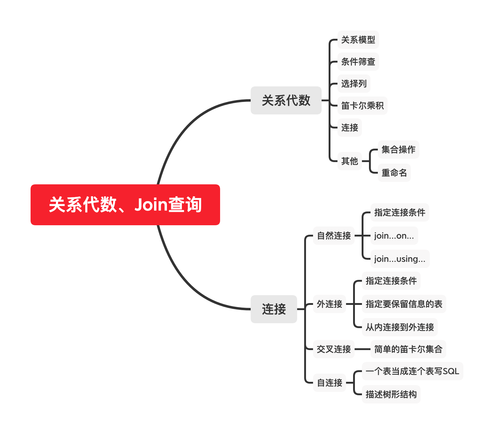
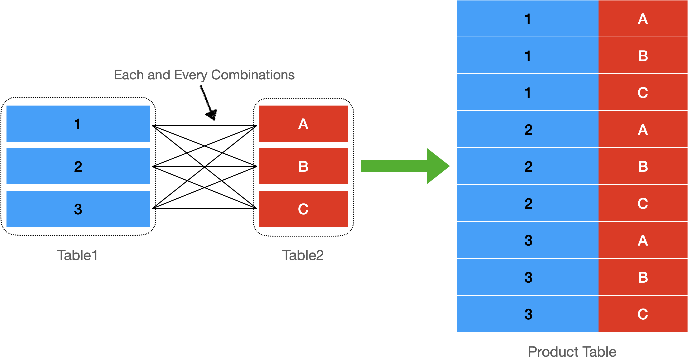
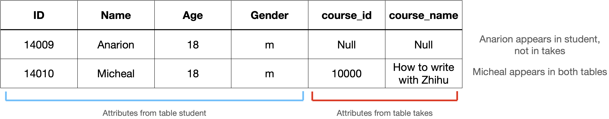
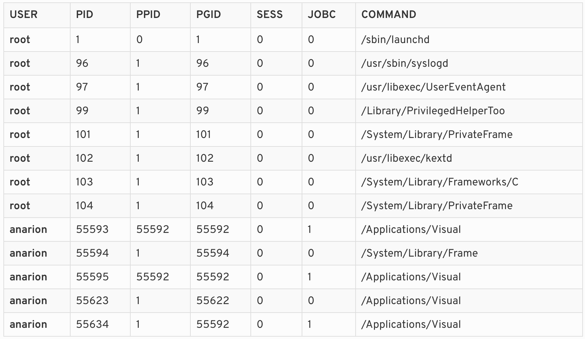

#! https://zhuanlan.zhihu.com/p/165365961
# SQL深入理解|关系代数、简单查询、连接

本文是本人学习SQL的简单笔记，主要和join查询有关。如果你对SQL中的join连接查询感到头疼，那么本文可以为你解决疑惑（希望。如果你想学习SQL和数据库的其他方面，请看我的知乎专栏：

[数据库归总](https://zhuanlan.zhihu.com/c_1270772459143311360)

本文md源码链接：[Anblogs](https://github.com/Anarion-zuo/AnBlogs/tree/master/数据库/sql-query.md)

本文思维导图：



[TOC]

# 关系代数 (Relational Algebra)

关系代数是数据库操作的数学符号体系，可以理解为SQL的数学版本。其实应该是反过来，SQL是关系代数的具体实现。纯粹的技术书籍很少谈及这方面，常常被认为是「书卷气太浓」。如果你不喜欢这样过于理论的描述，可以跳过这个标题。我强烈建议你不跳过，抽象的描述常常可以帮助建立更好的认知。

关系代数的所有记号如下：


关系代数记号非常有限，对应的SQL关键字也很有限。有些记号定义的操作我们经常使用但不自知，可见这些操作有多么简单！所以要有信心，一定可以写好SQL！

每一个记号代表对数据库的一种操作，实现一个数据库，也就是对应地把这些操作都实现了。以下一一列举。

## 关系模型和集合 (Relational Model)

「关系」模型是非常常见的数据库设计，你即便不知道这个名字，也一定非常熟悉它的样子。可以简单地理解为，关系模型就是可以画成二维表格的模型。此外不必过多解释。


最需要注意的是，关系模型的本质是个「集合」，其中的数据「没有顺序」，列之间没有顺序，行之间也没有顺序，只讲究「存在」与否。

## 条件筛查$\sigma$

我们经常做的操作是`where`，也就是条件查询。在关系代数中的原型为$\sigma_{pred}(M)$，表示在`pred`条件下从集合M中产生一个子集。

如想从集合`instructor`中取出工资`salary`大于20000的大佬，写成关系代数就是$\sigma_{salary>20000}(instructor)$。

你可能更加熟悉SQL，同样的操作，写成SQL就是`select * from instructor where salary > 2000;`

## 选择列$\Pi$

这应该属于经常使用而不自知的操作。字母$\Pi$的含义是「投影」(Projection)，在「向量」的语境下，省略一些分量，保留一些分量，相当于把向量「投影到低维空间」。在这里是类似的，省略一些列的结果，保留一些列的结果，就是「投影」，或称「选择列」。

如想从集合`instructor`中取出姓名`name`和性别`gender`，写成关系代数就是$\Pi_{name, gender}(instructor)$。你可能更加熟悉SQL，同样的操作，写成SQL就是`select name gender from instructor;`

关系代数和SQL语句一样，可以「嵌套」，写法非常自然。从上面条件筛查出来的高工资大佬中拿到他们的姓名和性别，写成关系代数就是$\Pi_{name,gender}(\sigma_{salary>2000}(instructor))$，非常自然！

同理可以写出对应的SQL，`select name gender from instructor where salary > 2000;`。SQL的形式不是嵌套的，但是你可以理解为两个过程$\sigma,\Pi$合并为一个过程$\Pi(\sigma())$，分别对应`where`和`name gender`列表。

## 笛卡尔乘积$\times$ (Cartesian Product)

上面两个记号定义了很常用很简单的操作，这个记号可能有一点点陌生。

你一定听说过两个表的「连接」，有「内连接」、「外连接」、「自连接」等等等。笛卡尔乘积是实现连接最简单的方式，针对不同的连接方式和数据情况，可以有各种各样的优化。这里从这个最简单的开始。

把两个集合做笛卡尔乘积，就是让两个集合的「每一行」的「所有组合」组成一个新的集合。



如上图所示，最右边的表是左边两个表的乘积。表1的每一行一共可以和表2的3行组合，表1一共3行，故最终一共$3\times3=9$行。

若两个表做笛卡尔乘积，结果集的行数是两个表行数的乘积。

要连接两个表格，只需要筛选结果集就可以了。如有两个表，一个表示授课教师`instructor`，一个是课程信息`course`，他们分别包含`name`属性和`teacher`属性，都表示「教师姓名」。将两个表做笛卡尔乘积，结果集中保留教师姓名相同的行就是我们想要的结果。写成关系代数$\sigma_{instructor.name=course.teacher}(instructor\times course)$，写成SQL语句`select * from instructor, course where instructor.name = course.teacher;`。

我们得到了重要的结论：*连接=筛选+笛卡尔乘积*。

## 连接

连接有专门的记号$\bowtie$，下标表示连接的条件。如上面的连接操作可以写成$\bowtie_{instructor.name=course.teacher}(instructor,course)$。

更多的也就不多说，后文专门讲解连接的各种情况。

## 其他

剩余的关系代数记号非常简单，不需要太多解释。

$\rho$是「重命名」，SQL语句中对应`as`关键字，个人感觉没必要专门拿一个字母表达这么简单的操作。

集合操作有「交集」「并集」「补集」「差集」，是高中数学的简单常识，也就不费篇幅了。

# 连接 (Join)

我们知道，连接可以理解为`筛选+笛卡尔乘积`，即便真实的算法可以做很多优化，基本思想不会变。笛卡尔乘积是固定的，让连接操作变得复杂的，只有`筛选`操作，也就是`筛选条件`。根据不同的筛选条件，SQL提供了不同的书写方式，帮助程序员明确目的、减少意料之外的事情，也增加了学习的难度。只要牢记，*各种连接就是筛选条件不同*，也就可以很容易地区分各种连接了。

以下挨个介绍常用的连接方式，同时呈现对应SQL的写法。

## 自然连接 (Natural Join)

两个表中含有相同的「属性」，或称「列」，在笛卡尔乘积的结果集中，筛选这些相同属性相等的情况。

前文讲解笛卡尔集合时的例子就是一种自然连接，相同的列是表达教师姓名的两个属性。但是， 从SQL的角度说，这个例子并不自动构成「自然连接」，因为两个列的「名称」不同。把`instructor`表中的列名改为`teacher`，或把`course`表中的列名改为`name`，才可以自动构成SQL意义下的「自连接」。

虽然SQL有所规定，但是我们知道，自然连接实际划出了一类连接，代表「使用相等条件筛选」。只要我们明确，「使用相等条件筛选」是有直接SQL支持的，就可以了。

说了这么多，还没说SQL怎么写。

最简单的是直接使用SQL提供的关键字`natural join`。假设`student`表和`takes`表有相同的列`ID`，则以下两行SQL等价：

```mysql
select name, title from student natural join takes;
select name, title from student, takes where student.ID = takes.ID;
```

关键字`natural join`相当于自动添加了`where`语句，自动检查了两个表的哪几个属性相同。

也可以同时操作多个表，多写几个`natural join`就可以了。当然，前提是多个表都存在同样的列。

```mysql
select name, title 
from student natural join takes natural join course;
```

无论有多少个表被同时操作，SQL解释器都会找到这些表共有的相同列，以这些列的相等为条件，筛选产生结果集。

## 指定连接条件

这样自动找相同列的操作十分方便，同时也十分危险。要是程序员粗心地看漏了一些列名，或是对表结构有不正确的预期，可能导致数据库采用的相等条件比程序员设想的要多。SQL也提供了手动指定连接属性的方法。

如要连接表示选课情况的表`takes`和课程列表`course`，指定以属性`course_id`相等为筛选条件。以下SQL语句等价：

```mysql
select name, title from takes join course using(course_id);
select name, title from takes, course where takes.course_id = course.course_id;
```

也可以指定多个属性，相当于多个筛选条件：

```mysql
select name, title from takes join course using(course_id, course_name);
```

`join...using...`形式的语句可以很方便地指定「相等」条件，SQL同样提供了指定其他条件的方式，也就是`join...on...`。`on`语句同样可以指定相等条件，如上面的SQL等价于以下SQL：

```mysql
select name, title from takes join course on takes.course_id = course.course_id;
```

`on`关键字可以指定任意筛选条件，这就可以实现任意形式的连接，也增加了我们学习的难度。

你可能认为，`where`关键字可以直接筛选笛卡尔乘积的结果，没有必要使用`on`或`using`。这是个人习惯问题，见仁见智。然而，`where`通常用作对结果集最后的筛选，而`on using`专门用作连接时候的筛选，遵守一些规定，不但可以帮助SQL解释器减轻负担，还可以让自己的工作更加清晰明了。

## 外连接 (Outer Join)

使用「自然连接」时，若有一个取值没有同时出现在两个表中，连接的结果集中也不会出现这个取值。若有个学生没有选任何课程，在学生表`student`中有他，但是在选课表`takes`中没有他，那么以「学生姓名相等」作为连接筛选条件的结果集中也不会出现这个学生的名字。

在大多数情况下，我们想要这样的效果。但是，我们有时也想保留其中一个表的信息，不希望连接之后得到的表信息缺失。这就是「外连接」。

当指定连接方式为「外连接」时，即便有的元素没有同时出现在两张表里，也会被保留。如一个没有选任何课的学生，指定外连接后，这个学生在学生表`student`中的信息会完整出现在结果集中，而相应行中来自选课表`takes`的信息则不会出现，以「空」显示。可能形式如下：



SQL语句中对应的关键字是`outer join`，可以加上前缀`left`或`right`或`full`，表示「左连接」、「右连接」和「全连接」。所谓「左右」的意思是，保留`outer join`操作符左边或是右边的列的信息。如上图的结果集，就是一个「左连接」的结果集，保留了左边`student`表的信息，而没有保留右边`takes`表的信息，出现在`takes`表中的信息要是没有出现在`student`表中，也就不会出现在结果集中。

`full`代表要同时保留两个表的信息，如果一个表中的信息在另一个表中没出现，就把没出现的信息显示为「空」，道理是相同的。

上图对应SQL语句如下，同样使用`on`来指定连接条件。

```mysql
select * from student left outer join takes on student.name = takes.name;
```

相同的结果可以由「顺序相反」的右连接得到：

```mysql
select * from takes right outer join student on student.name = takes.name;
```

上面两个SQL得到的结果集相同。这提醒我们，无论是左连接还是右连接，甚至是全连接，重要的是指定好「要保留哪个表的信息」，而不是「连接的名字是什么」。

## 从内连接到外连接

「内连接」是和「外连接」相对的概念，也就是丢弃没有同时出现在两个表中的数据，也就是我们一开始介绍的连接方式。可以通过内连接理解外连接。

两个表进行内连接后，有的行满足内连接的筛选条件，有的不满足。给不满足筛选条件的，相应填补空值，得到的就是「外连接」的结果集。

由此，我们可以这样理解：*外连接=内连接+Null填补*。

## 外连接条件使用`where`

外连接的筛选条件不能用`where`写。

考虑这样一个SQL语句：

```mysql
select * from student left outer join takes on true where student.ID = takes.ID;
```

这个SQL语句，连接的结果集是完整的、没有筛选过的笛卡尔乘积。把连接的结果集通过`where`筛选，最终结果集中一定不存在`ID`不相等的行，这不是我们想要的「外连接」结果。

你可以停下来想一想，有没有可能通过`where`实现外连接。当然是不可能的！因为「筛选」不是外连接的最终结果，还有填补空值这一步，并且填补空值依赖筛选的结果。

## 交叉连接

交叉连接就是直接保留笛卡尔乘积的结果集，不做任何处理，没有太多好说的。普通的逗号可以触发交叉连接，如`select * from student, takes;`。也可以使用`cross join`关键字，如`select * from student cross join takes;`。

应该不需要再多解释了。

## 自连接

同一个表可以当做两个表来使用，出现在`join`操作符的两边，相同的连接操作仍然适用。如列出所有的工资大小关系，显示所有「同事A比同事B工资高」的情况。

```mysql
select higher.name as better_employee, lower.name as lower_employee
from salary as higher join salary as lower
on higher.sal > lower.sal;
```

根据显示出来的「工资比较」，你就可以去打死比你工资高的同事了。

光是可以用来打死同事还不太够，「自连接」的操作场景更多是一种树形结构的序列化方式，常用来处理「上下级关系」。具有上下级关系的表，通常有一个唯一表示自己的id，还有一个表示父对象的id。Linux的进程管理器就是一个很好的例子。下表是在MacOSX终端中输入`ps -ej`得到的部分结果：



`PID`是「进程描述符」，`PPID`是父进程的「进程描述符」。可以看到，大多数进程的父进程都是1号进程，也就是`/sbin/launchd`，也就是Mac系统的祖宗进程。这个进程是系统启动之后启动的第一个进程，它的父进程的「进程描述符」是特殊值0。Mac的进程启动次序大概如下图，是个树形结构。


像Mac的进程表这样有着树形结构的表就是有「树形结构」的，有唯一确定自身的id，也有「父对象」的id。当我们看到某一行，我们可以通过`PPID`找到这一行的父对象。每个对象都有一个父对象，这样就构成了一个树形结构，根对象的父对象用一个特殊值来表示。

可以显示出每个进程的父进程的命令和自己的命令，SQL语句如下：

```mysql
select child.command, parent.command
from process as child join process as parent
on child.ppid = parent.pid;
```

## 连接总结

要写带有连接的查询， 需要想清楚这两件事情：

1. 筛选条件是什么？
2. 是否保留只在一个表中出现过的信息？

其余的，也就很简单啦！