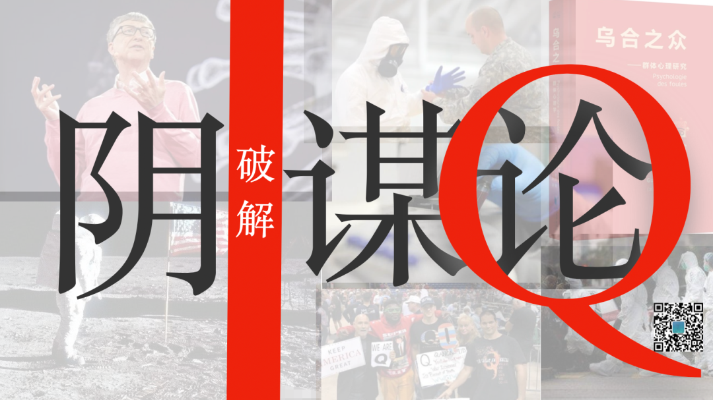
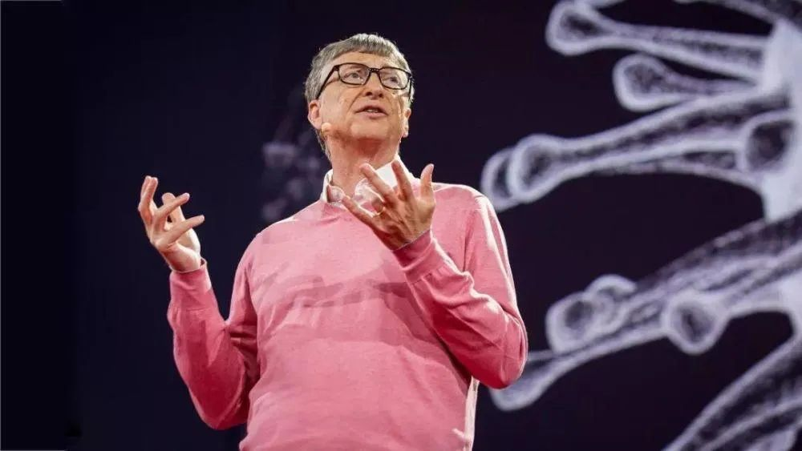
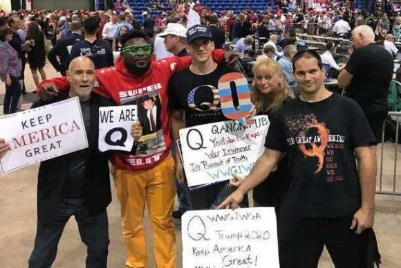
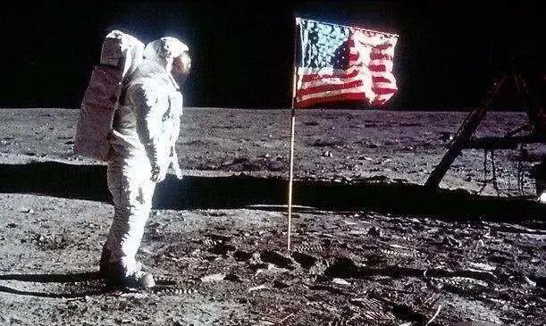

#! https://zhuanlan.zhihu.com/p/192781610
# 破解阴谋论￨你听过的那些“惊天”“秘闻”是真的吗

本文转载自微信公众号**博物**，原文链接如下：

https://mp.weixin.qq.com/s/Eah01bUAFcW9UO17Tjaz_Q

曾经有幸听到老师的语文课，虽然高考成绩不算理想，但是学习到的知识至今受用。图片之后开始正文。

# 比尔·盖茨的“阴谋”？

比尔·盖茨一定想不到，作为曾经的创业英雄、微软帝王的缔造者、无数青年的偶像，在疫情期间，他花了十亿美元开发新冠病毒疫苗，结果竟变成了想要控制人类、控制世界的邪恶科学家。

早在2015年，比尔·盖茨在TED演讲中提到：

> 接下来十几年间倘若有什么灾难能让人间死亡千万人以上的话，我想应该是病毒了。 

在演讲的结尾，比尔·盖茨呼吁：

> 要说这场埃博拉病毒的疫情带来了什么正面影响的话，那就是提早响起了警报，让我们觉醒并做好准备。我们如果即刻开始准备，那么在下一场疫情来临前我们是可以准备好的。

> In fact, if there's one positive thing that can come out of the Ebola epidemic, it's that it can serve as an early warning, a wake-up call, to get ready. If we start now, we can be ready for the next epidemic.

接着，比尔·盖茨基金会宣布拨款1亿美元，投入到疫苗的研究中去。

无论怎么看，这位科学界与商界的天才，是基于人类与病毒的抗争史做出了极有前瞻性的科研准备，堪称真正的“神操作”。但是，当人们还没有足够远的视野去理解“神操作”时，他们就会感到失去了对世界的理解力、控制感，在不确定感的恐慌中，他们只好选择将前瞻者拉下神坛。

疫情爆发后，大量网友把比尔·盖茨的“神操作”解读成一种阴谋。他们言之凿凿地说，新型冠状肺炎病毒就是比尔·盖茨制造的，然后他再把开发的疫苗卖给人类，并借机在疫苗中植入可以控制人类的芯片，这样他就能实现自己不可告人的秘密：削弱政府、控制人类，成为世界之主。

这堪比好莱坞大片剧本的想法，竟然在网上拥有大量的支持者。《纽约每日新闻报》最近做了个民调，发现美国有44%的共和党人士表示坚决不会使用比尔·盖茨投资研发的新冠疫苗，就因为担心被植入微型芯片。

看透如此邪恶阴谋的网友们，最常见的抵抗方案就是，每天在网上发各种竖中指的照片，然后@比尔·盖茨。

这种荒诞无稽、不值一驳的想法，本来过段时间也应该烟消云散了。可是，随着疫情的发展，编造、散布类似想法的人群中，有一个团队渐渐形成了气候，甚至被FBI列为了“国内恐怖威胁”的名单，它的名字叫：Q Anon。（Q Anonymous的简称，意思是“匿名者Q”）

# Q Anon是什么组织

住在美国俄亥俄州的肖克，在一家汽车零件厂工作。退休后无所事事，闲来上网，一下子就被Q Anon组织发布的信息迷住了，而且很快就开始对创始人Q无比崇拜。

Q何许人也。谁也不知道，至今也没谁能给他写一个“正传”。但他声称自己是一名政府工作人员，有着美国政府最高等级的安全许可。而且每次他发布的信息中都夹杂了大量简称、缩写、暗语，让读者感觉此人大有来头。

加入组织后，肖克沉迷于破解Q在网上提供的各种线索。有时，真的能和一些现实事件呼应，信众们纷纷膜拜能量巨大的Q；有时，竟与现实事件大有偏差，大家就纷纷反思自己错误地解读了领袖的暗示——总之，Q那一套模棱两可的“黑话”，总能让自己立于不败之地。 

信奉Q Anon的教徒们不仅在网上“解谜”，还到现实中付诸行动。

2016年，一位在华盛顿某披萨店开枪的男子，声称自己找到了希拉里·克林顿控制了一处虐童组织的大本营。

2018年，一名加州男子因为携带炸弹制造材料被捕，他的计划是袭击伊利诺伊州国会大厦。

就在今年，Q Anon似乎迎来了最大的一位粉丝——美国现任总统特朗普。

3月29号，特朗普发布了一条推文说“I am giving consideration to a QUARANTINE”。字面意思是，我正在考虑是否要采取隔离措施。

Q Anon解读道，如果忽略推文中的大部分字母，就会发现特朗普真正告白的意思：“I am……Q”。

这还真不是Q Anon的一厢情愿，特朗普多次和这个怪诞的组织一唱一和。比如，特朗普转发了一张自己闭着眼睛拉小提琴的图片，上面写着：“我的下一首曲子叫《没有什么能阻止即将到来的事》”。而“没有什么能阻止即将到来的事”这句话，正是Q Anon最著名的口号。于是，Q Anon粉丝们纷纷大开脑洞，猜测特朗普就是Q本人。

今年，美国民众长期深陷对疫情的恐慌之中，Q Anon斩钉截铁地说，新冠病毒就是由Deep State制造的，而这个Deep State（深层国家）就是藏在美国政府背后的、掌握着美国命运的一个神秘组织。结果，特朗普在一次新闻发布会上就把美国国务院直接说成是Deep State Department“深层国务院”。

考虑到竞选即将到来，特朗普不断营造自己“勇斗恶龙的英雄”形象似乎也不意外。

# 阴谋论

听了前面两则事件，你可能会觉得美国人是不是好莱坞大片看多了。

什么国家背后的神秘组织、什么幕后神秘人，还有疯狂的科学家、想要控制人类的世界霸主……这不就是007系列、漫威系列么，怎么还有人真的用简单的电影剧本来理解真实的世界呢。但事实上是，真的有很多很多人，他们需要用非常简单的、甚至比电影剧本还简单的逻辑来理解这个复杂的世界。这样，他们可以把非常复杂的人物、事件，用一套逻辑概括：背后有一个坏人、有一个坏组织，要做一件坏事。可他们为什么要这么做呢，这么做有多困难呢，一般人是完全想不到也不会想的。

就在我们身边，疫情刚刚出现时，你一定听过很多很多非常对新冠病毒极有想象力的解释。

最有名的莫过于“美帝国主义亡我之心不死”，美国人派大兵来中国散播病毒，甚至排演出一套现实版“生化危机”的剧情。

2020年2月19日，权威医学杂志《柳叶刀》在发表声明，强烈谴责关于新冠病毒非自然起源的阴谋论，强调疫情中相关数据迅速、公开且透明的共享正受到这种阴谋论的威胁。

但是，大多数民众并不知道《柳叶刀》意味着什么。

现在，本篇文章的主角登场，它是网友对比尔·盖茨的揣测，是Q Anon发布的那些模棱两可的黑话……

——它就是流散在我们周围，从原始时代到今日现代，时时刻刻影响着我们的认识与判断的：阴谋论。

为什么要讲阴谋论和破解阴谋论呢？

大家知道我的专业是高考语文，这和阴谋论有什么关系呢。答案是，一个长期被阴谋论浸淫的人根本无法有条理、有逻辑地阅读和写作。为了让我的学生在语文学习中科学地分析问题、有逻辑地表达，我有必要带领大家破解阴谋论的思维方式。

比如，新冠病毒是不是美军对付中国的“生化武器”，双黄莲口服液能不能治疗新冠肺炎，比尔·盖茨到底是不是要控制全人类……

这些问题应该如何思考呢？

# 巫师的阴谋论

很久很久以前，生活在密林中的原始人类，发现了一处极深的洞穴。要不要冒险到里面一探究竟呢？

这时候，氏族里的巫师又算又跳，然后说，使不得，洞穴里面隐藏着吃人的妖魅。

巫师怎么知道洞穴里有吃人的妖魅呢？这谁敢问呀。

但是，有一个勇者站出来，孤身前往。结果，再也没有出来。于是，巫师悲痛而得意地说，你看，我早就说了不要去嘛。

然后，又有一个勇者站出来，孤身前往。结果，不仅成功返回，还找到了第一位勇者的尸体。

巫师说，你看全凭我刚才又算又跳，已经帮你祛除了鬼魅，还帮你祈求到神明的帮助。相比第一位勇者，你有神明护体，必是我们天选的大王啊。于是，所有人扑通扑通跪在面前，第二位勇者也觉得真如神仙附体一般全身轻灵，自然骄傲地接受下来。

氏族里的妈妈们，纷纷对自己的孩子说，可不要学第一位勇者呀，你看他没有神明护体，自己跑到洞里去，果然被妖魅杀死，对了，以后还要多听巫师的话哦。

妈妈说得没错，相信巫师的臆想，少做危险的尝试，的确可以在大概率上保障自己的安全。于是，千百代的遗传中，那些轻信危言耸听之词的能力，就像基因一样，被我们保存在了意识之中。直到今天，“宁可信其有，不可信其无”，仍然是大多数人对待网络信息的态度——与原始人类的思维方式又有何异。

其实我们都知道，巫师那一套话完全是编造的、臆想的。当然，也许说得多了他自己也信了。不过，无论他信与不信，他所讲的就是一套无法证明、也无法证伪的想象，这就是阴谋论。

谁也无法证明他说的神明是存在的，当然，也没有人能证明他说的神明不存在，也就是无法被证伪。

这种既无法被证明、也无法被证伪的观点，即不被现代科学所接受。

同理，那些能够被证明、也能够被证伪的观点，即可以被现代科学所接受。

现代科学，不是对的或错的，也不是好的还是坏的，它只是一种思维方式、一种检验方法，来评价一种观点、方法能否被证明或被证伪，能即科学、否即不科学。仅此而已。

例如，世界上有没有鬼。也许在宗教人士看来，讨论这事是错的、或者是坏的。但是，在现代科学看来，没有人可以证明世界上有鬼，也没有人能够证明世界上没有鬼，所以，这不是科学家所研究的问题。仅此而已。

而阴谋论恰恰是讲一些既无法被证明，也无法被证伪的观点。

比如，911之后，有人说，就是布什派人撞的世贸大楼。如果你问他有什么证据，他就会说，这证据能让你找到么，这么阴的阴谋，全世界知道的人就不超过三个。你看，这说法和巫师说的是不是没有任何本质的不同。

当然，一定会有人说，也可能真的是布什派人撞的啊，美军可能真的就是用新冠做生化武器呀……

请注意，在此我们要谈一个非常关键的问题，我的作文课里也会经常讲到，即分析概念。上面一段里，其实混淆了一对概念：阴谋和阴谋论。

阴谋，是指背地里设计出的计谋。它的确可能是真实存在的。

阴谋论，则是指一种讨论方式，一种不讲证据而凭空揣测对方背地里设计出计谋的论调。

我们当然无法确定某种阴谋一定不成立，但我们却可以明确地指出，阴谋论讨论阴谋的方式是不正确的。

回到前面911的例子，布什派人撞世贸大楼，这的确可能是个阴谋。这个阴谋是真实的么，那就请用证据来证明或证伪，而不是不停地说布什太坏了、阴谋太阴太阴了。那就是阴谋论的论调。

同样，美军是不是拿新冠做武器，我们也不知道，那么，如果你不能证明或证伪，就不要用这个没有被证明的判断为依据，来不停地咒骂美帝用心险恶。那同样是阴谋论的论调。

讲到这里，大家一定能够看出来，阴谋论的表达两个突出特点：

## １、不用证据说话，而用想象直接发挥

我以前看过一些文章，说四十三任美国总统中，有四十一任都是共济会成员，只有两个不是，但都被刺杀了，一个是林肯、一个是肯尼迪。然后，下面就开始讲共济会怎么操纵美国……但是呢，证明那些美国总统是共济会成员的直接证据呢，却一个都拿不出来。

## ２、拿不出证据就把没证据当证据，最后就会拿爱国当证据

这个非常厉害，拿不出证据就会说，那你怎么知道就不是这么回事呢。再不行，就直接质问，这个你都不信，那你还爱国吗？布什就是坏，美国人就是坏，美国人用病毒迫害中国人，你这都不信还是中国人吗？

你看，这话就基本没法往下接了。爱国是美好的情操，但爱国和爱真理并不矛盾。

# 阴谋论的本质和弱点

我们且不说有没有证据这码事吧，即使没有证据，从逻辑上看，阴谋论照样不成立。

就以新冠疫情事件来说。刚有传言是美国大兵故意携带病毒攻击中国的时候，我身边的很多老年人义愤填膺，大骂“美帝国主义亡我之心不死”，然后就开始痛数历史上美国人做的坏事。结果不久，发现美国疫情比我们还严重，他们就都不吱声了，谣言也不攻自破。

喜欢阴谋论的人，只是想用极简化的思考来理解这个复杂的世界。比如，为什么炸世贸大楼呢，这个问题太复杂了，简化一下吧，因为背后的布什很坏。为什么比尔·盖茨知道病毒的危害并且提前做科研呢，这个问题太深奥了，简化一下吧，因为背后的盖茨很坏。

阴谋论的本质就是总想用一个非常简单的逻辑把很复杂的现实问题解决掉。

其实冷静想想，这种阴谋论是多么天真、多么漏洞百出啊。真的来生化危机，为什么不选北京，而选武汉，美国人不怕热吗？真的用生化危机，干嘛还让美国大兵自身携带病毒，你把病毒放什么器皿里不行吗，难道你病毒都能开发出来，但装病毒的设备没开发出来吗？真的用生化危机，那美国肯定之前已经准备好疫苗或者防范措施了吧，结果美国自己也没准备好……

重新想想比尔·盖茨控制全人类的阴谋言论，简直可笑透顶。这么厉害的计划，保密工作做得还不如高考命题，都天下皆知了。大家知道，任何一件事哪怕只有三四个人知道，那就无法做到密不透风，而这么厉害这么宏伟的计划，没有听到有任何一个科学家、一个工程师、一个产品经理的方案，难不成全靠比尔·盖茨一个人，先做研究，再做疫苗、再去找媒体宣传，甚至实验室都是自己清扫么……

阴谋论的本质弱点是，它经不起用常识、用逻辑稍微做一点点推敲。

再比如，双黄莲可以治疗新冠，稍微一想，如果真的有效，怎么不像口罩一样全国推广或者是强制性使用呢，怎么可能疫情还在全球蔓延呢，怎么可能连我都发现了，但是全世界的医学专家都没有发现呢。

阴谋论如此荒诞，但就是很多人喜欢，这种思维方式来自于以下三个方面，而这更值得我们警惕。

# 阴谋论的思考方式哪里来

## 第一，阴谋论的思考方式基本就是电影等通俗、娱乐内容的模式。

一部电影、一部武侠，可能支线众多、情节复杂，但相对于现实来说，还是非常简单片面的，情节基本就是主人公在某些场景和事件下的唯一选择。大多数商业片的逻辑更简单，塑造一个坏人、坏组织，然后就是好人与其斗争，最后好人获胜。

阴谋论的典型逻辑就是，这事背后绝对有一个大坏人、有一个邪恶的组织，它们控制了一切。

## 第二，阴谋论的知识往往来自于小初时期的基础知识

比如，有一个非常有名的阴谋论，说美国的“阿波罗登月计划”是为了拖垮苏联而在地球上拍摄出来的，美国人那时根本没有登上月球。网友还能找出很多论据，比如，插在月球表面上的美国国旗迎风飘舞，而月球上根本没有风，这一定是NASA的惊天骗局。但其实，国旗的支架是“７”字型，正可以把国旗展开，同时因为月球处于真空之中，插在地面上的旗子处在相对静止的状态。 

我们知道，小学中学的教学内容主要是基础阶段的知识，并不太强调逻辑、质疑，缺少科学思维、查证方法的训练。这就导致很多阴谋论者喜欢用片面的知识解释复杂的问题，并且也不知道如何寻找相关领域的专家言论（或者根本不信专家），更不知道如何用证明和证伪的方法来查证。

## 第三，喜欢用片面的感官经验替换全面的科学思考

比如，吃了某一种中药治好了某种疾病，就会对整个中医崇拜至极。其实，无论如何，中医的理论，是建立在阴阳五行这一套无法证明、证伪的观点上，这就决定了它无法进入现代科学。再说一次，这不是好坏问题。现代科学只是一种查证方法。

这时候患者往往会争辩，我大姑的病、我自己的病，都是这药治好的呀。这当然非常幸运，不过，这种药里的见效成分是草木呢还是西药呢，他就没有研究过了；治药的过程，是煎熬泡煮还是萃取提炼呢；这种药能够治愈疾病的整个治药过程、检验过程，是用中医望闻问切的方法、还是用西医的大样本随机双盲试验的方法呢，他就更没有研究过了；特别是整个检查的过程，是摸脉用功运气呢，还是抽血化验做CT呢。他这时候会气急败坏地大声质问你，你怎么知道中医不好，你难道不爱国吗，你难道不爱中国传统文化吗？

你看，这话就基本没法往下接了。爱国是美好的情操，但爱国和爱真理并不矛盾啊。

归根结底，跳出感观经验而用理性分析理解世界是很复杂的。喜欢信一些根本无法被证明和证伪的东西，不过就是想用最简单、最直接的方法来理解现实，来获得对未知的一种把控感。

然而，现实世界很复杂，我们越是打开视野、增长见识，越有能力去判断很多唬人的观点，越能理解深信和质疑并不矛盾，这才是真正的把控感。

我记得，小时候有一种阴谋论非常盛行，说日本人发明漫画就是要摧残中国青年的心灵，看日本漫画就是不爱国。后来，我去了日本，发现日本年轻人坐地铁、走路也都在看漫画。我还记得，小时候有一种阴谋论，说美国人把可乐输送到中国，就是要毁掉中国孩子的身体，喝可乐就不如喝健力宝爱国。后来，我去美国一看，那边小孩也没少喝可乐。

# 怎样识别阴谋论

阴谋论并不难分辨，主要有以下三点特征供你参考：

## 第一，情感越激烈的观点越是信不得

如果你看到一篇网文的题目中包含着极度煽动情绪的用词，比如“不转不是中国人”“一亿人都哭了”，然后连续几个感叹号，再加上“震惊”“爆炸”……十有八九信不得。

道理很简单，一个科学家或者是权威部门发布信息时，绝对不会这样说。只有不惜一切求关注的自媒体才会这样写标题，而且也会不惜一切扭曲内容以迎合大众。另外，稍微有点历史常识的人都知道，大多数变革，无论是科技、政治还是文化，都是缓慢发展、长期积累、循序渐进的，我们很少见到什么一夜之间的惊天剧变。当然，如果你订阅一个质量很差的公众号，可能每周都会发生几起“震惊了一亿人”的大事件。那你觉得这种态度科学合理么。

我们前面讲过，见识不足，就会导致对阴谋论的偏好。同理，一个平时咋咋呼呼、大惊小怪、喜欢道听途说的人，不就是因为见识不足么。

当然，世界这么大，谁也不敢说自己足够见多识广，但这不影响我们学会判断什么样的信息是无法证明证伪的阴谋论。

## 第二，信息源头无法追查的不可信

“翌得”app上多个作者的文章，如果有超过自己知识范围的而需要引用内容的，往往会注明引用的源头。这是科学的研究方法。

而如果在一个卖农产品的网站上出现讨论国家大事的内容，在一个议论国是的微信号里又推荐养生药，八成都是转来转去的水文，其可信度就会非常之低。

## 第三，无法被证明、证伪的不妨暂且不信

我们每天都被大量的广告信息环绕，这些广告真的可以证明或证伪么。比如，某明星代言的产品，说用了就腰不酸腿不痛，其实，你并不知道人家不用这个产品，身体也很棒；再比如，某专家写了一本辅导书，说看了这本书班里的学生纷纷考上清北，其实，你并不知道那些学生不用这个书还可能上哈佛耶鲁……

我们经常在朋友圈里看到这样的文章：北京某金领熬夜过多患癌，通宵熬夜让他年纪轻轻得了某病……反正极尽恐吓之能。用我们今天的方法来反思一下，这些文章能够证明他因为熬夜就得癌症么，能够证明不熬夜就不得癌症么。“熬夜”和“癌症”就像鸡叫和天明一样，也许只是前后关系，而没有因果关系。

2017年《科学》（Science）杂志发表了一篇研究。他们对常见的32种癌症的基因突变，进行了风险因素的分析。研究结果发现，癌症基因突变最大的危险因素不是环境也不是遗传，而是随机错误。

在此我并非发表赞成或反对熬夜的观点，而是倡导大家，当我们遇到一个非常唬人的题目时，要保持着看透发布阴谋论者的一份冷静和理智，不能证明或证伪时，不妨暂且不信。

# 唤起警惕

一百多年前，法国学者古斯塔夫·勒庞，在法国革命不断的年代里，亲眼目睹了法国民众在狂热的情绪中退化成野蛮、极端的原始人，并做出骇人听闻的暴行，之后却又打出爱国主义的旗帜要求得到奖赏。

于是，勒庞在他1895年的传世名作《乌合之众》写道：

> 民众缺乏理性，依赖于信仰与权威的引导，用想象来判断，模仿他人行为，简而言之，民众是盲从的。

在我们面对危言耸听的言论和陷入某种不理智的情绪时，希望这篇文章至少可以唤起我们的一丝警惕。