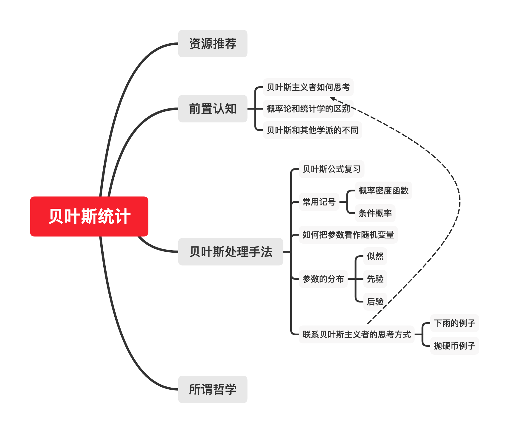
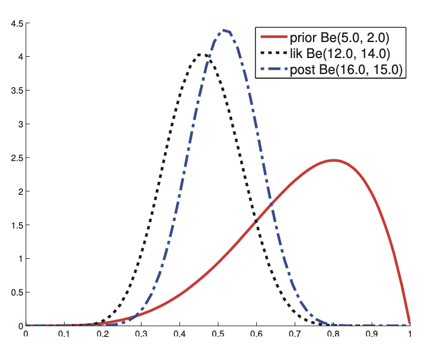

# 人话入门贝叶斯统计学

你可能刚学完大学里面喜欢开的「概率论与数理统计」，知道各种各样的分布，听说过中心极限定理，会做一些参数估计。这时候是继续深入统计学的绝佳时机，然而大多数学校到这里就要期末考试了，非有关专业学生不会继续学习这方面课程，非常可惜。

本文从概率论结束开始，讲解对贝叶斯统计学的直观理解。你可能在概率论的课上学过一点点统计学，也可能很深入的学过统计学。在大多数情况下，大学开设的概率统计课程是「频率学派」或「Fisher学派」，而不是本文要讲的「贝叶斯学派」。大多数学生学过「频率学派」和「Fisher学派」，而没有学过「贝叶斯学派」，你可能也是这样，也可能两个都没学过，这不重要。本文着重讲解「贝叶斯学派」的基本想法，阅读本文后，你可以更顺滑地开始贝叶斯统计的正式学习，进而深入学习机器学习。

本文重在「个人理解」，而不是「事实」，个人理解不尽相同，海涵。

本文md文档源码链接：[AnBlog/统计和机器学习](https://github.com/Anarion-zuo/AnBlogs/blob/master/统计和机器学习/Bayes-Intro.md)

本文思维导图：

[TOC]

# 可以参考的资源

这里推荐一些可以用于学习贝叶斯统计或其他统计的资源，你可以不阅读本文，直接根据这些资源开始学习。

首先是概率论，如果你的概率论基础不够扎实，可以看MIT公开课：

官网：

https://ocw.mit.edu/resources/res-6-012-introduction-to-probability-spring-2018/

b站视频：

https://www.bilibili.com/video/BV1LE411B7ir?from=search&seid=10175626909093542824

进阶统计学，主要讲的是非贝叶斯，后续慢慢讲点贝叶斯：

官网：

https://ocw.mit.edu/courses/mathematics/18-650-statistics-for-applications-fall-2016/

b站：

https://www.bilibili.com/video/BV1bb411N7B9?from=search&seid=1687106088945504987

看完上面两个，基础知识就差不多了。这时候最好可以看书，看著名的机器学习书籍，是以贝叶斯统计为主的：

https://book.douban.com/subject/10758624/

推荐在于精而不在于多，能学号以上资源，就是很大的大佬！

如果你想看贝叶斯统计用于线性回归，请看：

用于简单的分类：

用于线性分类：

下面正式开始本文。

# 前置认知

## 贝叶斯主义者如何思考

你坐在家里，准备出门。你在想门外是不是在下雨，你有了一个猜测，这个猜测可能是根据你对季节天气的经验，也可能就是一个随机的猜想，也可能是一厢情愿的认死理。

你走出门了，看到地上有一滩水。喔，可能还是下雨了呀。你心中「下雨」的可能增加了，「没下雨」的可能减少了。

再走出去几步，看到窗户外面有洒水车在洒水。刚才那摊水可能是洒水车洒的。你心中「下雨」的可能稍微减少了一点。

走到房子外面，没有感受到雨滴，你「确定」没有下雨了。但是地上到处都是水，屋檐上也再滴水，你心中「刚才下雨了」的可能增加了很多。

这样观察一些、改变一些概率的思考方式，就是贝叶斯统计的思考方式。这很符合直觉！

## 概率论和统计学的区别

「概率论」不等于「统计学」，你应该先区分两者。

得知随机变量满足的「概率分布」，也得知这个分布的参数，进而得知随机变量在某些区间取值的概率，这是「概率论」。

假设随机变量满足一些分布，通过「实验」，或称为「调查」、「统计」，得到一些「数据」或称为「样本」，通过这些数据估计这个分布的参数，这是「统计学」。

概率论已知参数求概率，统计学已知数据求参数。

在简单的抛硬币的例子里，带入公式求某面朝上的概率是「概率论」，通过多次试验估计某面朝上的概率是「统计学」。

## 贝叶斯和其他学派的不同

和其他学派不同，贝叶斯统计看法如下：

> 「实验数据」确定 (deterministic)，不是随机变量。「分布参数」不确定，是随机变量，其分布通过实验数据得知。

你学过的统计学可能是：

> 「分布参数」是确定的(deterministic)，存在所谓「真实值」。「实验数据」只是从同一个分布中「采样」出来的，是随机变量的一些样本。通过数据得到一个「接近」参数真实值的估计值。

这两种看法有本质上的不同，让你体会清楚，是本文的目的。这里以抛硬币为例，稍微介绍非贝叶斯统计的处理方式，以求和之后介绍的贝叶斯统计的处理方式作比较。

要估计硬币某面朝上的概率，做多次抛硬币实验。记朝上为1，没朝上为0，这样就有取值0,1的概率分布，是一个伯努利分布。记这个伯努利分布的参数为$\theta$，也就是硬币某面朝上的概率是$\theta$。多次抛硬币，就是从这个分布中取出独立同分布的多个样本。这些样本的平均值$\overline X=\frac{1}{N}\sum_iX_i$，作为「正面朝上的概率」$\theta$的估计值，这是「最大似然估计」的选择，即$\hat\theta=\overline X$。这里$\hat\theta$就是估计值，和真实值可能存在一点误差$\epsilon=\theta-\hat\theta$。如果你还不了解「最大似然估计」或「矩估计」，只需要知道，他们是常用的参数估计的方法。

在这个过程中，每次抛硬币的结果$X_i$、得到的平均值$\overline X$都是「随机变量」，也称为「统计量」。但是，$\theta$绝对不是「随机变量」，不论估计的方法如何。

# 贝叶斯处理手法

这里继续以抛硬币为例，具体介绍贝叶斯统计的处理手法。

## 贝叶斯公式复习

贝叶斯统计学基于贝叶斯公式。

有两个事件$A,B$，他们发生的概率记为$P(A),P(B)$，他们相互之间的条件概率可以这样表示：
$$
P(B|A)=\frac{P(AB)}{P(A)}=\frac{P(B)P(A|B)}{P(A)}
$$
你一定早就知道贝叶斯公式，如果记忆模糊了，最好先复习一下。

这里要指出来的是，贝叶斯公式将$A|B$变成了$B|A$，$|$前后的事件对换了。从某种程度上说，可以表述为，*通过$A$的概率推测了$B$的概率*。

## 概率密度函数记号

我喜欢用$p(x)$表达概率密度函数，你可能喜欢$f_X(x)$这样的记号，或$p_X(x)$。$f_X(x)$使用下标指明了所属随机变量，而$p(x)$需要根据语境「意会」，有些不明确。

我强烈建议你习惯$p(x)$这样的记号，因为这是贝叶斯统计学喜欢的记号，许多作者采用这种记号，习惯了可以方便今后的阅读。这种记号也有它的优势所在，可以让读者的注意力集中在具体分布和各种随机变量的条件依赖关系。

使用这种记号的作者，包括我在内，会选择尽量显而易见的字母，如统计量记作$X$，则选择$p(x)$，而不是$p(y)$，并且会在文字描述中做出说明。

## 条件概率记号

下文中，我常常写如$x|\theta$这样的记号。你可能困惑，因为$x,\theta$都不是「事件」，都是「随机变量」，不像上文的$A,B$。这样写表示「在已知$\theta$的条件下的$x$」，而$\theta$的取值不是「一个」值，正如$|$左边的$x$取值也没有限制在「一个」值一样。要是写作$x|\theta=1$，那就是「在$\theta$取1的条件下$x$的概率分布」，这才是限制$\theta$取一个值了。

把这样的条件概率记号放进具体语境里，$p(x|\theta)$表示在$\theta$已知的情况下$x$的概率密度函数。同样，这里没有对$\theta$作任何指定，说明$\theta$的取值没有限制，取值不同，$x$的这个「条件分布」也会有所不同。

## 如何把分布参数看做随机变量

在参数这个随机变量已知的「条件$x|\theta$」下，我们才可以写出随机变量的分布函数$p(x|\theta)$。对于抛硬币的伯努利分布：
$$
p(x|\theta)=\begin{cases}\theta&x=1\\1-\theta&x=0\end{cases}
$$
写成更加容易「分析」的形式，利用$x$是离散取值：
$$
p(x|\theta)=\theta^x(1-\theta)^{1-x}
$$
这样的记号表示，在$\theta$给定的条件下，$x$才有这样的「条件分布」。若是要摆脱$\theta$，就必须使用条件概率的各种公式得到边缘分布。

当我们具有一些数据$D$时，也就是我们有一系列$x_1,…,x_N$的时候，统计的目的，是求此时参数$\theta$的取值情况。由于$\theta$被看做随机变量，而不是像非贝叶斯统计那样看做确定的常量，我们实际上要求的是$p(\theta|D)$，或$p(\theta|x_1,…,x_N)$。

如抛硬币的例子，我们不想要硬币某面向上的概率的具体值，但我们知道这个概率服从一个分布$p(\theta|D)$，我们想要比「一个值」更多的信息。

有了这个「条件概率」分布，我们可以使用这个分布做一些应用了。

### 抛硬币

假设要求下一次抛硬币某面朝上的概率。这是求随机变量的概率，直接带入$x$的概率密度函数，得到$p(x=1|\theta)=\theta$。这是个条件概率，我们要把条件去掉，求$p(x=1)$，才是真正的某面朝上的概率。你一定对这个概率论操作非常熟悉，就是利用积分求「边缘分布」：
$$
p(x=1)=\int p(x=1,\theta)d\theta,p(x=1,\theta)=p(x=1|\theta)p(\theta)
$$
对于离散情况，把积分换成求和。

还有一点不完善，这些分布，都应该是在已知一系列数据$D$的前提下得到，故在以上所有$|$的右边都应加上$D$：
$$
p(x=1|D)=\int p(x=1,\theta|D)d\theta,p(x=1,\theta|D)=p(x=1|\theta, D)p(\theta|D)
$$
注意到，抛同一个硬币，抛硬币之间应当是相互独立的，也就是前一次结果不影响后一次，故$p(x=1|\theta,D)=p(x=1|\theta)=\theta$。注意区分这和$p(x=1|D)=p(x=1)$之间的区别，$\theta$放入条件中，才能代表我们的实验情况，也只有这样，我们假设的「相互独立」才能成立，才可以把$D$拿出条件列表。这个假设对于其他绝大多数例子成立，但也不一定，故结论也不一定成立。

可以进一步化简：
$$
p(x=1|D)=\int\theta p(\theta|D)d\theta
$$
此处使用了一整个分布来求$p(x=1|D)$，也就是使用了$\theta$「所有」取值情况，而不是「一个点」。这就是贝叶斯统计的优势！在带入参数求新的概率时，不是带入「一个点」，如$p(x=1|\hat\theta)$，而是让参数在所有可能的取值上加权，得到$p(x=1|D)$。

### 多次抛硬币

我们再看一个稍微复杂一些的例子，求抛$N_l$次硬币，某面朝上的次数$n$的分布。这是个「二项分布」，$n$的概率密度函数如下：
$$
p(n|\theta)=\dbinom{N_l}{n}\theta^{n}(1-\theta)^{N_l-n}
$$
同样要把$\theta$拿走：
$$
p(n|D)=\int p(n,\theta|D)d\theta=\int p(n|\theta,D)p(\theta|D)d\theta
$$
带入具体表达式：
$$
p(n|D)=\dbinom{N_l}{n}\int \theta^{n}(1-\theta)^{N_l-n}\cdot\theta d\theta
$$

我们暂时还不会求$p(\theta|D)$，这个表达式读作「在已知数据的条件下参数的分布」。把表达式的意义读出来，发现就是统计学的意义所在！下面讲解关于这个表达式。

## 参数的分布

要求$p(\theta|D)$，可以直接带入贝叶斯公式：
$$
p(\theta|D)=\frac{p(\theta)p(D|\theta)}{p(D)},p(D)=\int p(D,\theta)d\theta=\int p(D|\theta)p(\theta)d\theta
$$
我们来拆解这个等式。

### 似然 (Likelihood)

$p(D|\theta)$被称作「似然」，是「数据出现的概率」。这和非贝叶斯统计对「似然」定义一致。

数据记作了$D$，其实也就是一系列数据$x^{(1)},…,x^{(N)}$。对于抛硬币的例子，这可能是一系列抛硬币中某面向上的情况。把$D$展开来写，也就是一个维度很高的联合概率密度函数$p(x^{(1)},…,x^{(N)}|\theta)$。如果假设抛硬币之间相互独立，我们就可以吧它展开：
$$
p(x^{(1)},…,x^{(N)}|\theta)=\prod_ip(x^{(i)}|\theta)=\prod_i\theta^{x^{(i)}}(1-\theta)^{1-x^{(i)}}
$$
如果记某面朝上次数为$N_+$，则可以进一步化简似然：
$$
p(D|\theta)=\theta^{N_+}(1-\theta)^{N-N_+}
$$

在非贝叶斯统计中，就有「最大似然估计」，这里可以很方便地对$\theta$求最大似然估计，结果应该是某面朝上的频率。在很多其他方面，贝叶斯统计也可以其他学派达成一致！

### 先验 (Priori)

$p(\theta)$被称作「先验」，是在没得到数据的时候对模型的猜测，猜测参数的分布应该具有什么形式。

所谓猜测，固然是人为添加的。对于抛硬币的例子，我们有多种选择。

可以认为对参数$\theta$一无所知，也就是认为先验是「均匀分布」，在区间$[0,1]$。

也可以认为参数$\theta$很可能取$\frac{1}{2}$左右的值，认为先验是以1/2为均值的正态分布$N(\frac{1}{2}, \sigma^2)$。

也可以为了计算方便，令先验和似然具有相同形式，虽然这样的假设可能过于“强”，不如其他选择，$p(\theta)\propto\theta^\alpha(1-\theta)^{\beta}$。

### 分母 (Evidence)

分母上的$p(D)$为一个「边缘分布」，不含参数$\theta$，故无论是求导还是积分，这个项不参与。

通常来说，此项当做无关紧要的「归一化系数」，使得得到的$p(\theta|D)$积分为1。求最值时，可以直接忽略。

$x$选择不同的分布，选择不同的先验，都会让整个模型发生变化。哪个选择更好呢？要做这样的判断，计算相应$p(D)$，比较大小，$p(D)$大的模型更好。$p(D)$表示，对于给定的模型，在这个模型下出现已有数据的概率，固然是越大越好。

### 后验 (Posterior)

后验就是$p(\theta|D)$，就是我们想要的。

对于抛硬币的例子，假设先验和似然具有相同形式$p(\theta)\propto\theta^{\alpha}(1-\theta)^{\beta}$，这里使用「正比于」$\propto$，表示不关心先验分布的归一化系数。

带入之后，得到后验的形式如下，同样不关心归一化系数：
$$
p(\theta|D)\propto\theta^{\alpha+N_+}(1-\theta)^{\beta+N-N_+}
$$
有了后验，对于任意概率分布的概率密度函数$p(???|\theta)$，我们都可以使用贝叶斯的方式带入参数。
$$
p(???|D)=\int p(???,\theta|D)d\theta,p(???,\theta|D)=p(???|\theta, D)p(\theta|D)
$$
通常有$p(???|\theta,D)=p(???|\theta)$。

这里通常也可以不关系归一化系数，因为计算得到的概率分布$p(???|D)$通常只用于比较大小，真正的概率不一定有特别大的价值。

如一定要计算抛硬币例子的后验归一化系数，可以参考「$\Gamma$函数和Beta函数」。

这就是一次贝叶斯统计的完整过程！

## 联系贝叶斯主义者的思考方式

### 下雨的例子

让我们联系开篇介绍的思考方式。

在家里，你随意做出「是否下雨」的猜想，这是「先验」。

走出门，看到一滩水，你得到了一点「数据」，并根据这个数据得到了一个「后验」，更新了你对「是否下雨」的估计。「地上有一滩书」，使得「似然」较大，故可能让你估计的概率变大。

又看到洒水车，又没有感受到雨点，收集了一个又一个的数据，不断更新对「是否下雨」的认知。「没有感受到雨点」使得你的似然较小，故对「是否下雨」的估计的概率变得很小。

像这样，每得到一个新的数据，就把之前的认知当做「先验」，得到一个新的认知作为「后验」。或者是一次性观察到所有现象，根据所有现象计算一个完整的「似然」，以在屋内的猜测为先验，直接计算出一个后验。在屋内的猜测也有可能是一个贝叶斯统计的过程估计出来的。

### 抛硬币的例子

抛硬币的例子同理。如果多次抛硬币结果反映某面朝上的次数远远大于另一面，我们就有理由认为硬币有「偏差」，这可能是硬币制作不均匀导致的，或是某人把硬币掰弯了。

我们在没有做多次抛硬币实验之前，对硬币做出的假设，在贝叶斯统计的过程中，向着「硬币有偏差」偏移，在计算上反映在似然的值。

最大似然估计的结果是$\hat\theta=N_+/N$，似然的最大值受到某面朝上的频率的影响。可以想象，对于不同的实验数据，似然对应的是一些形状类似、峰位置不同的曲线，如下图。把这样的似然乘到先验上，就是把数据给我们的新认知加到旧认知上！

这样根据已有数据，更新对硬币的认知，就是贝叶斯主义者的思考方式！

# 所谓哲学

以上讲解了贝叶斯统计的基本想法。统计得到的结果可以带入其他模型，如$p(???|D)=\int p(???,\theta|D)d\theta$，也可以直接从结果中提取信息，直接通过$p(\theta|D)$计算参数取值的概率。

在计算的过程中，我们在践行这样的哲学：

> 对世界的认知由已经看到的真实世界决定，受到真实世界观察结果的影响。

这个表述很唯物主义，可以作为贝叶斯统计的「哲学支撑」。我们观察真实世界，得到数据，计算「似然」，修正了原有的认知「先验」，得到了修正后的认知「后验」，如此往复。