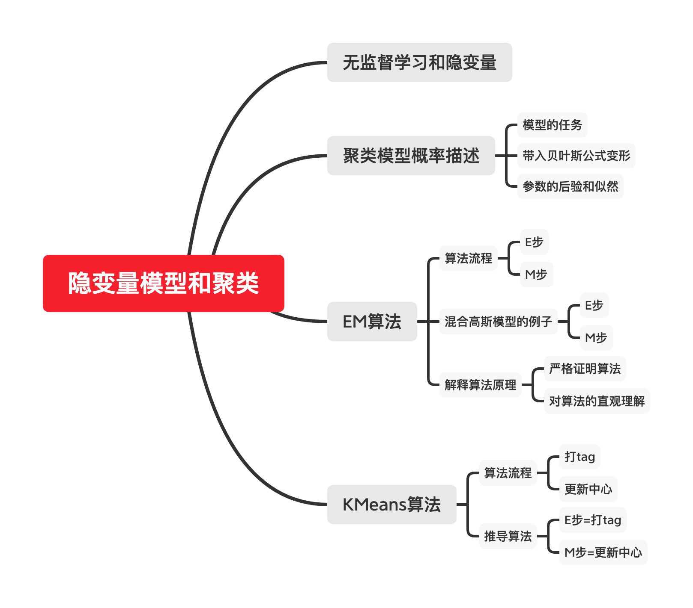
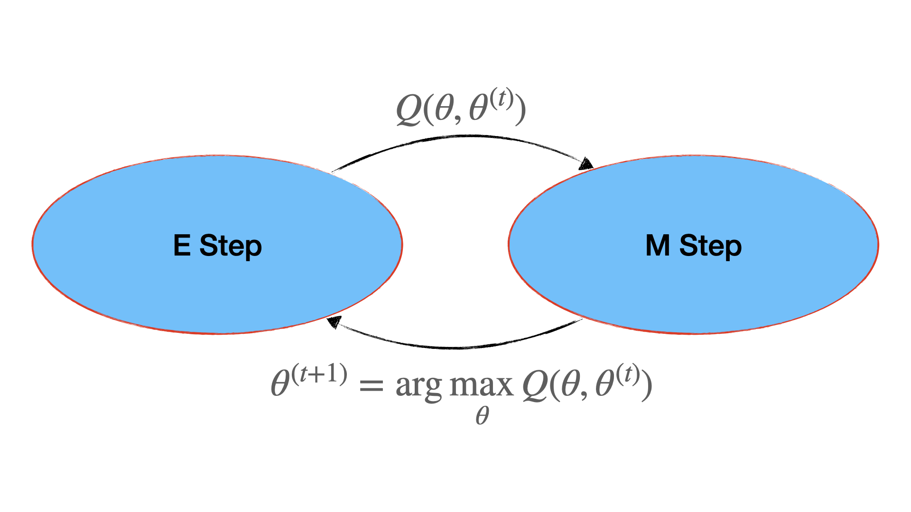
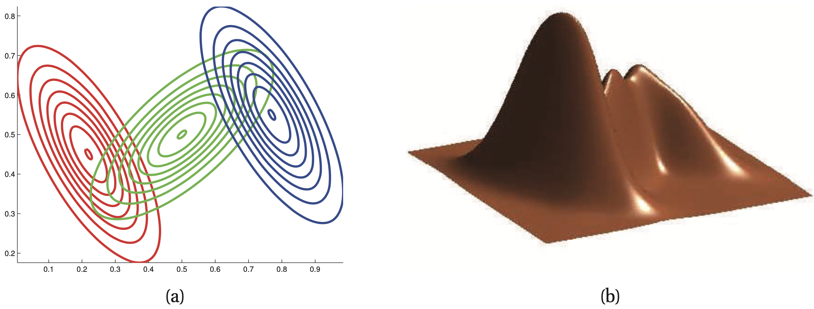
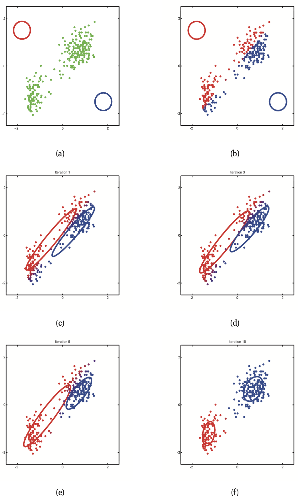

#! https://zhuanlan.zhihu.com/p/161733843
# K-Means：隐变量、聚类、EM

本文「最后」将介绍著名的KMeans算法，在此之前，先作一系列铺垫。只知道KMeans算法本身远远不够，且算法十分简单，并不值得花一整篇博客讲解。知其然且知其所以然，非常重要。

故本文从含有隐变量的概率模型开始讲起，介绍清楚最一般的情况，看看怎么用EM算法求解隐变量模型的最大似然估计。最后KMeans算法的出现就显得十分简单，几乎不值一提。阅读本文，你不但将知道KMeans算法的来龙去脉，还将对贝叶斯统计和隐变量模型有更深的理解。

如果你只想了解KMeans算法，一点数学推理都不想看，可以直接跳到文章的最后一个h1标题下的第一个标题。

本文思维导图：

本文的md源码地址：[AnBlogs](https://github.com/Anarion-zuo/AnBlogs/blob/master/统计和机器学习/Latent-EM.md)

[TOC]

# 无监督学习和隐变量

无监督学习，就是目标没有给出的机器学习模型。聚类问题中，给出的数据没有「标签」，需要让模型「学」标签，并且能够把新来的数据归到标签中。

这样在数据集中没有给出的量，就是「隐变量」。聚类问题中，「隐变量」是模型的目标。在其他问题中，隐变量不一定是目标，可能是一个中间变量。故具有隐变量的模型不一定是无监督模型，无监督模型一定有隐变量。

# 概率模型描述

## 模型的任务

要对一系列对象特征（一行数据）$x$进行分类，分类的「标签」未知，需要模型自己发现。也就是「无监督学习」。可以理解为，数据表中的每一行有一个隐藏列，这个列的值没有给出，但模型认为这个列存在。

假设每个特征$x$都对应一个隐变量$z$，$z$表示这个特征的「聚类」，也就是模型训练的结果。也就是说，数据集中的每一行都有一个隐藏属性，表示这一行对象的聚类。$z$离散取值，模型的任务，就是求$p(z=k|x,\theta)$。也就是，给定输入数据$x$和参数$\theta$的前提下，这个数据分类到某个聚类$k$的概率。

和「监督学习」相比，监督学习的数据集中，数据的分类是给出的，通常用$y$表示，不是「隐」的。

以下先探索最一般的情况，再带入具体的随机变量取值状况和服从的分布。

## 带入贝叶斯公式变形

直接给模型带入贝叶斯公式，对于一行数据$(x^{(i)},z^{(i)})$：
$$
p(z^{(i)}|x^{(i)},\theta)=\frac{p(z^{(i)},x^{(i)}|\theta)}{p(x^{(i)}|\theta)}
$$
展开分子：
$$
p(z^{(i)},x^{(i)}|\theta)=p(z^{(i)}|\theta)p(x^{(i)}|z^{(i)},\theta)
$$
展开分母：
$$
p(x^{(i)}|\theta)=\int p(x^{(i)},z^{(i)}|\theta)dz=\int p(z^{(i)}|\theta)p(x^{(i)}|z^{(i)},\theta)dz
$$
这里将$z$写作积分，为了适应更广泛的情况。当$z$离散取值时，把积分换成求导即可，没有区别。

## 后验和似然

按照惯例，写出参数的后验和似然。这里需要特别注意，由于$z$实际并未给出，在后验表达式中，不可以出现$z$。换句话说，表示数据集的$D$中不含$z^{(i)}$，只含$x^{(i)}$。要估计参数，$z$必须作为中间量，不出现在最终结果中。故后验表达式应具有以下形式：
$$
p(\theta|D)=\frac{p(D|\theta)p(\theta)}{p(D)}
$$
其中似然展开：
$$
p(D|\theta)=\prod_ip(x^{(i)}|\theta)=\prod_i\int p(x^{(i)},z^{(i)}|\theta)dz=\prod_i\int p(z^{(i)}|\theta)p(x^{(i)}|z^{(i)},\theta)dz
$$
取似然的对数：
$$
l(\theta)=\log p(D|\theta)=\sum_i\log\int p(x^{(i)},z^{(i)}|\theta)dz
$$
要表达后验的对数也十分简单，是需要多乘一项作为先验：
$$
l(\theta)=\sum_i\log\int p(x^{(i)},z^{(i)}|\theta)p(\theta)dz
$$
要求最大似然估计，或最大后验估计，优化问题都非常复杂。解决此类优化问题，常使用EM算法。

# EM算法 (Expectation Maximization)

这个算法非常复杂，先介绍算法流程，带入一个具体例子GMM，再讲解原理。

## 流程

算法是一个迭代的过程，使用上一次迭代计算的结果$\theta^{(t)}$进行本次计算，得到新的结果$\theta^{(t+1)}$更新参数的估计值。

算法分成两步，E和M，以下分别介绍。

### E步

$\log$中包含积分，是计算困难所在。

在此设置另一种「似然」，以求绕开这个积分。具体这样做的原因，在后文有解释。
$$
l_c^{(i)}(\theta)=\log p(x^{(i)},z^{(i)}|\theta)
$$
计算一个「条件均值」，作为「辅助函数」：
$$
Q(\theta|\theta^t)=\underset{z^{(i)}|x^{(i)},\theta^{t}}{E}[\sum_il_c^{(i)}(\theta)]=\sum_i\underset{z^{(i)}|x^{(i)},\theta^{t}}{E}[l_c^{(i)}(\theta)]
$$
设置另一种「后验」也很类似：
$$
l_c^{(i)}(\theta)=\log p(x^{(i)},z^{(i)}|\theta)+\log p(\theta)
$$
由于「最大似然估计」和「最大后验估计」的EM算法求解过程几乎相同，下文只讲「最大似然估计」的情况，「最大后验估计」只需加上一项即可。

### M步

最大化「辅助函数」，使用此时的$\theta$作为新的参数值：
$$
\theta^{(t+1)}=\arg\max_\theta Q(\theta)
$$

## 混合高斯模型 (GMM)

这里带入著名的「混合高斯模型」，看看算法具体是怎样运行的。

带入混合高斯模型，就是指明了分布。$z$离散取值，使用「多项伯努利分布」描述，参数为$\pi$，下标$k$表示「取离散值$k$的概率」。$x$连续取值，使用「正态分布」描述，参数为均值和协方差$\mu,\Sigma$。把参数写在一起，方便表示，$\theta=(\mu,\Sigma,\pi)$。对于每个聚类$k$，都有一组参数，$\theta_k=(\mu_k,\Sigma_k,\pi_k)$。
$$
p(z^{(i)}=k|\pi)=\pi_k,p(x^{(i)}|z^{(i)}=k,\mu_k,\Sigma_k)=N(x^{(i)}|\mu_k,\Sigma_k)
$$
把聚类问题的目标表达成GMM：
$$
p(z^{(i)}=k|\theta,x^{(i)})\propto p(z^{(i)}=k|\theta)p(x^{(i)}|z^{(i)}=k,\theta)=\pi_kN(x^{(i)}|\mu_k,\Sigma_k)
$$
可以理解为，有$K$个不同的正态分布，带有不同的参数$\mu_k,\Sigma_k$，每个分布对于「应该归进哪个聚类」都有一定「话语权」$\pi_k$，最终的选择是比较$z$取这$k$个不同值的概率、从而「共同决策」的结果。

如下图所示，图中有三个正态分布，对应三个类。每个正态分布对应参数$\pi_k,\mu_k,\Sigma_k$。通过每个正态分布的参数，计算出样本$x^{(i)}$分到$k$聚类的概率为$p(z^{(i)}=k|x^{(i)},\pi_k,\mu_k,\Sigma_k)$，比较$k$取不同值时候的概率大小，就知道应分到哪个聚类，也就是应归属哪个正态分布。

我们来用EM算法求解这个模型。

### E步：写出$l_c$和$Q$

写出$l_c$:
$$
l_c^{(i)}(\theta)=\log p(x^{(i)}|z^{(i)},\theta)p(z^{(i)}|\theta)=\log\prod_k(p(x^{(i)}|\theta_k)\pi_k)^{I(z^{(i)}=k)}=\sum_kI(z^{(i)}=k)\log p(x^{(i)}|\theta_k)\pi_k
$$
$l_c$求和：
$$
\sum_il_c^{(i)}=\sum_i\sum_kI(z^{(i)}=k)[\log\pi_k+\log p(x^{(i)}|\theta_k)]
$$
表达辅助函数：
$$
Q=\underset{z^{(i)}|x^{(i)},\theta^{(t)}}{E}[\sum_il_c^{(i)}(\theta)]=\sum_i\sum_k\underset{z^{(i)}|x^{(i)},\theta^{(t)}}{E}[I(z^{(i)}=k)][\log\pi_k+\log p(x^{(i)}|\theta_k)]
$$
计算里面的条件均值：
$$
\underset{z^{(i)}|x^{(i)},\theta^{(t)}}{E}[I(z^{(i)}=k)]=\sum_{k'}I(z^{(i)}=k')p(z^{(i)}=k'|D,\theta^{(t)})=p(z^{(i)}=k|D,\theta^{(t)})
$$
给计算结果一个记号：$r_{k}^{(i)}=p(z^{(i)}=k|D,\theta^{(t)})$，称为「responsibility」，可以理解为$k$聚类对第$i$行数据的「认领程度」。若认为行之间没有关联，每个样本都是相互独立的，这个「认领程度」可以写成$r_{k}^{(i)}=p(z^{(i)}=k|x^{(i)},\theta^{(t)})$。

利用贝叶斯公式继续展开$r$:
$$
\begin{aligned}r_{k}^{(i)}=&p(z^{(i)}=k|x^{(i)},\theta^{(t)})\\\propto & p(z^{(i)}=k|\theta^{(t)})p(x^{(i)}|\theta^{(t)},z^{(i)}=k)\\=&\pi_k^{(t)}p(x^{(i)}|\theta_k^{(t)})\\=&\pi_k^{(t)}p(x^{(i)}|\mu_k^{(t)},\Sigma_k^{(t)})\end{aligned}
$$
其中最后$p(x^{(i)}|\mu_k^{(t)},\Sigma_k^{(t)})$为正态分布。

这样就完整地表达了下一步所需要的各种函数和分布。

### M步：求解优化问题

表达出最终的Q:
$$
Q=\sum_i\sum_kr_k^{(i)}[\log\pi_k+\log p(x^{(i)}|\theta_k)]
$$
有一个约束条件不要忘记$\sum_k\pi_k=1$，最终目标函数为：
$$
Q_L=\sum_i\sum_kr_k^{(i)}[\log\pi_k+\log p(x^{(i)}|\theta_k)]-\lambda(\sum_k\pi_k-1)
$$
具体求偏导的过程相对复杂，以下分别描述。

### 对$\pi$求偏导

只有约束项和第一个$\log$对$\pi$的偏导有效。
$$
0=\frac{\partial Q_L}{\partial\pi_k}=\sum_ir_k^{(i)}\frac{1}{\pi_k}-\lambda
$$
于是有$\lambda\pi_k=\sum_ir_k^{(i)}$.

两边对$k$求和，左边为：
$$
\lambda\sum_k\pi_k=\lambda
$$
右边为：
$$
\sum_k\sum_ir_k^{(i)}=\sum_i(\sum_kr_k^{(i)})=\sum_i1=N
$$
其中，$\sum_kr_k^{(i)}=1$可以由$r$的定义直接看出。

以上说明，$\lambda=N$，则得到$\pi$估计值：
$$
\pi_k=\frac{1}{N}\sum_ir_k^{(i)}
$$
用这个估计值更新$\pi$，$\pi_k^{(t+1)}=\frac{1}{N}\sum_ir_k^{(i)}$。

### 对$\mu,\Sigma$求偏导

只有第二个$\log$对这个偏导有效，故实际目标函数为：
$$
l(\mu_k,\Sigma_k)=\sum_i\sum_kr_k^{(i)}\log p(x^{(i)}|\mu_k,\Sigma_k)=\sum_i\sum_kr_k^{(i)}[\log|\Sigma_k|+(x^{(i)}-\mu_k)^T\Sigma_k^{-1}(x^{(i)}-\mu_k)]
$$
这是个标准的「正态分布最大似然估计」问题，这里省掉求解过程，直接给出结论。求解过程十分复杂，需要使用复杂的张量代数，不是本文的重点。以后可能专门写文介绍正态分布的各种结论。
$$
\mu_k=\frac{1}{\sum_ir_k^{(i)}}\sum_ir_k^{(i)}x^{(i)}
$$

$$
\Sigma_k=\frac{1}{\sum_ir_k^{(i)}}r_k^{(i)}(x^{(i)}-\mu_k)(x^{(i)}-\mu_k)^T=\frac{\sum_ir_k^{(i)}x^{(i)}{x^{(i)}}^T}{\sum_ir_k^{(i)}}-\mu_k\mu_k^T
$$

### 总结GMM

以上以「混合高斯模型」为例，介绍了EM算法求解聚类问题的一般流程。其他问题与此类似，修改一些步骤即可。

EM算法严谨地遵守了规定的步骤。先表达$l_c^{(i)}$，利用$l_c^{(i)}$表达$Q(\theta)$，利用$Q(\theta)$的优化问题得到新的参数$\theta^{(t+1)}$。

## 原理 (Why does it Work???)

以上介绍的EM算法的求解过程，建议你反复阅读，反复体会。

这里给出算法的严格证明，和对算法的直观理解。你可以跳过严格证明，直接看对算法的理解，可能对你帮助更大。

### 严格证明算法正确性

我们之前把$p(x^{(i)}|\theta)$作为$p(x^{(i)},z^{(i)}|\theta)$的「边缘分布」处理，现在我们换一种角度来看它。
$$
p(x^{(i)}|\theta)=\frac{p(x^{(i)},z^{(i)}|\theta)}{p(z^{(i)}|x^{(i)},\theta)}
$$
对它取对数：
$$
\log p(x^{(i)}|\theta)=\log p(x^{(i)},z^{(i)}|\theta)-\log p(z^{(i)}|x^{(i)},\theta)
$$
等式两边，在给定$x^{(i)},\theta^{(t)}$的条件下，同时对$z$取均值，类似于计算辅助函数$Q$。也就是在每一项上乘上$p(z^{(i)}|x^{(i)},\theta^{(t)})$，并对所有$z$求和：
$$
\log p(x^{(i)}|\theta)=\sum_{z^{(i)}}p(z^{(i)}|x^{(i)},\theta^{(t)})\log p(x^{(i)},z^{(i)}|\theta)-\sum_{z^{(i)}}p(z^{(i)}|x^{(i)},\theta^{(t)})\log p(z^{(i)}|x^{(i)},\theta)
$$
等式左边不变，只有右边发生了变化。

记$H(\theta|\theta^{(t)})=-\sum_{z^{(i)}}p(z^{(i)}|x^{(i)},\theta^{(t)})\log p(z^{(i)}|x^{(i)},\theta)$，则新得到的表达式可以写成：
$$
\log p(x^{(i)}|\theta)=Q(\theta|\theta^{(t)})+H(\theta|\theta^{(t)})
$$
利用简单的变量代换：
$$
\log p(x^{(i)}|\theta)-\log p(x^{(i)}|\theta^{(t)})=[Q(\theta|\theta^{(t)})-Q(\theta^{(t)}|\theta^{(t)})]+[H(\theta|\theta^{(t)})-H(\theta^{(t)}|\theta^{(t)})]
$$
只要能够证明$\log p(x^{(i)}|\theta)-\log p(x^{(i)}|\theta^{(t)})\ge Q(\theta|\theta^{(t)})-Q(\theta^{(t)}|\theta^{(t)})$，就说明在一次迭代中，只要使得$Q$增加，一定使得$\log p(x^{(i)}|\theta)$增加，算法就是对的。

要证明这个关系，就是证明$H(\theta|\theta^{(t)})\ge H(\theta^{(t)}|\theta^{(t)})$，也就是证明：
$$
\sum_{z^{(i)}}p(z^{(i)}|x^{(i)},\theta^{(t)})\log p(z^{(i)}|x^{(i)},\theta)\le \sum_{z^{(i)}}p(z^{(i)}|x^{(i)},\theta^{(t)})\log p(z^{(i)}|x^{(i)},\theta^{(t)})
$$
看似复杂，实则简单。写出左边减右边：
$$
\delta=LHS-RHS=\sum_{z^{(i)}}p(z^{(i)}|x^{(i)},\theta^{(t)})\log\frac{p(z^{(i)}|x^{(i)},\theta)}{p(z^{(i)}|x^{(i)},\theta^{(t)})}
$$
这是一个「均值」：
$$
\delta=\underset{z^{(i)}|x^{(i)},\theta^{(t)}}{E}\log\frac{p(z^{(i)}|x^{(i)},\theta)}{p(z^{(i)}|x^{(i)},\theta^{(t)})}
$$
由于$\log$为凹函数，对于均值有不等式：
$$
\underset{z^{(i)}|x^{(i)},\theta^{(t)}}{E}\log\frac{p(z^{(i)}|x^{(i)},\theta)}{p(z^{(i)}|x^{(i)},\theta^{(t)})}\le\log\underset{z^{(i)}|x^{(i)},\theta^{(t)}}{E}\frac{p(z^{(i)}|x^{(i)},\theta)}{p(z^{(i)}|x^{(i)},\theta^{(t)})}
$$
这个不等式右边的均值很好计算：
$$
\underset{z^{(i)}|x^{(i)},\theta^{(t)}}{E}\frac{p(z^{(i)}|x^{(i)},\theta)}{p(z^{(i)}|x^{(i)},\theta^{(t)})}=\sum_{z^{(i)}}p(z^{(i)}|x^{(i)},\theta^{(t)})\frac{p(z^{(i)}|x^{(i)},\theta)}{p(z^{(i)}|x^{(i)},\theta^{(t)})}=\sum_{z^{(i)}}p(z^{(i)}|x^{(i)},\theta)=1
$$
也就是说：
$$
\delta=\underset{z^{(i)}|x^{(i)},\theta^{(t)}}{E}\log\frac{p(z^{(i)}|x^{(i)},\theta)}{p(z^{(i)}|x^{(i)},\theta^{(t)})}\le\log 1=0
$$
取等条件很严格，$\theta=\theta^{(t)}$。

这是严格证明。

### 直观理解

EM算法的出发点，是绕开复杂的对$z$积分/求和，不直接对「似然」$\log p(x^{(i)}|\theta)$求解优化问题，而是对似然的一个「修改」$E_z[\log p(x^{(i)},z^{(i)}|\theta)]$求解优化问题。算法可以保证，当这个修改的似然通过改变参数$\theta$变大时，似然本身一定可以变大，变大的程度至少是修改的似然变大的程度。

这种通过优化下界来优化目标本身的操作，属实牛逼。

# K-Means算法

KMeans算法是「混合高斯模型」GMM的EM算法的特殊情况，如果你已经阅读了上文，理解起来应该十分简单。KMeans算法中关键的两步，正好可以对应EM算法中的E步和M步！

## 算法流程

算法启动时，初始化一些「中心」，「中心」的个数人为指定，是为$\mu_k,k=1,…,K$。每个「中心」代表一个聚类，算法运行的过程就是不断寻找更好的中心的过程。

判断一个对象$x$应取哪个聚类，只需要比较到每个中心的距离，选择距离小的那个：
$$
z^*=\arg\min_k||x-\mu_k||_2^2
$$

### 打tag

每次迭代，先给所有的样本划分类别。划分的方式，就是计算样本到每个中心的距离，选择距离最近的中心为归属。

表现为给隐变量赋值：
$$
z^{(i)}=\arg\min_k||x^{(i)}-\mu_k^{(t+1)}||_2^2
$$

### 更新中心

给样本打好tag之后，计算新的中心$\mu_k^{(t+1)}$，计算的方法就是求所有归到$k$聚类的数据$x^{(i)}$的平均值。
$$
\mu_k^{(t+1)}=\frac{1}{N_k}\sum_{i:z^{(i)}=k}x^{(i)}
$$
其中，求和下标$i:z^{(i)}=k$表示只选择归到$k$聚类的$x$进行求和，$N_k$表示归到$k$聚类的样本的个数。

如此重复，直到算法收敛，达到预定精度。

算法的运行可以由下图表现。(a)中初始化了两个中心，(b)基于这两个中心给所有样本归类打tag，(c)基于(b)中归类重新计算了中心，(d)又基于(c)的中心重新计算了归类打了tag，如此重复。

## 推导KMeans

KMeans是混合高斯模型的特殊情况。设置$\pi_k=\frac{1}{K}$，协方差矩阵是对角矩阵$\Sigma=\sigma^2I$，则需要估计的只有$\mu_k$。

可以直接带入之前得到的GMM的结论。

### E步：表达$r,Q$

表达$r$:
$$
r_k^{(i)}=\pi_k^{(t)}p(x^{(i)}|\mu_k^{(t)},\Sigma_k^{(t)})=\frac{1}{K}N(x^{(i)}|\mu_k^{(t)},\sigma^2I)
$$
$r$衡量一个聚类对样本的「认领程度」，也就是这个样本分到这个聚类的概率。这里使用更简单粗暴的办法，$r_k^{(i)}=I(k=k^*),k^*=\arg\max_k N(x^{(i)}|\mu_k^{(t)},\sigma^2I)$，直接赋值。这样的直接赋值称为「硬」EM (Hard EM)。

这种「硬赋值」和原先「软求和」之间的联系可以这样理解。正态分布的方差$\sigma$很小，使得$x^{(i)}$和中心$\mu^{(i)}$相差很小的距离的时候，概率密度就接近0。把这一系列概率密度求和，最终占主导地位的，还是离样本最近的中心计算的概率。

这样一来，对于给定的一系列$\mu^{(t)}$，我们都可以为所有样本找一个聚类，也就是给所有的$z^{(i)}$赋值。样本所属的聚类是通过比较概率$N(x^{(i)}|\mu_k^{(t)},\sigma^2I)$得到的，也就是通过比较$||x^{(i)}-\mu_k||_2^2$得到的，也就是比较样本到各个中心的距离。这正是KMeans算法中的关键一步「打tag」！

为所有样本根据$\mu^{(t)}$找到了聚类，也就是完成了$z^{(i)}$的赋值，接下来就要试着求$\mu^{(t+1)}$。还是通过求辅助函数$Q$的优化问题得到新的参数，我们为每个中心$\mu_k$单独准备一个$Q_k$，原先定义的辅助函数，由所有$Q_k$求和得到，$Q=\sum_kQ_k$。

表达$Q_k$如下，省去了和优化求解无关的常数项。
$$
Q_k=\sum_{i:z^{(i)}=k}\log N(x^{(i)}|\mu_{k},\sigma^2I)
$$
下标$i:z^{(i)}=k$表示，只让选择归类到聚类$k$的样本参与求和。

### M步：表达优化问题

在求解优化问题时，$\mu_k$之间互不关联，$Q$对$\mu_k$求偏导，也就是$Q_k$对$\mu_k$求偏导。故可以分$Q_k$进行计算，将每个$Q_k$最大化，也就是将整体$Q$最大化。

$Q_k$中对数接受一个正态分布的概率密度函数，展开如下：
$$
\log N(x^{(i)}|\mu_k,\sigma^2I)=-\log K-\frac{1}{2}\log(2\pi)^k\sigma^{2D}-\frac{1}{2\sigma^2}||x^{(i)}-\mu_k||_2^2
$$
求$Q_k$的最大值，也就是求$\sum_i||x^{(i)}-\mu_k||_2^2$的最小值。

对$\mu_k$求偏导：
$$
\frac{\partial}{\partial\mu_k}\sum_{i:z^{(i)}=k}||x^{(i)}-\mu_k||_2^2=\sum_{i:z^{(i)}=k}2(\mu_k-x^{(i)})
$$
令偏导数为0，得到：
$$
\sum_{i:z^{(i)}=k}x^{(i)}=\sum_{i:z^{(i)}=k}\mu_k=N_k\mu_k
$$
得到了KMeans算法的另一步「更新中心」：
$$
\mu_k^{(t+1)}=\frac{1}{N_k}\sum_{i:z^{(i)}=k}x^{(i)}
$$
至此，我们知道，KMeans算法的两步，正是EM算法的两步！