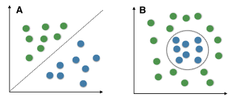

#! https://zhuanlan.zhihu.com/p/148651205
# 线性分类器：Logistic回归

本文讲解Logistic回归的基本统计学计算，只进行到最大似然估计，估计后验等计算过于复杂而暂不进行。

本文的md源码地址：[AnBlog/统计和机器学习](https://github.com/Anarion-zuo/AnBlogs/blob/master/统计和机器学习/Logistic-Easy.md)

[TOC]

## 干什么

### 概率模型

模型的任务是，拿到一个特征数据$x$，判断这个特征的对象更可能属于哪个类别。可能只有两个可以选择的类，也就是二分类问题，也可能有多个，也就是多类分类问题。翻译成数学语言，就是要求$p(y=c|x)$，$y$就是目标预测变量，取一系列离散值，代表多个不同的类。

Logistic回归默认场景是二分类问题，目标$y$取0或1。如果是多分类问题，可参考「Sigmoid回归」，原理和Logistic回归几乎相同，且可以直接转化为二分类问题，故不作讨论。二分类问题估计的是「伯努利分布」，概率密度函数如下：
$$
p(y|\mu)=\mu^y(1-\mu)^{1-y}
$$

以上写法只是$p(y=1|\mu)=\mu$的花哨版本。

### 数据条件

和线性回归一样，Logistic回归可能是兼具「最简单」和「最常用」的少数机器学习模型之一。也和线性回归一样，Logistic回归是「线性模型」，在一些「非线性」场景下可能发挥不太好。

如果你对线性回归还不熟悉，请看：[线性回归和贝叶斯的线性回归]()

线性分类器，假设样本「线性可分」，就像下面这样。可以用一条直线，分开两类的样本。

左边是线性可分，右边的分界很「不线性」。如果要用一条直线分开右边的样本，效果肯定很糟糕。

### 刻画概率

正如上面的图里的点，一条直线把样本空间分成两半，越远离直线的点分类就越明确。三维空间里是平面，再高的维度就画不出来了，思想却是相同。

> 样本点离分界面越远，样本点分到某个类的概率就应该越接近0或1。

线性分界面由一个线性方程表示：
$$
\eta=\theta^Tx=0
$$
给这个函数$\eta$输入一个样本$x$，它的取值就可以表示样本点到分界面的距离！

这个结论对于你也许不是那么明显，你可以直接选择相信我，也可以回忆一下高中学过的点到直线距离公式：
$$
d(x,y)=\frac{|y_0-(kx_0+b)|}{\sqrt{1+k^2}}
$$
相同形式可以拓展到高维情形：
$$
d(x)=\frac{|\theta^Tx|}{||\theta||}
$$
$\eta$的符号反应样本点在分界面的哪一侧。这里对$||\theta||$没有限制，而「支持向量机」就会限制$||\theta||$，这大概是支持向量机的优越之处。

要刻画样本分到某类的概率，肯定是根据$\eta$的取值，正如上面说的那样。这个函数应该具有以下形状：

具有这个形状的函数有很多，这里选择最有名的Sigmoid函数：
$$
\mu=\frac{1}{1+\exp(-\eta)}=\frac{1}{1+\exp(-\theta^Tx)}
$$
伯努利分布的参数应该这样刻画。原来的分布应该写成这样：
$$
p(y|\theta,x)=(\frac{1}{1+\exp(-\theta^Tx)})^y(1-\frac{1}{1+\exp(-\theta^Tx)})^{1-y}
$$
原分布依赖$\mu$，$\mu$依赖$\theta,x$，故分布依赖$\theta,x$。其中$\theta$是需要估计的参数，$x$是外部输入的数据。

## 似然

### 表达似然

似然是参数$\theta$已知时，样本数据出现的概率。
$$
p(D|\theta)=\prod_ip(x^{(i)},y^{(i)}|\theta)=\prod_i(\mu^{(i)})^{y^{(i)}}(1-\mu^{(i)})^{1-y^{(i)}}
$$
取对数：
$$
\ln p(D|\theta)=\sum_i(y^{(i)}\ln \mu^{(i)}+(1-y^{(i)})\ln(1-\mu^{(i)}))
$$
这里$\mu$上标表示把第$i$行数据输入给函数$\mu$：
$$
\mu^{(i)}=\frac{1}{1+\exp(-\theta^Tx^{(i)})}
$$

### 最大似然估计

求$\mu$对参数的导数，注意是对向量求导，结果是个向量：
$$
\frac{d}{d\theta}\mu=-\frac{1}{(1+\exp(-\theta^Tx))^2}\exp(-\theta^Tx)(-x)=\frac{x\exp(-\theta^Tx)}{(1+\exp(-\theta^Tx))^2}=x\mu(1-\mu)
$$
求对数的导数，注意还是对向量求导，结果还是个向量：
$$
\frac{d}{d\theta}\ln p(D|\theta)=\sum_i(y^{(i)}\frac{d}{d\theta}\ln\mu^{(i)}+(1-y^{(i)})\frac{d}{d\theta}\ln(1-\mu^{(i)}))
$$
进一步计算：
$$
\frac{d}{d\theta}\ln\mu^{(i)}=\frac{x^{(i)}\mu^{(i)}(1-\mu^{(i)})}{\mu^{(i)}}=x^{(i)}(1-\mu^{(i)}),\frac{d}{d\theta}\ln(1-\mu^{(i)})=\frac{-x^{(i)}\mu^{(i)}(1-\mu^{(i)})}{1-\mu^{(i)}}=-x^{(i)}\mu^{(i)}
$$
带入：
$$
\frac{d}{d\theta}\ln p(D|\theta)=\sum_i(y^{(i)}x^{(i)}-x^{(i)}\mu^{(i)})=\sum_ix^{(i)}(y^{(i)}-\mu^{(i)})
$$
令这个为0，没有$\theta$解析解哦。我尝试了很多种办法，最后还是没有办法！如果你看不明白，写成矩阵形式更清晰：
$$
\sum_ix^{(i)}y^{(i)}=yX^T,\sum_ix^{(i)}\mu^{(i)}=\mu X^T
$$
令这两者相等以获得极值点：
$$
(y-\mu)X^T=0
$$
这不是一般的$Ax=0$形式的方程，即便可以解出一个向量$v$满足方程$vX^T=0$，得到$\mu=y-v$，也不可以用得到的$\mu$表达出$\theta$。就是这样求不出解析解。

虽然如此，数值求解的方法和其他估计的方法还是可以使用的。

