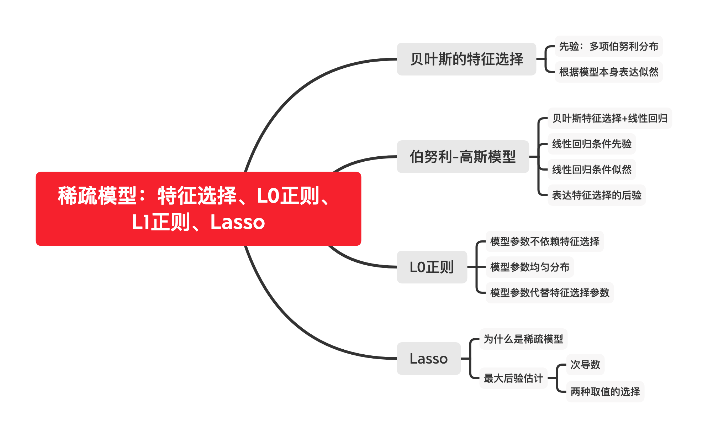
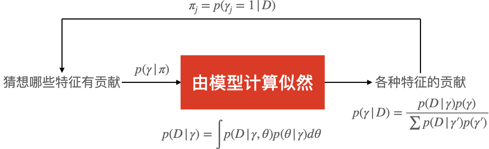
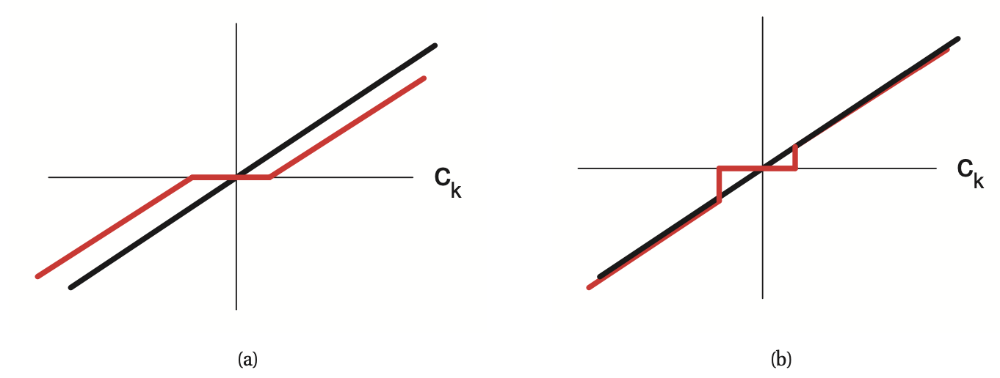

# 稀疏模型：特征选择、L0正则、L1正则、Lasso

本文讲解「稀疏」模型的相关结论。至于为什么要「稀疏」，在于稀疏的模型有诸多好处，总的来说可以归纳为两点：

1. 特征非常多时，大部分特征对模型没有贡献，是噪声信号，去掉可以提升模型性能和准确性。
2. 存储稀疏矩阵可以节省大量空间。
3. Lasso回归在面试中占据一席之地，最好知道来龙去脉。

本文忽略贝叶斯统计中经常出现的极其复杂的积分，只求对统计学研究过程有深刻的理解，具体的积分计算不一定是由求出不定积分表达式得到的。希望你不会淹没在数学之中，个人认为数学成分并不大。

本文思维导图：

本文md源码地址：[AnBlogs](https://github.com/Anarion-zuo/AnBlogs/blob/master/统计和机器学习/sparse.md)

# 贝叶斯特征选择

要知道特征对模型是否有贡献，我们采用原始的贝叶斯统计方法。定义一个随机变量$\gamma$，$\gamma_j=1$表示第$j$个特征对模型有贡献，$\gamma_j=0$表示没有贡献。

按照贝叶斯统计的惯例，$\gamma$的概率分布应该从数据中得来，表达「后验」：
$$
p(\gamma|D)=\frac{p(D|\gamma)p(\gamma)}{\sum p(D|\gamma')p(\gamma')}
$$
得到的$p(\gamma|D)$是「每个特征对模型的贡献」，我们可以直接删去一些对模型贡献不大的特征。如设置一个「阈值」为0.1，所有$p(\gamma_j=1|D)<0.1$的特征$j$都不参与模型计算。重点是针对特定模型求解$p(\gamma|D)$。

下文先表达出关于$\gamma$的先验和似然，其中，「似然」的表达式和模型本身有关，下文中带入了一个具体的模型举例子，展示在具体模型上进行特征选择的方法。

## 先验

对于$\gamma$的每个分量$\gamma_j$，它们都是取$0,1$的随机变量，服从伯努利分布$p(\gamma_j|\pi_j)=\pi_j^{\gamma_j}(1-\pi_j)^{1-\gamma_j}$。假设每个$\gamma_j$相互独立，则向量表达为联合概率分布，先验表达为：
$$
p(\gamma|\pi)=\prod_j\pi_j^{\gamma_j}(1-\pi_j)^{1-\gamma_j}
$$
现为了简化问题，认为$\pi$的各个分量相同，即$\pi_j=\pi_0$，则$\gamma$的先验可以更加简洁地表达：
$$
p(\gamma|\pi_0)=\pi_j^{||\gamma||_0}(1-\pi_j)^{D-||\gamma||_0}
$$
其中，$||\gamma||_0$表示「0阶范数」，也就是$\gamma$所有分量中取1的个数，$||\gamma||_0=\sum_j\gamma_j$。有的书以$N_+$之类表达「个数」的字母表示。

对先验取对数：
$$
\log p(\gamma|\pi_0)=||\gamma||_0\log\pi_0+(D-||\gamma||_0)\log(1-\pi_0)=||\gamma||_0\log\frac{\pi_0}{1-\pi_0}+D\log(1-\pi_0)
$$

## 似然

似然是$p(D|\gamma)$，是「选好特征后数据出现的概率」。对于$\gamma_j=0$的特征$x_j$，自然不让这个特征参与计算，相当于从表格中拿掉了这一列。

要计算似然，必须以「边缘概率分布」的方式表达似然，也就是带入模型的参数，如下：
$$
p(D|\gamma)=\int p(D,\theta|\gamma)d\theta=\int p(D|\gamma,\theta)p(\theta|\gamma)d\theta
$$
其中，$p(D|\gamma,\theta)$中的样本$D$和模型参数$\theta$，具体形式取决于模型本身，而不是这个特征选择的过程。可以根据筛选的特征进行删减，从而简化表达式。如$\gamma$中标明不参与计算的特征对应的参数和数据可以直接省去，记作$p(D_\gamma|\theta_\gamma)$。

# 带入线性回归：伯努利-高斯模型

把上面所讲的「贝叶斯特征选择」应用到线性回归模型上，看看哪些特征对模型的贡献较大，哪些较小可以省略。如上文所述，特征的贡献由$p(\gamma|D)$表示。然而，无论是计算出后验$p(\gamma|D)$的表达式，还是计算出似然$p(D|\gamma)$的表达式，都不是本文的重点。现代的贝叶斯统计学有更加优秀的办法计算复杂积分，而不一定要求出积分表达式。

本文展示如何将特征选择的流程带入一个具体的模型中，而不是讲解如何计算出具体特征选择的方案。所以，后文给出相对$\gamma$的先验、似然、后验的积分表达式，并给出一定计算结果，而不展示具体高斯积分的过程。

## 回顾线性回归模型

对于线性回归来说，认为目标预测$y$服从一个以「特征$x$的线性组合」为均值的正态分布，即$p(D|w,\sigma)=N(y|Xw,\sigma^2I)$。

上文强调了，要计算相对$\gamma$的似然，就必须通过积分计算「边缘概率密度」。故$\gamma$的似然表达如下：
$$
p(D|\gamma)=\int p(D,w,\sigma|\gamma)dwd\sigma=\int p(D|w,\sigma,\gamma)p(w|\gamma)p(\sigma|\gamma)dwd\sigma
$$
$w,\sigma$都是线性回归模型的参数，在「特征选择」的模型中，需要这样被积分掉。

注意术语上的区别。$p(w|y),p(\sigma|y)$实际上属于「线性回归模型」的「先验」，而不是「特征选择」的「先验」，$p(D|w,\sigma,\gamma)$同理。以下通过「模型的」和「特征选择的」修饰词加以区分。

## 模型的先验

这里讨论「模型的」先验项$p(w|\gamma)$。特别地，我们忽略方差$\sigma$和$\gamma$之间的关联，认为两者相互独立，即$p(\sigma|\gamma)=p(\sigma)$。

当我们认为某个特征对模型$j$没有贡献的时候，就是将这个特征对应的权重设置为$0$。

反映到$w$的概率分布上，当$\gamma=0$，$w$只能取$0$，取其他值的概率均为$0$，用$\delta$函数表达：
$$
p(w_j|\gamma_j=0)=\delta(w_j)=\begin{cases}1&w_j=0\\0&otherwise\end{cases}
$$
当认为某个特征$j$对模型有贡献时，我们依旧采用「认为参数较小」这一假设，认为$w_j$服从一个以0为均值的正态分布。
$$
p(w_j|\gamma_j=1,\sigma)=N(w_j|0,\sigma_w^2\sigma^2)
$$
其中$\sigma_w$用作「缩放」，目的是方便使用$\sigma$描述$w$的分布参数。

其实，当$\gamma_j=0$，第$j$个特征$x_j$也就不参与计算，我们使用$w_\gamma$表示去掉了不存在的特征所对应的系数，留下的$w$中，每一个$w_j$对应的均有$\gamma_j=1$。对应的先验表达式简洁一些：
$$
p(w_\gamma|\sigma)=N(w_\gamma|0,\sigma_w^2\sigma^2I)
$$
同理，我们用$X_\gamma$表示根据$\gamma$去掉不参与计算的列之后的样本矩阵$X$。

## 模型的似然

这里讨论「模型的」似然项$p(D|w,\sigma,\gamma)$。

这里同样只考虑参与计算的特征，满足$\gamma_j=1$。则原线性回归的似然可表示为：
$$
p(D|w,\sigma,\gamma)=p(D|w_\gamma,\sigma)=N(y|X_\gamma w_\gamma,\sigma^2I)
$$
带入表达「特征选择的」似然：
$$
p(D|\gamma)=\int N(y|X_\gamma w_\gamma,\sigma^2I)N(w_\gamma|0,\sigma_w^2\sigma^2I)p(\sigma^2)dw_\gamma d\sigma^2
$$
要进一步计算表达式，可以参考下文的结果，但没必要。现代贝叶斯统计有许多更加高效的方法，可以避免此类超级复杂的积分计算。以下为了文章的完整性给出结果。

如果认为$\sigma$为已知量，或称「超参数」，则可以计算出「特征选择的」似然的表达式：
$$
p(D|\gamma,\sigma^2)=\int N(y|X_\gamma w_\gamma,\sigma^2I)N(w_\gamma|0,\sigma_w^2\sigma^2I)p(\sigma^2)dw_\gamma=N(y|0,C_y)
$$
其中$C=\sigma^2X_\gamma\Sigma_\gamma X^T_\gamma+\sigma^2I,\Sigma_\gamma=\sigma_w^2I$。

同样还可以计算当$\sigma$非给定值时候的「特征选择的」似然，那就更加复杂啦。

# L0正则

在上面的讲述中，我们认为，$w,\sigma$是依赖于$\gamma$的随机变量。这里，我们改换一种思维方式，认为他们相互独立，通过修改模型达到相同效果。

修改线性回归模型为：
$$
p(y|X,w,\gamma,\sigma^2)=N(y|\sum_{j}x^{(i)}_jw_j\gamma_j,\sigma^2)
$$
这也是新的「似然」。若$\gamma_j=0$，则相应的$w_j,x_j$都会被「掩盖」，被阻止参与计算。

剩余部分和原来相同，$\gamma_j$的先验为「伯努利分布」$p(\gamma_j)=\pi_0^{\gamma_j}(1-\pi_0)^{1-\gamma_j}$，$w_j$的先验为「正态分布」$N(0,\sigma_w^2\sigma^2)$。得到先验：
$$
p(\gamma,w)\propto N(w|0,\sigma_w^2\sigma^2I)\pi_0^{||\gamma||_0}(1-\pi_0)^{D-||\gamma||_0}
$$
可以很简单地表达后验：
$$
p(\gamma,w|D,\sigma)\propto N(w|0,\sigma_w^2\sigma^2I)\pi_0^{||\gamma||_0}(1-\pi_0)^{D-||\gamma||_0}\prod_iN(y^{(i)}|\sum_jx^{(i)}_jw_j\gamma_j,\sigma^2)
$$
取对数，省去不必要的项：
$$
f(\gamma,w)=\log p(\gamma,w|D,\sigma)=\sum_i||y^{(i)}-x^{(i)}_jw_j\gamma_j||_2^2+\frac{1}{\sigma^2_w}||w||^2+\lambda||\gamma||_0
$$
其中系数$\lambda=2\sigma^2\log\frac{1-\pi_0}{\pi_0}$。

## 从离散变为连续

上面得到的$f(\gamma,w)$的优化问题不好求解，因为离散值$\gamma$的存在。这里，我们尝试将这个问题解决，创造一个好解的优化问题。

首先，假设$w$先验为均匀分布，即$\sigma_w\rightarrow\infty$，目标函数变为：$f(\gamma,w)=\sum_i||y^{(i)}-x^{(i)}_jw_j\gamma_j||_2^2+\lambda||\gamma||_0$。

当$\gamma_j=0$，$w$的取值对模型没有影响，故令此时$w_j=0$。这样一来，0阶范数的定义使得可以使用$w$替换$\gamma$，目标函数变为：
$$
f(\gamma,w)=\sum_i||y^{(i)}-x^{(i)}_jw_j\gamma_j||_2^2+\lambda||w||_0
$$
其中，系数$\lambda$由超参数组成，故自成超参数。我们就得到了「**目标函数=损失函数+正则**」的形式，自然称为「L0正则」。

## 最大后验估计

解关于$f(\gamma,w)$的优化问题，就是求最大后验估计。

此处不讲解直接求解L0正则的方法，因为后面有更好的模型。如果你感兴趣，可以试着往「贪心策略」方面想想。

# 从L0到L1

L0正则有诸多缺点，从求解算法的角度看，这些缺点往往也是「非凸优化」或「贪心策略」的缺点。这两者好像有很大的联系，但我还不理解，并且在知乎上问了个问题：https://www.zhihu.com/question/410121983

我们进一步修改L0正则，使得其能够由简单的优化算法得到近似的解。方法是采用「拉普拉斯分布」作为参数$w$的先验：
$$
p(w|\lambda)=\prod_jLap(w_j|0,\frac{1}{\lambda})\propto\prod_j\exp(-\lambda|w_j|)
$$
目标函数化为如下形式：
$$
f(w)=\sum_i||y^{(i)}-x^{(i)}_jw_j||_2^2+\lambda||w||_1
$$
称为Lasso回归。

## 为什么L1的结果是「稀疏」的？

把优化问题通过反向的「拉格朗日乘子法」，我们把最小化$f(w)$写成带有约束的优化：
$$
\min_w\sum_i||y^{(i)}-x^{(i)}_jw_j||_2^2\qquad s.t.\;||w||_1\le C
$$
同理，岭回归也可以写成带有约束的优化：
$$
\min_w\sum_i||y^{(i)}-x^{(i)}_jw_j||_2^2\qquad s.t.\;||w||_2\le C
$$
Lasso的约束是个「凸多边形」，岭回归的约束是个「球」，相比之下，「凸多边形」的表面没有那么「凸」，故相对更加靠近0。可以这样直观理解，严格的推理在后文。

## 最大后验估计

由于绝对值的存在，我们可以使用「次导数」(subderivative)的方法。当然还有很多其他解法，更快、更精确，这里介绍可以给出解析解的「次导数」，展示模型的「稀疏」。

次导数，就是解决导数不连续的优化问题的办法。对于绝对值来说，定义「次导数」如下：
$$
\partial|x|=\begin{cases}-1&\theta<0\\ [-1,1]&\theta=0\\1&\theta>0\end{cases}
$$
对目标函数求导，可以正常求导的部分正常求导，不可以的部分使用次导数：
$$
\partial_{w_j}f(w)=(a_jw_j-c_j)+\lambda\partial_{w_j}||w||_1
$$
其中，各项字母为：
$$
a_j=2\sum_i(x^{(i)}_j)^2,c_j=2\sum_ix^{(i)}_j(y^{(i)}-w^T_{-j}x^{(i)}_{-j})
$$
下标$-j$表示除了$j$分量之外其他分量组成的向量。

展开其中的次导数：
$$
\partial_{w_j}||w||_1=\begin{cases}-1&w_j<0\\ [-1,1]&w_j=0\\1&w_j>0\end{cases}
$$
来到最优解的充要条件是0在次导数的集合中，即$0\in\partial_{w_j}f(w)$，求出最优解所在区间。

#### 自然取法

若$w_j<0$，取$\lambda=-1$，带入得到$w_j=\frac{c_j+\lambda}{a_j}$，必须要求$c_j<-\lambda$。

若$w_j>0$，取$\lambda=1$，带入得到$w_j=\frac{c_j-\lambda}{a_j}$，必须要求$c_j>\lambda$。

貌似$w_j$已经取遍除了0之外的所有熟悉，那么当$c_j\in[-\lambda,\lambda]$的时候，只能取$w_j=0$。
$$
w_j=\begin{cases}0&c_j\in[-\lambda,\lambda]\\\frac{c_j+\lambda}{a_j}&c_j<-\lambda\\\frac{c_j-\lambda}{a_j}&c_j>\lambda\end{cases}
$$
Lasso有解析解，只要计算出$a_j,c_j$，就可以得到模型的训练结果。

#### 避免缩小绝对值的取法

注意到，当$c_j\not\in[-\lambda,\lambda]$时，参数$w_j$的估计值的绝对值总是被缩小了$\lambda/a_j$，$\lambda$似乎是训练时的参数，我们不希望它影响训练后的模型，故在结果中抹去它的影响。
$$
w_j=\begin{cases}0&c_j\in[-\lambda,\lambda]\\\frac{c_j}{a_j}&c_j<-\lambda\\\frac{c_j}{a_j}&c_j>\lambda\end{cases}
$$
两种取法可以由下图理解，横轴代表$c_j$。

